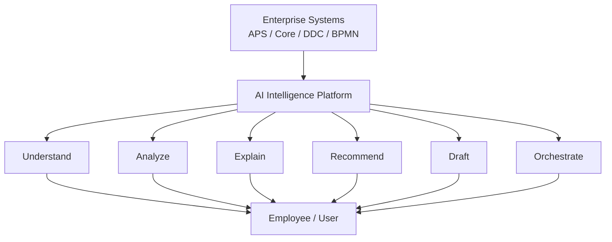
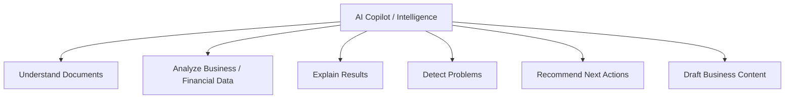
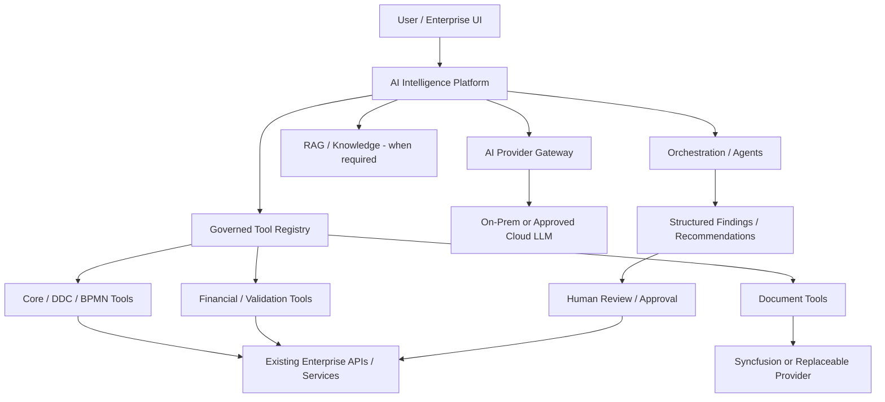
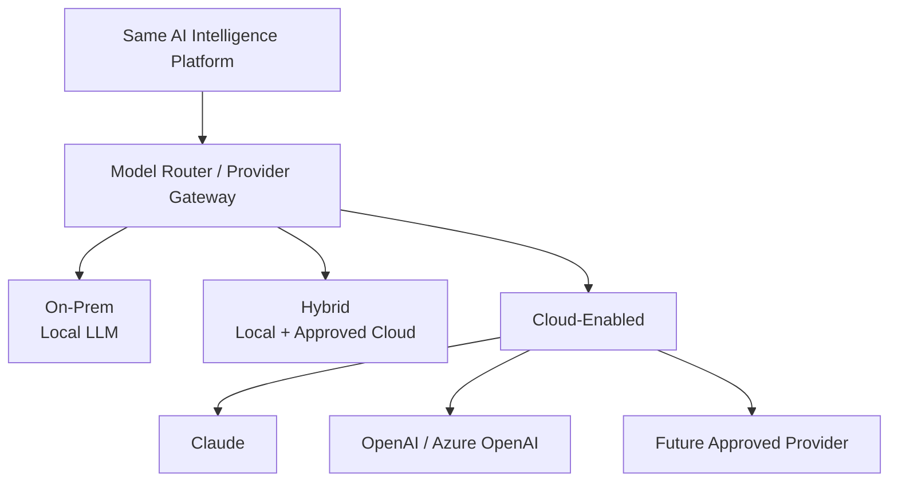
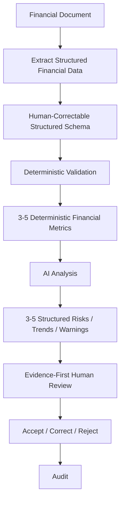
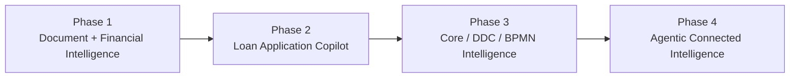
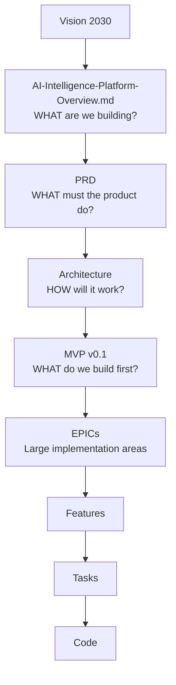
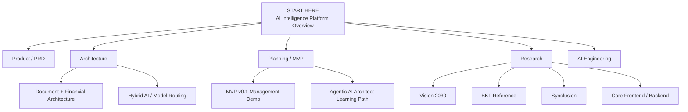
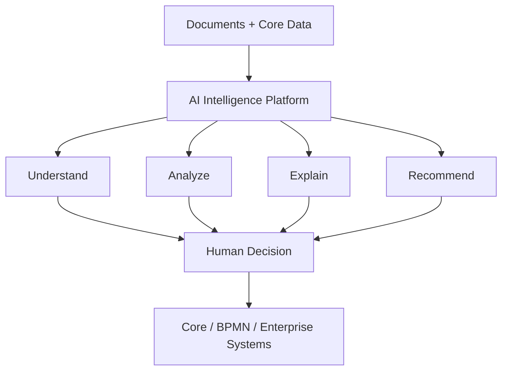

# AI Intelligence Platform — What We Are Building

**START HERE**  
**Purpose:** Give management, product, architecture, and development one simple picture of what we are building, what the client will experience, what we build first, and how detailed documentation follows from this north-star document.

## 1. Vision

> Build an enterprise AI layer that understands documents and business data, uses existing enterprise capabilities as governed tools, assists employees with analysis and recommendations, and keeps humans and deterministic systems in control.



This is not a standalone chatbot and not a replacement for Core. It is a shared intelligence layer around deterministic enterprise systems.

## 2. What the Client Will Experience

The target user experience is an AI Copilot embedded in the business process. The BKT demonstration is a useful product/UX reference pattern, but it is not a specification to clone.

```text
┌─────────────────────────────────────────────────────────────┐
│ LOAN APPLICATION                                AI COPILOT  │
├──────────────────────────────────┬──────────────────────────┤
│ Customer / Product / Amount      │ AI Assistant             │
│ Status / Officer / Case Data     │                          │
│                                  │ Missing documents        │
│ Documents                        │ Financial warnings       │
│ ✓ Financial Statement            │ Risk / trend findings    │
│ ✓ Registration                   │ Recommended next actions │
│ ✕ Required Document              │                          │
│                                  │ [Explain]                │
│ Financial Data                   │ [Check Documents]        │
│ Revenue / EBITDA / Debt / ...    │ [Analyze Financials]     │
│                                  │ [Draft Conclusion]       │
└──────────────────────────────────┴──────────────────────────┘
```

The AI experience may later appear as Copilot/chat, contextual actions, side panels, review/compare views, AI columns, smart forms, and background intelligence. All use the shared AI Platform rather than isolated direct model integrations.

## 3. High-Level Business Capabilities



Examples include document extraction and classification, financial trends/anomalies, explanation of deterministic warnings, missing-document detection, recommended next steps/conditions, and draft summaries or credit conclusions.

## 4. How It Works



### Responsibility Boundary

| AI Intelligence | Deterministic Core / Enterprise Systems |
|---|---|
| Understand | Calculate authoritative values |
| Extract / classify | Validate authoritative rules |
| Analyze | Apply product/business rules |
| Explain | Authorize actions |
| Recommend | Persist system-of-record state |
| Draft | Execute authoritative workflow transitions |
| Predict | Enforce permissions and controls |

AI may select permitted tools, but prompts are not a security boundary. Authorization, policy, approval, validation and audit are enforced by the platform and deterministic systems.

## 5. Deployment and Model Independence

The same platform must support client security and residency requirements.



Agents and business services depend on platform-owned contracts, not model brands. Claude, OpenAI/Azure OpenAI, local/open models, embedding providers, retrieval stores, and document providers remain replaceable behind governed boundaries.

## 6. What We Build First — MVP v0.1

The first management-presentable vertical slice is deliberately small.



### MVP v0.1 demonstrates

- one supported financial-document scenario;
- structured extraction rather than prose-only AI output;
- source/evidence beside extracted values;
- deterministic validation and financial calculations outside the LLM;
- structured AI findings/explanations;
- human review and correction;
- basic traceability/audit;
- provider boundaries that allow later on-prem/cloud model choices.

### Explicitly deferred from MVP v0.1

Multi-agent collaboration, full enterprise RAG, BPMN/DDC integration, production Core write-back, predictive ML, a complete model-routing engine, a general enterprise chatbot, and broad autonomous workflows are future phases unless discovery proves one is essential to validate the MVP.

## 7. Product Roadmap



### Phase 1 — Document & Financial Intelligence

Prove extraction, structured data, deterministic validation/calculation, AI analysis, evidence and human review.

### Phase 2 — Loan Application Copilot

Embed intelligence into the real loan/application workspace and introduce governed domain skills such as Analyze Financials, Check Missing Documents, Explain Warnings, Summarize Application and Draft Conclusion.

### Phase 3 — Core / DDC / BPMN Intelligence

Expose approved existing enterprise capabilities as governed tools and add workflow/context intelligence without replacing deterministic authority.

### Phase 4 — Agentic Connected Intelligence

Introduce broader agentic workflows and multi-agent collaboration only where clear specialist boundaries and measurable value justify the complexity.

## 8. Documentation Hierarchy

This document sits above implementation decomposition. It is not an EPIC document.



Every future EPIC should be traceable to an approved product/MVP capability. This prevents interesting AI experiments from expanding scope without contributing to the management-visible vertical slice.

## 9. Repository Map

Use this file as the entry point. Detailed documentation provides drill-down, not a competing product definition.



## 10. One-Sentence Management Explanation

> We are building an Enterprise AI Intelligence Platform on top of our existing Core systems; the first MVP reads financial documents, converts them into structured data, uses deterministic validation and calculations, provides evidence-backed AI analysis and recommendations, and keeps the human in control, with an architecture that can later support Loan, DDC, BPMN, on-premises models and approved cloud LLMs.

## 11. The Picture to Remember



Everything else in the repository explains how this picture will be implemented, validated, governed, and expanded.
