# AI Intelligence Platform — What We Are Building

**START HERE**  
**Purpose:** Give management, product, architecture, and development one simple picture of what we are building, what the client will experience, what we build first, which technology we intend to use, and how the platform expands toward Vision 2030.

## 1. Vision

> Build an enterprise AI layer that understands documents and business data, uses existing enterprise capabilities as governed tools, assists customers and employees with analysis, guidance and recommendations, and keeps humans and deterministic systems in control.

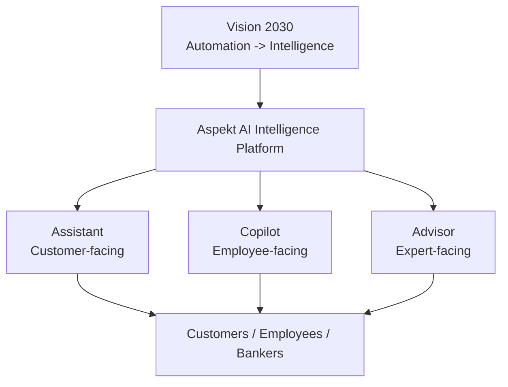

This is not a standalone chatbot and not a replacement for Core. It is a shared intelligence foundation around deterministic enterprise systems.

## 2. Three Experiences, One Shared Platform

A key product principle is that **Assistant, Copilot and Advisor are not separate AI backends**. They are different experiences/personas running on one shared foundation.

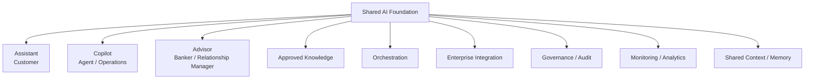

### Assistant

Customer-facing experience for bounded self-service, information/guidance, process initiation and approved safe actions. Human handoff must remain clear and context-rich.

### Copilot

Employee-facing experience for retrieval, summarization, real-time guidance, drafting, document/financial analysis and next-best-action recommendations. Human remains the decision maker for consequential work.

### Advisor

Expert-facing experience for preparation, client context, product/policy knowledge, meeting support, recommendations and follow-up. AI improves professional judgment; it does not replace it.

## 3. What the Client Will Experience First

Our first rich client experience should resemble an AI Copilot embedded in the real business process. The BKT AI demonstrations remain a useful credit-workflow UX reference, not a specification to clone.

```text
┌─────────────────────────────────────────────────────────────┐
│ LOAN APPLICATION                                AI COPILOT  │
├──────────────────────────────────┬──────────────────────────┤
│ Customer / Product / Amount      │ AI Assistant             │
│ Status / Officer / Case Data     │                          │
│                                  │ Missing documents        │
│ Documents                        │ Financial warnings       │
│ ✓ Financial Statement            │ Risk / trend findings    │
│ ✓ Registration                   │ Recommended next actions │
│ ✕ Required Document              │                          │
│                                  │ [Explain]                │
│ Financial Data                   │ [Check Documents]        │
│ Revenue / EBITDA / Debt / ...    │ [Analyze Financials]     │
│                                  │ [Draft Conclusion]       │
└──────────────────────────────────┴──────────────────────────┘
```

The AI experience may later appear as chat/Copilot, contextual actions, side panels, review/compare views, AI columns, smart forms, voice and background intelligence. All use the shared AI Platform rather than isolated direct model integrations.

## 4. Connected Intelligence and Shared Context

The platform should preserve context as work moves across self-service, employees, experts and workflows.

Candidate shared context includes identity, intent, journey/case history, case details, policy basis, evidence, next step, audit trail and follow-up status.

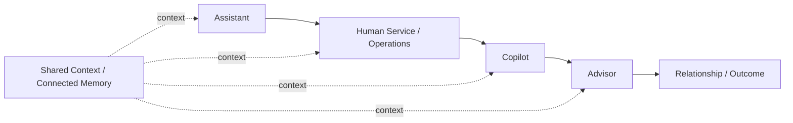

The client should experience one connected institution, not a sequence of isolated bots and systems.

## 5. High-Level Business Capabilities

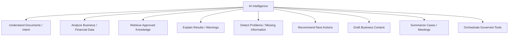

Examples include document extraction/classification, financial trends/anomalies, explanation of deterministic warnings, missing-document detection, policy retrieval, recommended next steps/conditions, draft summaries or credit conclusions, case summarization, and meeting preparation.

## 6. How It Works

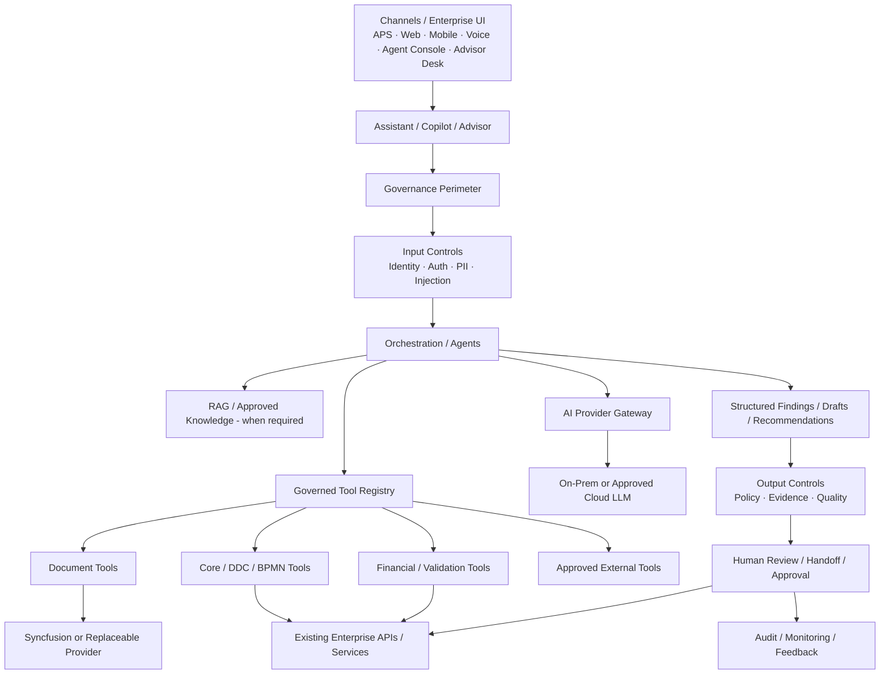

### Responsibility Boundary

| AI Intelligence | Deterministic Core / Enterprise Systems |
|---|---|
| Understand | Calculate authoritative values |
| Extract / classify | Validate authoritative rules |
| Analyze | Apply product/business rules |
| Explain | Authorize actions |
| Recommend | Persist system-of-record state |
| Draft | Execute authoritative workflow transitions |
| Predict | Enforce permissions and controls |
| Retrieve / summarize | Authenticate and control account/action access |

AI may select permitted tools, but prompts are not a security boundary. Authorization, policy, approval, validation and audit are enforced by the platform and deterministic systems.

## 7. Architecture Baseline — Clean Architecture + Modular Monolith

The platform starts as an **ASP.NET Core Modular Monolith** with **Clean Architecture principles per module**. We deliberately avoid premature microservice decomposition while preserving module and provider boundaries that can evolve later.

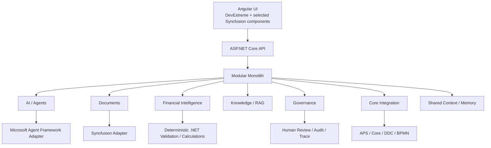

### Architecture principles

- Modular Monolith first; extract services only when operational evidence justifies it.
- Clean Architecture principles inside module boundaries.
- Frameworks/vendors remain behind application-owned contracts/adapters.
- Assistant, Copilot and Advisor share one platform foundation rather than separate implementations.
- Deterministic Core remains authoritative for calculations, validation, rules, permissions, workflow authority and system-of-record writes.
- Human-in-the-loop for consequential outcomes.
- On-premises, hybrid and approved cloud deployment are first-class requirements.
- Structured outputs/contracts are preferred when AI results are consumed by business systems.
- Approved knowledge and shared context must be governed, traceable and authorization-aware.

Detailed decision: `docs/architecture/ADR-002-Clean-Architecture-Modular-Monolith.md`.

## 8. Technology Direction

| Layer | Initial technology / approach |
|---|---|
| Existing APS frontend | Angular + DevExtreme |
| New document-heavy AI UI | Angular + selected Syncfusion runtime components where valuable |
| Backend / API | .NET / ASP.NET Core |
| Application architecture | Clean Architecture + Modular Monolith |
| Agent/orchestration candidate | Microsoft Agent Framework behind platform abstraction |
| Document intelligence / processing | Syncfusion Document SDK / Document Processing capabilities as first provider candidate |
| Document AI tools | Syncfusion AI Agent Tools where validated for the use case |
| Financial calculations / validation | Deterministic .NET services/tools |
| Existing enterprise capability | APS/Core, DDC, BPMN through governed APIs/adapters/tools |
| AI provider access | Platform-owned AI Provider Gateway |
| Cloud LLM options | Claude, OpenAI, Azure OpenAI and future approved providers |
| On-prem AI | Approved local/open LLM through the same provider boundary |
| RAG / knowledge | Provider-independent ingestion, embeddings, retrieval, reranking and authorization filtering |
| Shared context | Platform-owned connected case/journey context with explicit security/audit boundaries |
| Governance | Platform-owned HITL, authentication/authorization context, policy, evidence, audit, traces and escalation |
| Monitoring / evaluation | Technical + model + journey/business outcome metrics |

### Syncfusion position

We already have a Syncfusion license, so Syncfusion is a strong first implementation candidate for document-heavy capabilities. It remains a **provider/enabler**, not the AI Platform.

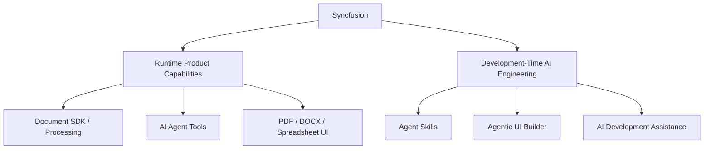

Existing APS screens remain DevExtreme-based. We evaluate selected Syncfusion UI components for new document-centric/evidence-heavy AI screens rather than replacing the existing frontend stack.

## 9. Deployment and Model Independence

The same platform must support client security and residency requirements.

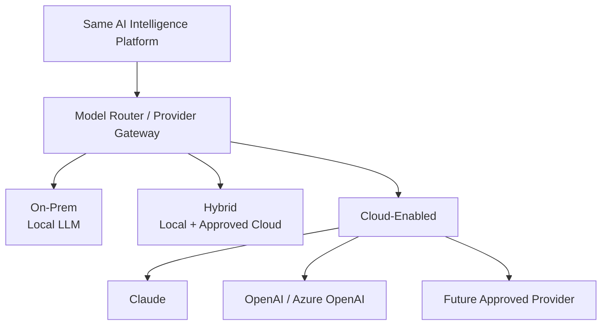

Agents and business services depend on platform-owned contracts, not model brands. Claude, OpenAI/Azure OpenAI, local/open models, embedding providers, retrieval stores, and document providers remain replaceable behind governed boundaries.

## 10. Governance — Trust Is a Platform Capability

Governance should be designed from the beginning rather than retrofitted later.

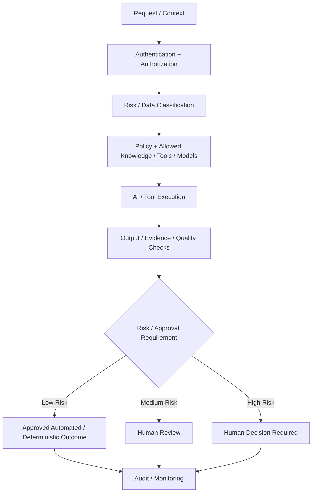

### Risk posture

- **Low risk:** bounded information and deterministic safe operations may be automated where policy allows.
- **Medium risk:** AI suggests/drafts; human review and confidence/escalation policy apply.
- **High risk:** lending decisions, investment/regulated judgment and other consequential actions remain human-led with full traceability.

Authentication boundaries, approved knowledge, prompt-injection/PII controls, tool permissions, human handoff, manual verification, auditability and model monitoring are platform-level concerns.

## 11. What We Build First — MVP v0.1

The first management-presentable vertical slice remains deliberately small and employee-facing, consistent with the principle of proving Copilot-style augmentation before broad customer automation.

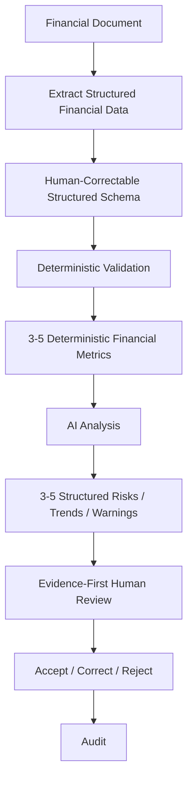

### MVP v0.1 demonstrates

- one supported financial-document scenario;
- structured extraction rather than prose-only AI output;
- source/evidence beside extracted values;
- deterministic validation and financial calculations outside the LLM;
- structured AI findings/explanations;
- human review and correction;
- basic traceability/audit;
- provider boundaries that allow later on-prem/cloud model choices.

### Explicitly deferred from MVP v0.1

Customer Assistant, full enterprise RAG, BPMN/DDC integration, production Core write-back, predictive ML, a complete model-routing engine, broad autonomous workflows and multi-agent collaboration are future phases unless discovery proves one is essential to validate the MVP.

## 12. Delivery Roadmap — What We Build in Each Step

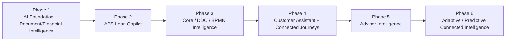

### Phase 1 — AI Foundation + Document & Financial Intelligence

**What we build:** document ingestion, structured extraction, deterministic validation/calculation, AI analysis, evidence, human review, basic audit and provider boundaries.

**Primary experience:** early employee Copilot/review experience.

**Technology:** ASP.NET Core Modular Monolith, Clean Architecture, Microsoft Agent Framework candidate, Syncfusion Document SDK/AI tools, deterministic .NET financial tools, AI Provider Gateway, Angular with selected Syncfusion/DevExtreme UI.

### Phase 2 — APS Loan Application Copilot

**What we build:** embed intelligence into the real Loan Application workspace with governed commands such as Analyze Financials, Check Missing Documents, Explain Warnings, Summarize Application, Draft Credit Conclusion and Suggest Next Action.

**Primary experience:** Copilot.

**Technology:** Angular + DevExtreme, AI Platform API, Agent Framework adapter, Tool Registry, Document/Financial tools, governed Core APIs.

**BKT relation:** this is where the visible credit-workflow experience becomes strongly BKT-like.

### Phase 3 — Core / DDC / BPMN Intelligence

**What we build:** expose approved Core, DDC and BPMN capabilities as governed tools; add workflow/context intelligence, missing-information detection, blocker explanation and next-step recommendations.

**Primary experience:** Copilot + internal operational intelligence.

**Technology:** Core APIs, DDC, BPMN, Tool Registry/Policy, shared context, deterministic rules, audit and HITL.

### Phase 4 — Customer Assistant + Connected Journeys

**What we build:** bounded customer self-service, guidance, process initiation, safe actions where allowed, intelligent handoff with full case/journey context.

**Primary experience:** Assistant connected to human service/Copilot.

**Technology:** Web/Mobile/Chat/Voice channels as required, shared AI Platform, RAG/approved knowledge, authentication boundaries, tool policy, escalation and connected context.

### Phase 5 — Advisor Intelligence

**What we build:** client briefings, relationship context, product/policy retrieval, meeting preparation, notes, follow-up drafts and next-best-action support.

**Primary experience:** Advisor.

**Technology:** shared context/customer 360 sources, RAG, governed external/internal data tools, AI Provider Gateway, human-controlled recommendations and audit.

### Phase 6 — Adaptive / Predictive Connected Intelligence

**What we build:** broader pattern recognition, anomaly detection, prediction, recommendation, learning/feedback loops and justified multi-agent collaboration.

**Primary experience:** Assistant + Copilot + Advisor over one connected intelligence foundation.

**Technology:** evaluation/observability, historical/event data, prediction/ML where justified, governed agentic orchestration, model routing and multi-agent only where specialist separation adds measurable value.

## 13. Measurement — Measure the Journey, Not Only the Model

Evaluation should combine technical/model measures with business journey outcomes.

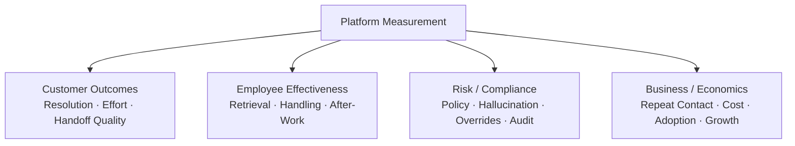

Containment or automation rate is not the only success metric. Resolution quality, continuity, trust, employee effectiveness and compliance matter at least as much in banking scenarios.

## 14. Documentation Hierarchy

This document sits above implementation decomposition. It is not an EPIC document.

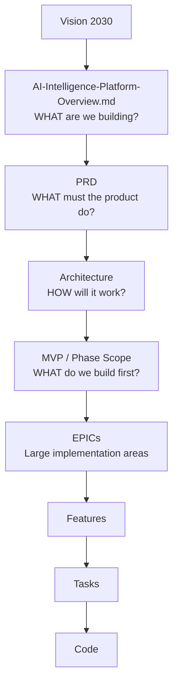

Every future EPIC should be traceable to an approved product/phase capability. This prevents interesting AI experiments from expanding scope without contributing to the agreed business journey.

## 15. Repository Map

Use this file as the entry point. Detailed documentation provides drill-down, not a competing product definition.

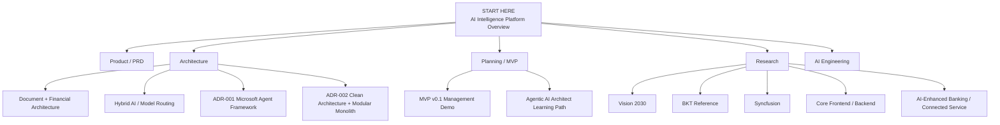

## 16. One-Sentence Management Explanation

> We are building one Enterprise AI Intelligence Platform on top of our existing Core systems, exposed through connected Assistant, Copilot and Advisor experiences; we start with a small Document & Financial Intelligence Copilot MVP, keep deterministic banking logic and humans in control, and progressively connect Loan, DDC, BPMN, customer journeys and advisor workflows using the same governed, on-prem/hybrid-capable AI foundation.

## 17. The Picture to Remember

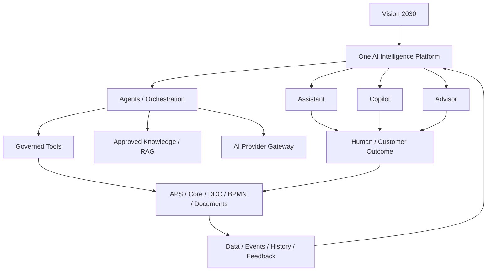

Everything else in the repository explains how this shared intelligence foundation will be implemented, validated, governed, measured and expanded.
