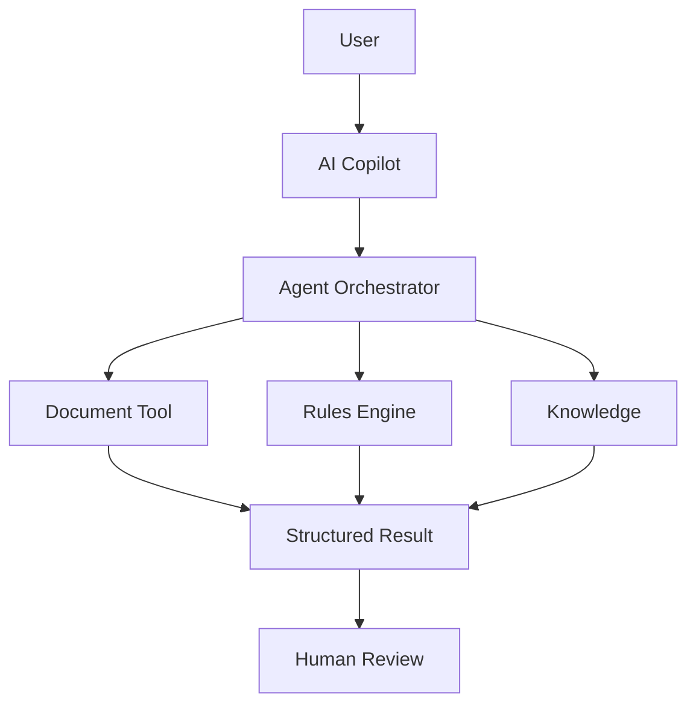

# Documentation Standards

## Purpose

This document defines mandatory documentation and visual-explanation standards for all product and AI-engineering work in this repository.

The goal is to make architecture, workflows, agent behavior, dependencies, and implementation plans easier to understand and review without relying on prose alone.

## 1. Visual-First Explanation Rule

Whenever a document or agent output explains a non-trivial process, architecture, workflow, lifecycle, dependency, state transition, or component interaction, it must include at least one diagram or visual flow.

A significant explanation should not consist only of prose.

## 2. Preferred Diagram Formats

Use the simplest format that communicates the idea clearly.

### Mermaid

Use Mermaid for maintained documentation when describing:

- Architecture
- Component relationships
- Sequence flows
- State transitions
- Decision flows
- Data movement
- Agent orchestration
- Deployment topology
- Dependencies

Example:



### ASCII / Text Diagrams

Use ASCII/text diagrams for quick explanations, discussion notes, lightweight research, or when Mermaid would add unnecessary complexity.

Example:

```text
Document
  -> Extraction
  -> Structured Data
  -> Validation
  -> Rules
  -> AI Explanation
  -> Human Review
```

## 3. What Diagrams Should Show

When applicable, diagrams should make the following visible:

- Inputs
- Actors/users
- Components/services
- Processing steps
- Data movement
- Decisions
- Dependencies
- Outputs
- Human approval points
- External integrations
- Error/fallback paths
- Feedback loops

Do not add decorative diagrams that do not improve understanding.

## 4. Mandatory by Artifact Type

### PRD

A PRD must contain diagrams for major user/product flows and the overall product capability model when those concepts become sufficiently defined.

### Architecture

Architecture documents must contain maintained diagrams. At minimum, include:

- High-level system context
- Major components and dependencies
- Main runtime flow

Additional sequence, deployment, security, data, or integration diagrams should be added where useful.

### MVP

MVP documentation must show the end-to-end MVP flow and clearly distinguish in-scope and out-of-scope components.

### EPIC / Feature Documentation

Non-trivial EPICs and Features should include a flow or component diagram when implementation depends on multiple components, services, states, or actors.

### GitHub Issues

Simple implementation tasks do not require diagrams. Issues involving architecture, integration, workflow, orchestration, non-trivial data flow, or complex behavior should include or link to the relevant diagram.

### Research

Research notes should use diagrams when translating an external concept into an internal architecture, workflow, or capability model.

## 5. Agent Requirements

The same visual-explanation rule applies to all engineering agents and AI tools.

### Planner

A Planner output for non-trivial work must include a flow showing:

```text
Requirement
  -> Components affected
  -> Implementation steps
  -> Validation / Tests
  -> Review
```

It should also include a more specific architecture/data flow when the work requires one.

### Worker

Before implementing non-trivial behavior, the Worker should understand or provide a flow showing the implementation path and component interactions.

### Reviewer

When identifying an architectural, lifecycle, dependency, or control-flow problem, the Reviewer should include a small diagram where it materially clarifies the issue and recommended correction.

### Other Agents

Future agents, skills, commands, and provider-specific instructions inherit this rule unless an output is genuinely trivial.

## 6. Diagram Maintenance Rule

Diagrams are part of the source of truth.

When a documented design changes, the corresponding diagram must be updated in the same change.

A diagram that contradicts the text or current implementation is a documentation defect and must be corrected.

## 7. Text and Diagram Must Agree

A diagram supplements explanation; it does not replace precise requirements.

Every important diagram should have enough surrounding text to explain:

- What the diagram represents
- What assumptions it makes
- Which components are authoritative
- Which parts are current versus proposed

## 8. Source vs Interpretation

When documenting external research, distinguish clearly between:

1. **Source-derived content** — what the source explicitly states.
2. **Internal interpretation** — how the concept may map to our product or architecture.
3. **Proposed requirement** — what we are considering adding to the source of truth.

Diagrams based on interpretation must be labeled as such and must not be presented as if they were copied from the source.

## 9. Language

All diagrams, labels, captions, comments, and accompanying documentation committed to the repository must be written in professional English.

## 10. Review Checklist

Before approving a major Markdown change, verify:

- Does the document explain the main flow visually?
- Is the diagram current?
- Does the diagram match the text?
- Are inputs, outputs, dependencies, and decision points clear?
- Are human approval points visible where relevant?
- Are proposed concepts distinguished from implemented/current behavior?
- Is the diagram understandable without reading the entire repository?

## Working Principle

If a concept is difficult to explain without several paragraphs, first try to draw the flow.
