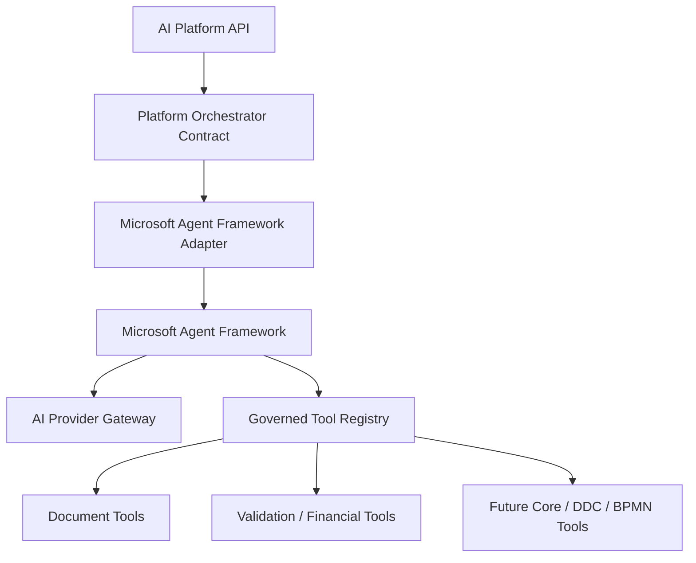
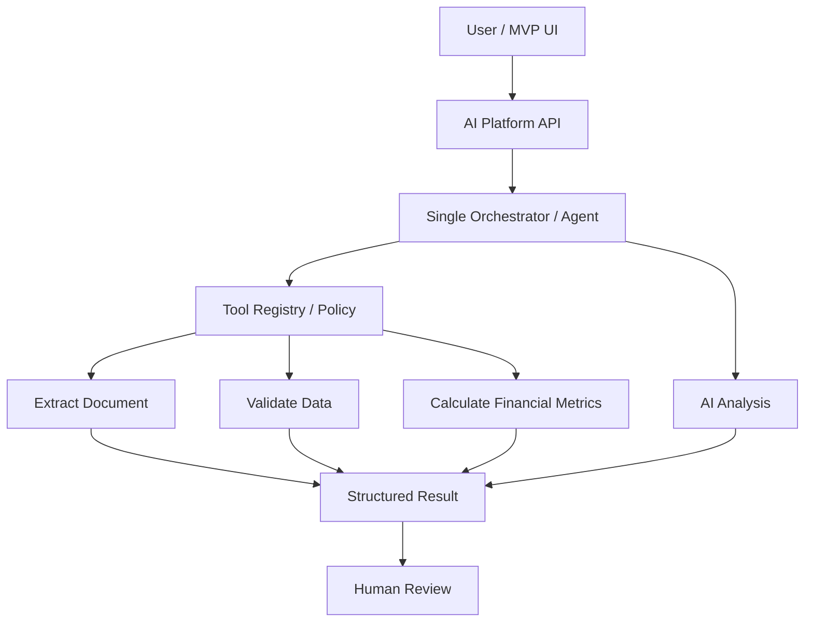
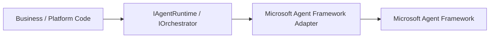
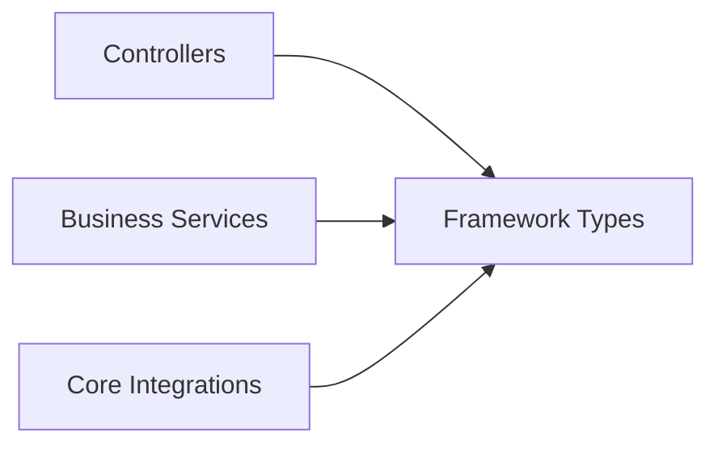
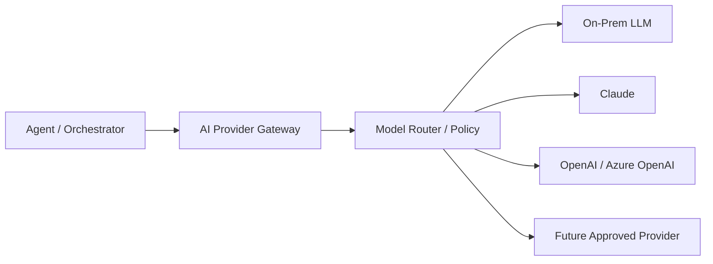
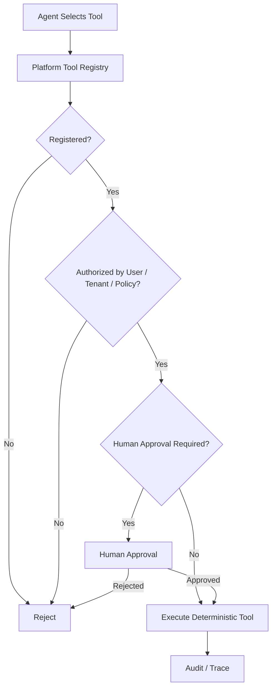
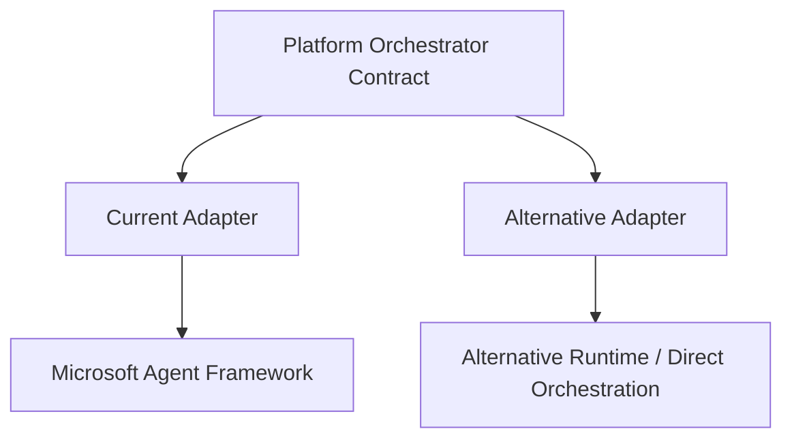

# ADR-001 — Microsoft Agent Framework as MVP Orchestration Candidate

**Status:** Proposed / evaluate in MVP  
**Decision scope:** Agent/orchestration implementation for the Enterprise AI Intelligence Platform MVP  
**Important:** This is an implementation choice behind platform-owned abstractions, not a permanent product dependency.

## 1. Context

The Enterprise AI Intelligence Platform needs an orchestration/runtime approach for agentic capabilities such as model interaction, governed tool calling, structured outputs, streaming, human review, and later more advanced orchestration patterns.

Our first MVP is intentionally small: a single orchestrator/agent coordinates document extraction, deterministic validation, financial calculation, AI analysis, evidence, and human review. Multi-agent collaboration is not required for MVP v0.1.

## 2. Proposed Decision

Use **Microsoft Agent Framework as the preferred first orchestration framework to evaluate for MVP implementation**, while protecting the platform through our own orchestration/runtime abstraction.

The rest of the platform must not depend directly on framework-specific agent types or APIs.

## 3. Why It Is a Strong MVP Candidate

The candidate aligns with our .NET / ASP.NET Core technology direction and with the agent/tool patterns identified during Syncfusion research. It is suitable to evaluate for the first patterns we need: an agent/orchestrator, tool invocation, structured interactions, streaming/tool activity, and future orchestration expansion.

This does **not** mean that every AI operation needs an agent. Deterministic workflow/code remains preferable when reasoning is unnecessary.

## 4. MVP Usage

For MVP v0.1, avoid introducing multiple collaborating agents unless implementation evidence demonstrates a real need.

## 5. Abstraction Boundary

Preferred dependency direction:

Avoid:

Framework-specific concepts should be translated at the adapter boundary into platform-owned request, tool, result, trace, approval, and error models.

## 6. Model Independence

Microsoft Agent Framework must not become the place where the application hardcodes a single LLM provider.

The platform's hybrid/on-prem architecture and provider-routing policy remain authoritative.

## 7. Tool Governance

Framework tool/function calling does not replace platform authorization.

System prompts are behavioral guidance, not security controls.

## 8. Evaluation Criteria

Before promoting this ADR from Proposed to Accepted, evaluate the framework against:

- .NET / ASP.NET Core integration quality;
- tool/function calling and typed/structured outputs;
- streaming support;
- human-in-the-loop integration;
- observability and traceability;
- testability and evaluation support;
- error handling, cancellation, retries and timeouts;
- long-running orchestration needs;
- future multi-agent support;
- compatibility with on-prem and cloud model providers;
- compatibility with our AI Provider Gateway and Tool Registry boundaries;
- deployment requirements for financial institutions;
- framework maturity and operational stability;
- vendor lock-in and replacement cost.

## 9. Alternatives

Alternatives should be compared when we have concrete MVP requirements and implementation evidence. Candidates may include direct model/tool orchestration using platform code and other orchestration/agent frameworks.

The decision should not be driven by feature count. Prefer the simplest approach that satisfies enterprise governance, portability, observability and maintainability requirements.

## 10. Exit / Replacement Strategy

If Microsoft Agent Framework does not meet MVP or enterprise requirements, replace the adapter rather than redesigning the platform.

Platform-owned tool contracts, domain schemas, audit models, provider gateway, security policies and deterministic Core integrations remain unchanged.

## 11. Current Decision Summary

> **Microsoft Agent Framework is the preferred first implementation candidate for agent/orchestration capabilities in MVP evaluation, not a permanent architectural dependency.**

We start with a single orchestrator/agent plus governed tools. We preserve provider independence, on-prem/hybrid deployment, deterministic Core authority, human-in-the-loop controls, and an abstraction boundary that allows the framework to be replaced if evaluation shows a better option.
