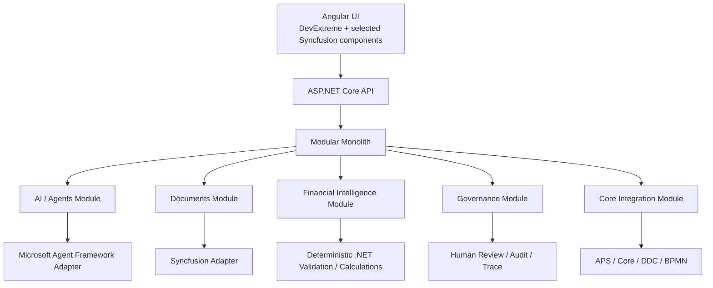
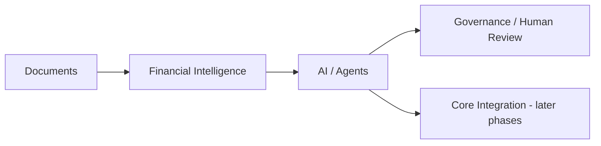
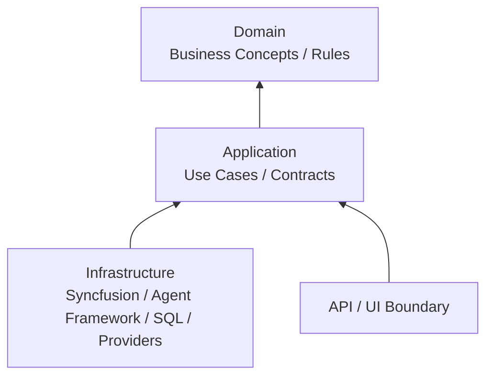
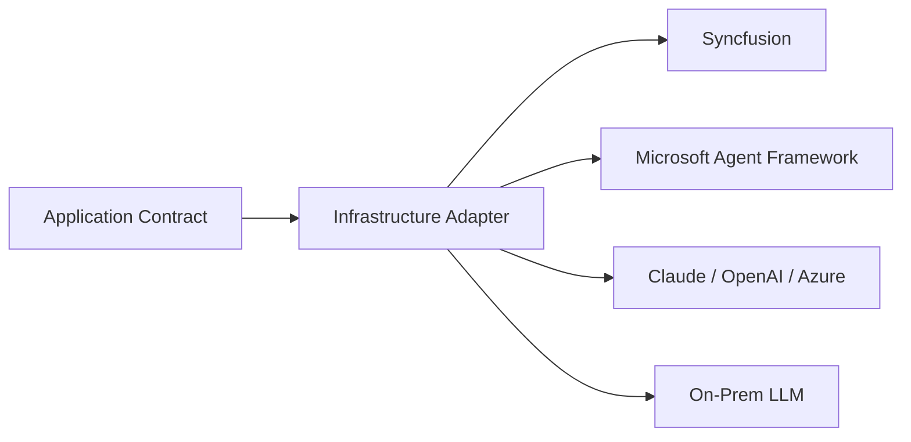
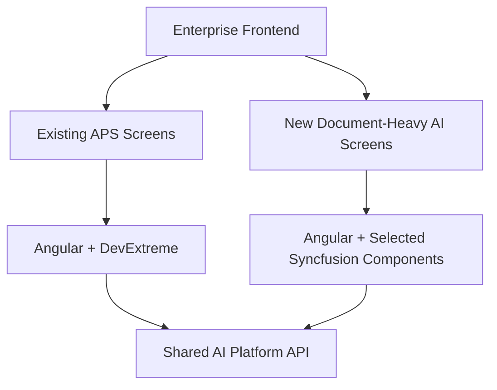
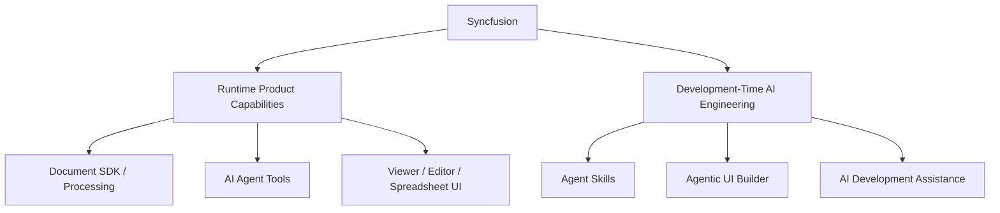
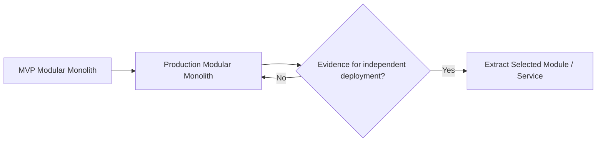
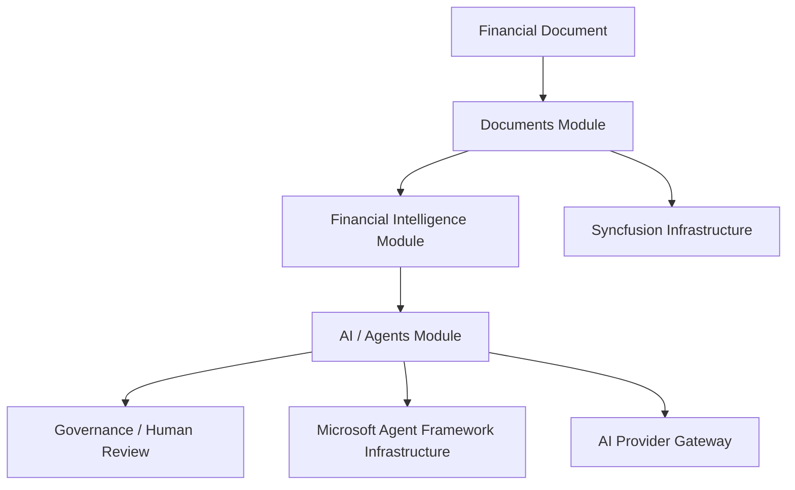

# ADR-002 — Clean Architecture + Modular Monolith

**Status:** Accepted architecture baseline  
**Applies to:** Enterprise AI Intelligence Platform and MVP evolution

## Decision

The Enterprise AI Intelligence Platform will start as a **Modular Monolith** implemented with **Clean Architecture principles per module**.

The objective is to keep MVP deployment and operations simple while preserving strong boundaries that allow modules, providers, agent runtimes, and integrations to evolve independently.



## Initial Module Boundaries

1. **Documents** — ingestion, extraction, evidence, deterministic document processing and provider adapters.
2. **Financial Intelligence** — platform financial schemas, validation, calculations, ratios and analysis inputs.
3. **AI / Agents** — orchestration abstraction, tool registry, AI provider gateway and Microsoft Agent Framework adapter.
4. **Governance** — human-in-the-loop, audit, traces, approvals and policy-related concerns.
5. **Core Integration** — governed adapters/tools for APS/Core, DDC and BPMN; minimal in MVP v0.1 and expanded later.



## Clean Architecture per Module

Each business module should protect domain/application logic from framework and vendor dependencies.



Conceptual solution structure:

```text
src/
├── AiPlatform.Api/
├── Modules/
│   ├── Documents/
│   │   ├── Documents.Domain/
│   │   ├── Documents.Application/
│   │   ├── Documents.Infrastructure/
│   │   └── Documents.Contracts/
│   ├── FinancialIntelligence/
│   ├── Agents/
│   ├── Governance/
│   └── CoreIntegration/
└── Shared/
    └── BuildingBlocks/
```

The exact project count may be simplified during MVP implementation. The architectural requirement is **clear module and dependency boundaries**, not creating projects for their own sake.

## Provider Boundaries

Vendor/framework implementations belong in Infrastructure/adapters.



Domain/application logic must not require Syncfusion, Microsoft Agent Framework, Claude, OpenAI, Azure OpenAI, or a specific local LLM.

## Frontend Decision

Existing APS applications remain based on **Angular + DevExtreme**. We do not replace DevExtreme simply because Syncfusion is available.

For new document-heavy AI experiences, selected Syncfusion runtime components may be evaluated where they provide clear value, particularly PDF/document/spreadsheet viewing or editing and evidence review.



## Syncfusion Position

Syncfusion is a licensed and strategically useful **document/UI provider**, not the AI Platform itself.

Runtime candidates include Document SDK/document-processing capabilities, AI Agent Tools, PDF/document/spreadsheet components, extraction/form-recognition capabilities validated through research, and other document-heavy UI capabilities where appropriate.

Development-time capabilities such as Agent Skills, Agentic UI Builder and AI coding/development assistance remain in the AI Engineering stream and must not be confused with runtime product architecture.



## Why Modular Monolith First

The first MVP is a small vertical slice and does not justify distributed microservice complexity. A modular monolith provides simpler deployment, debugging, transactions and local/on-prem operation while still enforcing logical boundaries.

Modules may be extracted into separate deployables later only when scale, security isolation, independent lifecycle, deployment ownership, or operational evidence justifies it.



## Hard Architecture Principles

- Modular Monolith first.
- Clean Architecture principles per module.
- Provider/framework abstraction at infrastructure boundaries.
- Deterministic Core remains authoritative for calculations, validation, rules, permissions, workflow authority and system-of-record writes.
- Human-in-the-loop for consequential AI-assisted outcomes.
- On-premises, hybrid and approved cloud deployment are first-class architecture concerns.
- Structured contracts between modules/tools are preferred over free-form AI prose.
- No direct coupling of enterprise UI components to arbitrary AI providers.
- No microservice decomposition without a demonstrated operational reason.

## Consequence for MVP

MVP v0.1 can remain one deployable ASP.NET Core solution while still proving the long-term boundaries:



This lets us build small now without creating a disposable prototype architecture.
