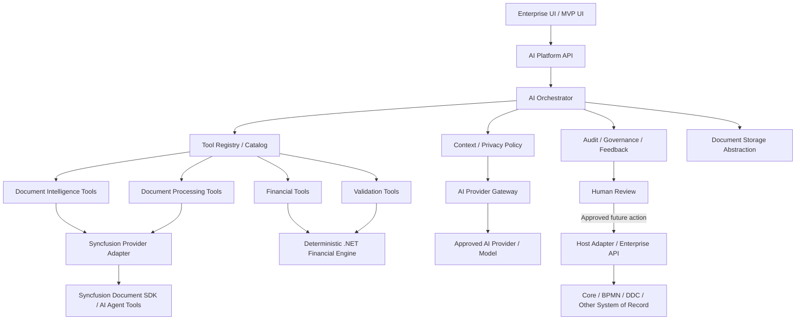
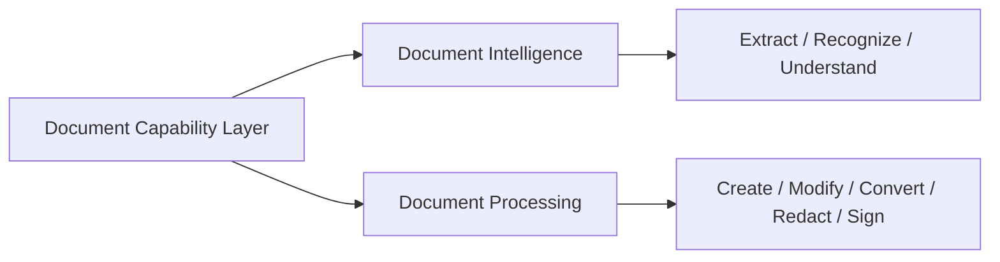
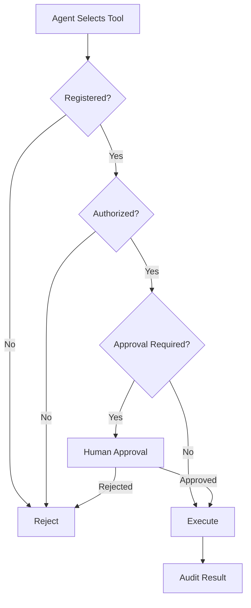
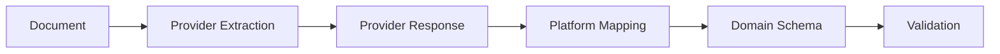
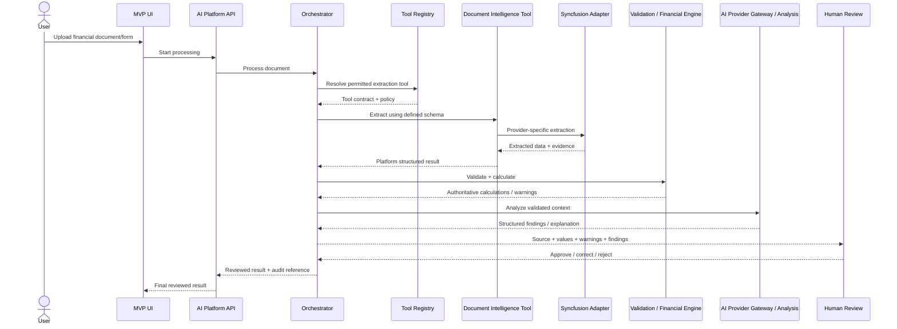

# Document & Financial Intelligence — Architecture Draft

**Status:** Architecture hypothesis for MVP validation  
**Strategic source:** Vision 2030  
**Research input:** Syncfusion Document Solutions 2026 Volume 1/2 plus Document Processing, Agent Workflow, and Embedded AI webinars

## 1. Purpose

Define the first reusable architecture slice of the Enterprise AI Intelligence Platform around document understanding, structured financial data, deterministic validation/calculation, AI analysis, evidence, human review, and governed tool execution.

This is not a Syncfusion architecture. Syncfusion is one candidate implementation behind platform-owned document contracts.

## 2. Core Architecture Rules

1. **AI understands, analyzes, explains, recommends, and selects governed tools.**
2. **Deterministic services remain authoritative** for validation, calculations, permissions, document mutations, workflow state, and system-of-record writes.
3. **System prompts guide behavior; platform policy enforces behavior.** Authorization and consequential-action approval cannot rely on prompts alone.
4. **Enterprise UIs call the AI Platform, not arbitrary model providers directly.**
5. **Provider-specific document models do not become domain models.** Structured business schemas are platform-owned.

## 3. Target Component Model

## 4. Logical Components

### 4.1 Document Ingestion

Receives an uploaded or referenced business document and records metadata, source, type, security context, and processing status.

### 4.2 Document Intelligence Capability

Understands and structures documents. Candidate responsibilities include:

- table/data extraction;
- form recognition;
- classification/understanding where needed;
- source evidence capture;
- mapping provider output into platform-owned schemas.

### 4.3 Document Processing Capability

Executes deterministic document operations. Candidate responsibilities include:

- create/generate;
- modify;
- convert;
- redact;
- sign;
- annotate.

### 4.4 Syncfusion Provider Adapter

Candidate implementation of Document Intelligence/Processing contracts using evaluated Syncfusion capabilities. Business/orchestration code must not depend directly on Syncfusion-specific APIs or response models.

### 4.5 Tool Registry / Catalog

Provides the orchestrator with an explicit catalog of available governed tools. Tool metadata should ultimately include contract/schema, permissions, risk/approval policy, provider/implementation, and audit behavior.

Future tool families can include Document, Financial, Validation, BPMN, DDC and Core/API tools without changing the orchestration model.

### 4.6 Tool Authorization and Policy

Before a tool executes, the platform must verify availability, user/role authorization, policy, and whether human approval is required.

### 4.7 Document Storage Abstraction

Input and generated documents should use a storage abstraction. MVP may use controlled local storage; production may use approved blob/object/client-specific storage without changing business orchestration.

### 4.8 Structured Schema Layer

Extraction output used by business systems must conform to a platform/domain schema rather than free-form prose.

### 4.9 Validation and Deterministic Financial Engine

Validates required fields, data types, periods, currencies, totals, cross-field consistency, and configured rules. Financial ratios/calculations execute deterministically outside the LLM.

### 4.10 AI Provider Gateway

Centralizes approved model/provider access. Enterprise UI components must not independently decide what sensitive document/business context is sent to an external provider. The gateway boundary supports provider replacement, data/privacy policy, configuration and audit.

### 4.11 AI Analysis Layer

Consumes validated structured data, deterministic results, authorized context and evidence to produce structured explanations, anomalies, trends, risk indicators, summaries, recommendations and draft conclusions.

### 4.12 AI Experience Layer

The broader platform should support more than chat. Candidate experience patterns include Copilot/chat, inline contextual actions, side panels, review/compare, contextual Q&A, and background intelligence. For the first MVP, the highest-value pattern is source/evidence beside extracted/AI results with accept/correct/reject controls.

### 4.13 Evidence and Confidence

Material extracted values or AI findings should be traceable to source evidence where technically possible. Confidence is advisory and never substitutes for deterministic validation or human review.

### 4.14 Audit / Feedback / Execution Telemetry

Capture tool selection/execution, model/provider metadata, validation results, AI outputs, corrections, review decisions and relevant processing events. Streaming execution activity may improve UX/observability but is not itself an authorization mechanism.

### 4.15 Host Adapter

Approved authoritative writes occur only through governed enterprise APIs/adapters. The model never writes directly to the system of record.

## 5. First MVP Processing Flow

## 6. MVP Guardrails

- No direct LLM access to production databases.
- No LLM-authored authoritative financial calculations.
- No automatic system-of-record write from extracted data.
- No provider-specific document model exposed as the platform/domain model.
- Human review is mandatory for consequential extracted/derived results in the first MVP.
- Document mutations such as permanent redaction are deterministic tool actions and must be explicitly authorized/audited.
- Tool authorization is enforced by code/policy, not by prompt text.
- UI components do not directly select arbitrary AI providers for enterprise data.
- Significant tool calls, validations, AI findings, provider/model metadata and review decisions are auditable.

## 7. MVP Provider Evaluation Questions

Before selecting Syncfusion for production, test complex financial statement extraction, form recognition, preservation of hierarchy/periods/currencies/units/totals, scanned documents, evidence/confidence metadata, on-premise/data residency, performance/licensing, Smart Spreadsheet financial semantics, storage integration, and AI Agent Tool compatibility with our tool registry/authorization model.

## 8. Deferred Capabilities

Outside the first technical slice unless required to validate a core requirement: autonomous workflow changes, broad multi-agent autonomy, customer-facing assistant, general document editor feature parity, advanced annotation UX, production banking write-back, self-modifying rules/schemas, and general-purpose writing/translation/grammar features.
