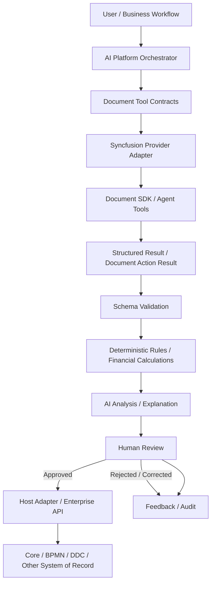
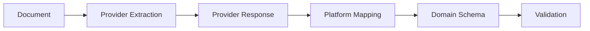
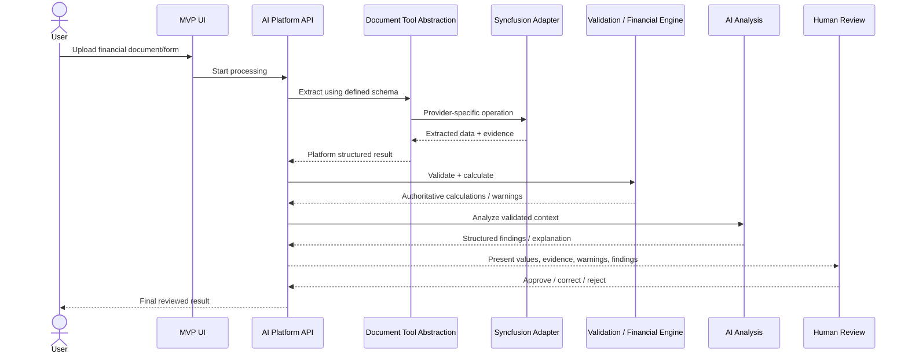
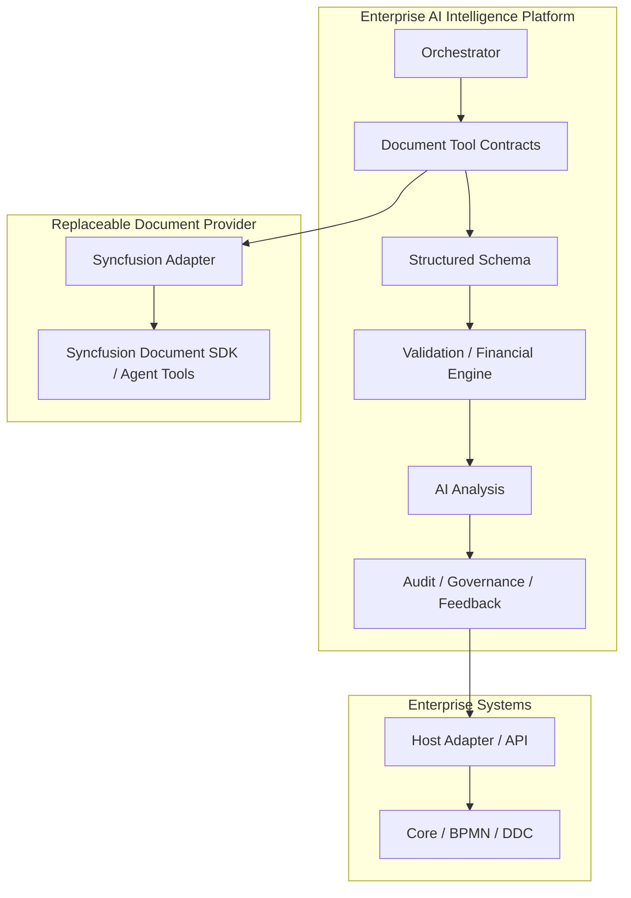

# Document & Financial Intelligence — Architecture Draft

**Status:** Architecture hypothesis for MVP validation  
**Strategic source:** Vision 2030  
**Research input:** Syncfusion Document Solutions 2026 Volume 1 and Volume 2

## 1. Purpose

Define the first reusable architecture slice of the Enterprise AI Intelligence Platform around document understanding, structured financial data, deterministic validation/calculation, AI analysis, evidence, and human review.

This is not a Syncfusion architecture. Syncfusion is one candidate implementation behind platform-owned document contracts.

## 2. Core Architecture Rule

**AI understands, analyzes, explains, recommends, and selects governed tools. Deterministic services remain authoritative for validation, calculations, workflow state, permissions, document mutations, and system-of-record writes.**

## 3. Logical Components

### 3.1 Document Ingestion

Receives an uploaded or referenced business document and records metadata, source, type, security context, and processing status.

### 3.2 Document Capability Abstraction

Platform-owned contracts isolate business/orchestration code from a document vendor.

Candidate responsibilities:

- extract structured data/tables;
- recognize forms;
- convert supported document formats;
- redact sensitive content;
- process spreadsheets;
- generate/modify documents when explicitly governed.

### 3.3 Syncfusion Provider Adapter

Candidate implementation of document contracts using evaluated Syncfusion Document SDK / AI Agent Tools capabilities. The adapter translates provider-specific responses into platform-owned schemas and evidence models.

### 3.4 Structured Schema Layer

Extraction output used by business systems must conform to a platform/domain schema rather than free-form prose.

### 3.5 Validation and Deterministic Financial Engine

Validates required fields, data types, periods, currencies, totals, cross-field consistency, and configured business rules. Financial ratios and calculations are executed deterministically outside the LLM.

### 3.6 AI Analysis Layer

Consumes validated structured data, deterministic results, authorized context, and evidence to produce findings such as:

- explanations;
- anomalies;
- trends;
- risk indicators;
- summaries;
- recommendations;
- draft conclusions.

The AI output should be structured where downstream processing depends on it.

### 3.7 Evidence and Confidence

Every material extracted value or AI finding should be traceable to source evidence where technically possible. Confidence is advisory and must not substitute for validation.

### 3.8 Human Review

Consequential results require review before authoritative application. Review must support accept, reject, and correct behavior and preserve the decision in audit/feedback data.

### 3.9 Host Adapter

Approved results are written only through governed enterprise APIs/adapters. The AI/model never writes directly to the system of record.

## 4. First MVP Processing Flow

## 5. Component Boundary

## 6. MVP Guardrails

- No direct LLM access to production databases.
- No LLM-authored authoritative financial calculations.
- No automatic system-of-record write from extracted data.
- No provider-specific document model exposed as the platform/domain model.
- Human review is mandatory for consequential extracted/derived results in the first MVP.
- Document mutations such as permanent redaction are deterministic tool actions and must be explicitly authorized/audited.
- All significant tool calls, inputs/outputs, validations, AI findings, and review decisions are auditable.

## 7. MVP Provider Evaluation Questions

Before selecting Syncfusion for production, test:

1. Complex financial statement extraction accuracy.
2. Form recognition against our defined schemas.
3. Preservation of table hierarchy, periods, currencies, units, totals, and merged cells.
4. Scanned PDF and image quality tolerance.
5. Evidence/source-location and confidence metadata.
6. On-premise and data-residency behavior.
7. Performance and licensing constraints.
8. Smart Spreadsheet suitability for financial semantics.
9. AI Agent Tools integration model and compatibility with platform tool contracts.

## 8. Deferred Capabilities

The following remain outside the first technical slice unless needed to validate a core requirement:

- autonomous workflow changes;
- broad multi-agent autonomy;
- customer-facing assistant;
- general document editor feature parity;
- advanced annotation UX;
- production write-back to banking systems;
- self-modifying rules or schemas.
