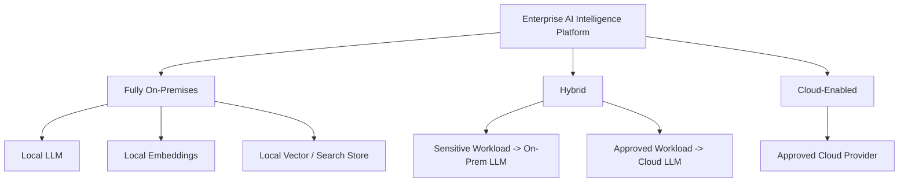
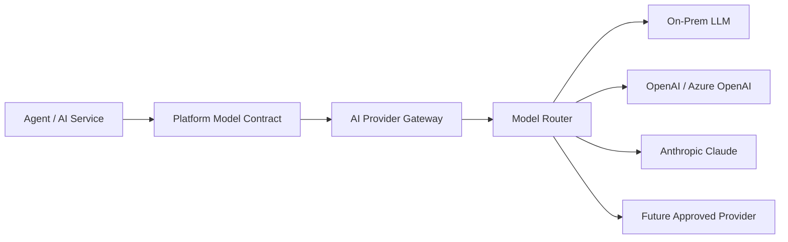
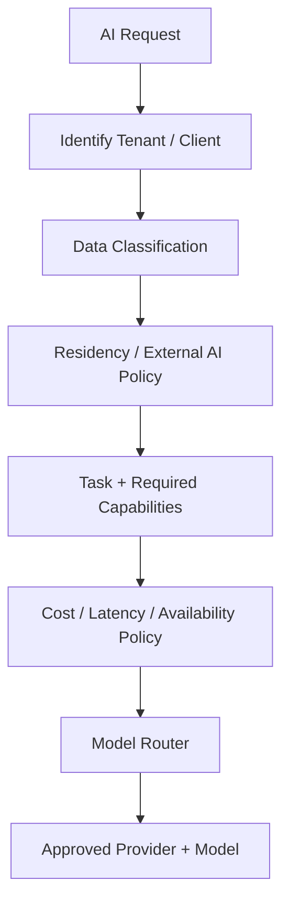
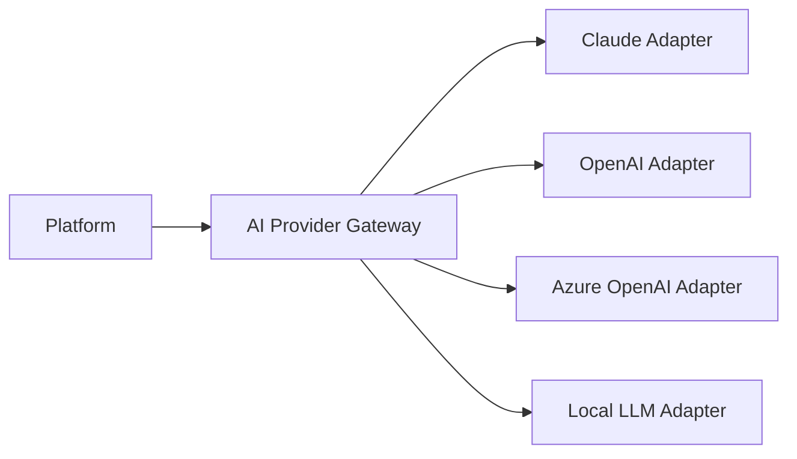
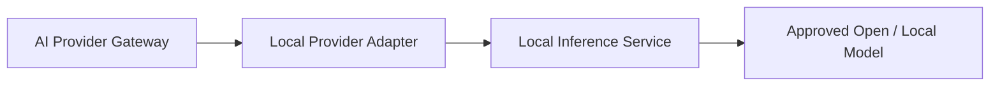
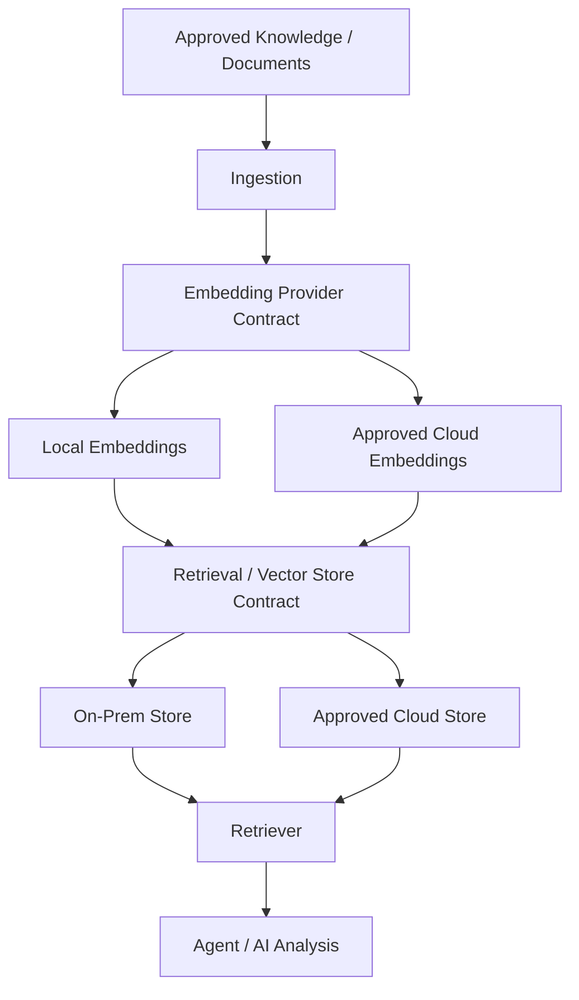
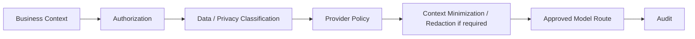
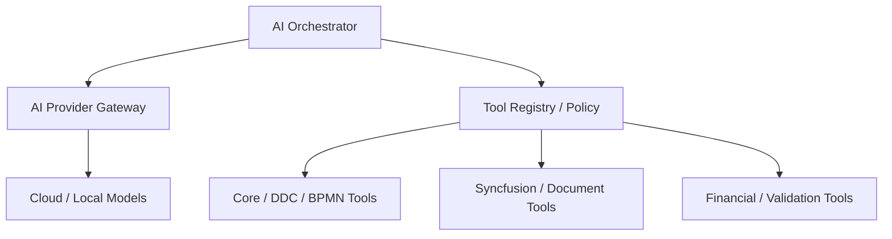

# Hybrid AI Deployment and Model Routing

**Status:** Architecture principle / target capability  
**Applies to:** Enterprise AI Intelligence Platform, agents, RAG, document intelligence, Core integration

## 1. Requirement

The platform must support **fully on-premises, hybrid, and cloud-enabled deployments**. Most financial-institution deployments may require significant on-premises processing, while approved workloads should retain the option to use cloud/open LLM providers.

Agents and business services must not depend directly on a specific model vendor. Model/provider selection is a platform responsibility.

## 2. Deployment Modes

### Fully On-Premises

Core, AI Platform, orchestration, RAG, document processing, embeddings, vector/search storage and LLM inference can operate inside the customer network.

### Hybrid

The platform can route workloads between local and cloud models according to tenant policy, data classification, capability, cost, latency and residency requirements.

### Cloud-Enabled

Approved clients/workloads can use external AI providers while still passing through the same AI Platform governance boundary.

## 3. AI Provider Gateway

Agents request **capabilities**, not model brands. A Financial Analysis Agent should describe requirements such as structured output, reasoning capability, context size and confidentiality; the router selects an allowed implementation.

## 4. Model Routing Policy

Candidate routing inputs:

- tenant/client policy;
- task type;
- data classification;
- external-provider permission;
- residency requirements;
- required model capabilities;
- structured-output/tool-calling requirements;
- context size;
- cost ceiling;
- latency target;
- provider/model availability;
- approved fallback policy.

## 5. Claude and Other Cloud Providers

Claude is treated as an **optional provider behind the AI Provider Gateway**, not as an architectural dependency. The same rule applies to OpenAI, Azure OpenAI and future providers.

Provider-specific features may be used through adapters where valuable, but platform/domain contracts, audit models, security policy and business workflows remain provider-independent.

## 6. On-Prem LLM Boundary

The exact local inference technology/model remains a deployment decision. The architecture must allow an approved local serving stack/model to satisfy the same platform contract where capabilities permit.

No specific local model is mandated by this architecture document.

## 7. RAG Provider Independence

LLM routing alone is insufficient. Embeddings and retrieval infrastructure must also preserve deployment independence.

LLM provider, embedding provider, and retrieval/vector-store implementation should be independently replaceable where practical.

## 8. Security Principle

Sensitive data must not be sent to an external model merely because a UI component or agent selected it. Routing is governed centrally.

## 9. Relationship to Tool Architecture

Model portability and tool portability are separate concerns.

The model reasons and selects permitted tools; deterministic enterprise services execute authoritative operations.

## 10. Architecture Decision

**Deployment and Model Independence:** The Enterprise AI Intelligence Platform must support fully on-premises, hybrid, and cloud-enabled deployments. LLMs, embedding models, retrieval/vector stores, document providers, and external AI services must be accessed through platform-owned abstraction boundaries. Provider selection must be governed by tenant policy, data classification, capability, cost, latency, availability and residency requirements.
