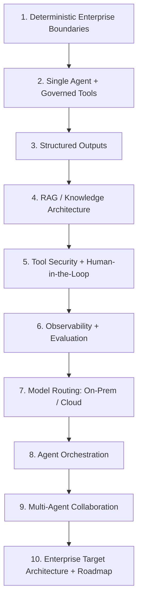
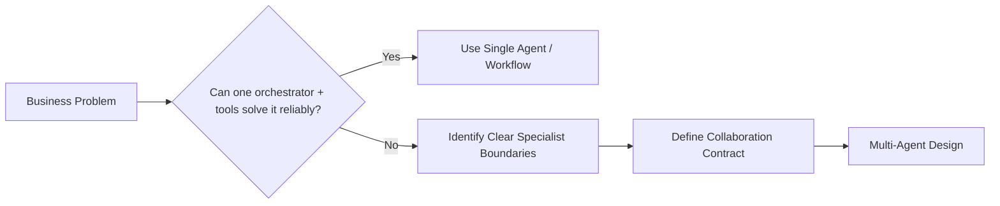
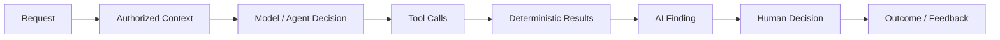
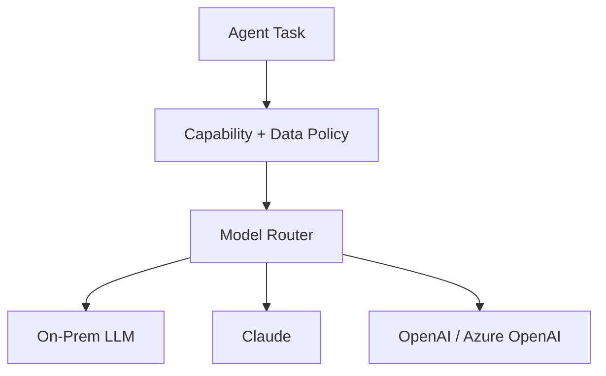
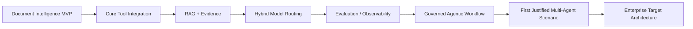

# Agentic AI Architect — Project Learning Path

**Purpose:** Use the Enterprise AI Intelligence Platform as a practical architecture-learning program, not only as a software project.

## Target Role

The target capability is **Agentic AI Architect**: able to design target AI architecture, agent roles and collaboration, human-in-the-loop processes, shared data models, traceability/audit, enterprise integrations, prototypes, technology choices and implementation roadmaps.

## Role-to-Project Mapping

| Agentic AI Architect responsibility | Practical work in this project |
|---|---|
| Target solution architecture | Enterprise AI Intelligence Platform architecture for APS/Core and reusable client deployments |
| Agent roles and decision logic | Define when a single agent, tool-driven workflow, reviewer, specialist agent or human is appropriate |
| Multi-agent systems | Introduce collaboration only where decomposition provides measurable value |
| Human-in-the-loop | Approval/review for consequential financial and enterprise actions |
| Shared data models | Financial schemas, evidence, tool results, decision/audit models |
| Traceability and monitoring | Tool/model traces, decisions, evidence, feedback, evaluation and operational telemetry |
| Enterprise integration | Core APIs, DDC, BPMN, validation, financial engines, document providers and identity |
| Functional prototypes | Document & Financial Intelligence MVP and later vertical slices |
| Technology recommendations | Orchestration, RAG, model routing, local/cloud inference, observability, evaluation |
| Roadmap | MVP -> governed agents -> broader connected intelligence -> justified multi-agent scenarios |

## Learning Sequence

## Architecture Skills to Practice

### Agent Design

For every proposed agent, document:

- objective and bounded responsibility;
- inputs/context;
- available tools;
- structured output contract;
- decision/stop/escalation logic;
- permissions;
- human approval points;
- failure behavior;
- audit/evaluation signals.

### Single-Agent Before Multi-Agent

Do not create multiple agents merely because an orchestration framework supports them.

### RAG

Learn ingestion, chunking, metadata, embeddings, retrieval, reranking, authorization filtering, citations/evidence, evaluation and on-prem/cloud deployment choices. RAG is a governed knowledge capability, not simply a vector database.

### Orchestration

Learn tool/function calling, workflow/state-machine orchestration, planning vs deterministic routing, retries/timeouts, idempotency, approval gates, long-running processes and multi-agent coordination.

### Enterprise Integration

Agents must use controlled APIs/tools rather than direct unrestricted database access. Existing Core rules, calculations, DDC, BPMN, validation and other enterprise engines remain authoritative.

### Traceability and Auditability

Architects should be able to explain how a consequential result was produced and which evidence/tools/models/humans participated.

## Hybrid / On-Prem AI as a Core Skill

The project deliberately requires architecture for fully on-premises, hybrid and cloud-enabled AI. This provides practical experience in provider abstraction, data residency, model routing, local inference, cloud providers such as Claude/OpenAI/Azure OpenAI, embedding/retrieval portability, security and fallback design.

## Architecture Decision Record Habit

For major decisions, document:

**Problem -> Constraints -> Options -> Architecture -> Decision -> Trade-offs -> Risks -> Validation -> Diagram**

This turns project implementation into reusable architecture experience and creates evidence of architectural reasoning rather than only framework familiarity.

## Project Milestones for Architect Growth

The objective is not to maximize the number of AI technologies used. The objective is to learn how to make defensible architecture choices for secure, auditable, portable enterprise agentic systems.
