# Build Roadmap — Vision 2030 + BKT AI + Technology

**Status:** Master implementation-order view  
**Purpose:** Answer four questions in one place:

1. What are we building?
2. In what order are we building it?
3. Which technology is used in each step?
4. Which Vision 2030 and BKT AI capabilities does each step deliver?

This document is a planning bridge between the high-level `AI-Intelligence-Platform-Overview.md` and future EPICs/Features/Tasks.

---

## 1. Product Destination

We are building **one Enterprise AI Intelligence Platform**, not a collection of isolated chatbots.

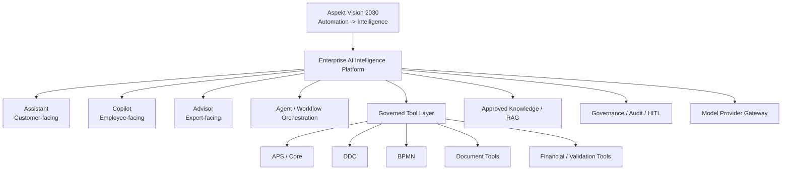

The platform augments deterministic enterprise systems. Authoritative calculations, validations, rules, permissions, workflow state and system-of-record writes remain outside the LLM.

---

## 2. Source Frame We Are Following

### Vision 2030 frame

Vision 2030 defines the strategic movement from **automation to intelligence**, with two complementary directions:

- **Internal Operational Intelligence** — observe, analyze, detect inefficiencies, predict bottlenecks/compliance risk, recommend improvements and continuously optimize workflows/data/processes.
- **Client-Facing / External Intelligence** — behavioral analytics, predictive modelling, intelligent recommendations, sentiment intelligence and proactive engagement.

Vision 2030 also identifies DDC, BPMN/workflow, validation, reporting/analytics, messaging/integration and other Product Suite engines as intelligence opportunities.

### AI-Enhanced Banking frame

The banking presentation gives us three user-facing AI roles built on one shared foundation:

- **Assistant** — customer self-service and bounded safe actions.
- **Copilot** — employee/operations support, retrieval, summarization, drafting and next-best-action guidance.
- **Advisor** — banker/expert preparation, client context, knowledge and follow-up support.

The presentation also emphasizes approved knowledge, orchestration, integration, shared context, model monitoring, auditability, authentication boundaries, risk-proportionate governance and human handoff.

### BKT AI frame

The BKT AI 1/2/3 demonstration is treated as a **credit-workflow reference pattern**, not a specification to clone. The consolidated pattern includes:

- AI Copilot inside the loan/credit workflow;
- business/domain commands rather than only generic chat;
- document extraction/classification;
- financial spreading and structured case data;
- deterministic ratios/rules/warnings;
- missing-document checks;
- AI explanation, summary and drafting;
- workflow blocker awareness;
- human review/decision.

---

## 3. Build Order — Big Picture

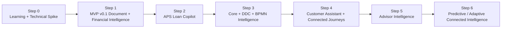

We deliberately start with a small employee-facing Copilot/financial-document slice rather than trying to build the entire Vision 2030 platform at once.

---

# STEP 0 — Learn and Prove the Building Blocks

## What we do

Before production MVP coding, learn and validate the smallest set of technologies needed for Step 1.

Recommended order:

1. Syncfusion Essential Studio Document Solutions — 2026 Volume 1.
2. What's New in Syncfusion Document Solutions — 2026 Volume 2.
3. Build AI Agent-Driven Document Workflows with the Syncfusion Document SDK.
4. Accelerate Document Writing, Editing, and Review with AI-Powered Workflows.
5. Syncfusion AI-powered development documentation.
6. Small Microsoft Agent Framework spike after the Syncfusion workflow concepts are understood.

## What we should understand before moving on

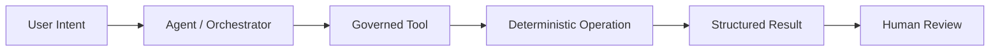

Key concepts:

- LLM vs agent vs tool;
- tool/function calling;
- structured output;
- provider abstraction;
- deterministic processing outside the LLM;
- human review;
- evidence and audit.

## Technology used

- Syncfusion Document SDK / Document Processing libraries;
- Syncfusion AI Agent Tools where useful;
- selected Syncfusion document UI components;
- .NET / ASP.NET Core;
- Microsoft Agent Framework as the preferred first orchestration candidate behind our abstraction;
- one approved LLM provider for development, while preserving the Provider Gateway boundary.

## Vision 2030 contribution

Foundation only. This step teaches the mechanism needed later to expose Product Suite capabilities as intelligence tools.

## BKT contribution

Foundation for BKT-style document extraction and domain-command execution.

---

# STEP 1 — MVP v0.1: Document & Financial Intelligence

## What we build

A management-presentable vertical slice using one real financial-document scenario.

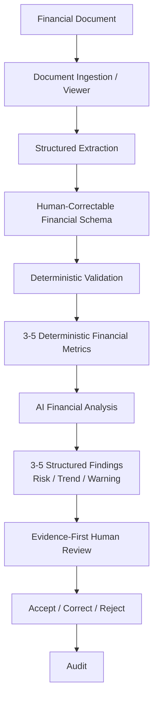

## Client / management sees

- original document;
- extracted structured values;
- source/evidence location;
- deterministic ratios/validation;
- AI explanation/findings;
- human correction and approval.

## Technology

- Angular;
- selected Syncfusion PDF/document UI for new document-heavy screen;
- ASP.NET Core;
- Clean Architecture + Modular Monolith;
- Documents module;
- Financial Intelligence module;
- Governance module;
- Microsoft Agent Framework adapter for the small agent/orchestration use case;
- Syncfusion Document SDK / extraction capabilities as first provider candidate;
- deterministic .NET validation/calculation tools;
- AI Provider Gateway;
- cloud LLM for development if approved, with local/on-prem provider contract preserved.

## Vision 2030 contribution

Delivers the first practical piece of **Internal Operational Intelligence**: turn raw financial documents into structured, reviewable intelligence while retaining deterministic business controls.

It also establishes patterns needed later by DDC, validation, reporting and analytical intelligence.

## BKT AI capabilities resolved

- document extraction;
- structured case/financial data;
- financial spreading foundation;
- deterministic ratios/rules/warnings;
- AI financial explanation;
- human review.

### BKT capabilities deliberately not yet resolved

- full Loan Application embedding;
- complete missing-document workflow;
- workflow blockers;
- authority explanation;
- production case write-back;
- broad credit proposal generation.

---

# STEP 2 — APS Loan Application Copilot

## What we build

Embed the proven intelligence capabilities into the real APS Loan Application.

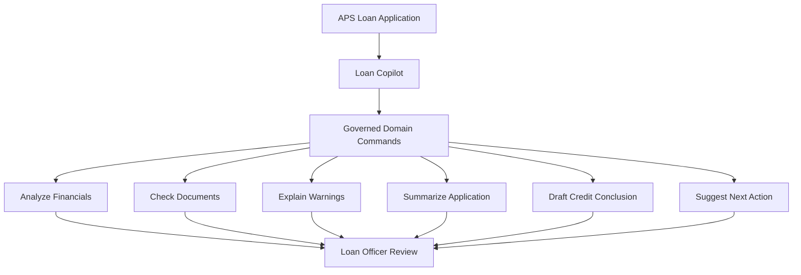

## Technology

- existing Angular + DevExtreme APS UI;
- contextual AI panel/actions, not a separate standalone chatbot;
- AI Platform API;
- Microsoft Agent Framework adapter;
- governed Tool Registry;
- Step 1 Document + Financial modules;
- Loan/Core APIs;
- shared structured case context;
- audit/HITL.

## Vision 2030 contribution

Moves AI into the operational Product Suite and begins the shift from execution-only software toward systems that **analyze, explain and recommend** within the flow of work.

## BKT AI capabilities resolved

This is the main **BKT-like visible user-experience phase**:

- Copilot inside loan/credit case;
- task/domain commands;
- document intelligence connected to application context;
- financial analysis;
- warnings/explanations;
- application summarization;
- draft conclusion/proposal patterns;
- recommended next action;
- human decision remains authoritative.

---

# STEP 3 — Core + DDC + BPMN Intelligence

## What we build

Expose deterministic enterprise capabilities as governed AI tools and add shared context across data and workflow.

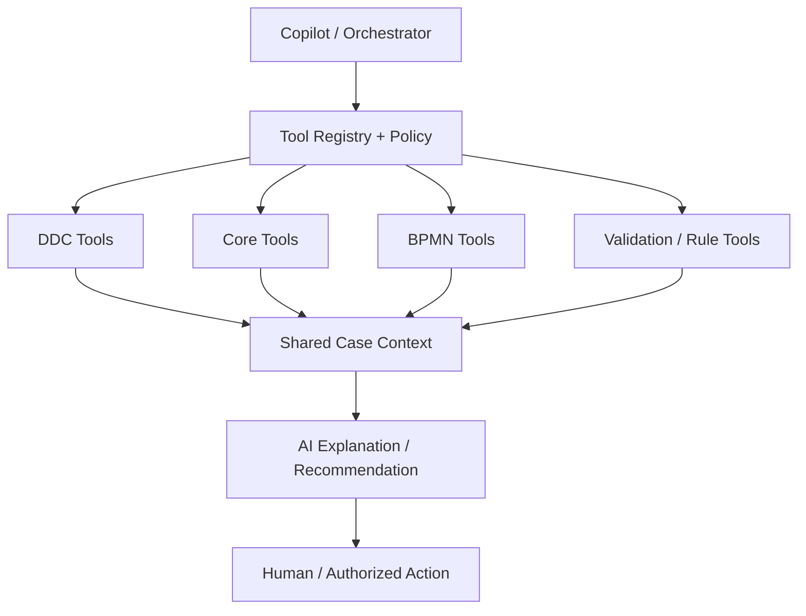

## Technology

- APS/Core APIs;
- DDC APIs/domain services;
- BPMN APIs/domain services;
- validation/rules services;
- Tool Registry + authorization/policy;
- shared context model;
- Agent Framework orchestration where reasoning is needed;
- deterministic workflow/state engines remain authoritative;
- audit and HITL.

## Vision 2030 contribution

This phase directly starts implementing major **Internal Operational Intelligence** concepts:

- DDC evolves from configuration utility toward intelligent data advisor;
- workflow state/history can support bottleneck and process insight;
- validation/rule capabilities become reusable governed tools;
- operational context becomes available for future pattern/prediction work.

## BKT AI capabilities resolved

- missing-document checks tied to authoritative product/case rules;
- workflow blocker awareness;
- next-step guidance;
- authority/rule explanation;
- richer application context;
- safe, governed interaction with enterprise systems.

---

# STEP 4 — Customer Assistant + Connected Journeys

## What we build

A customer-facing Assistant for bounded intents, connected to human service and employee Copilot without losing context.

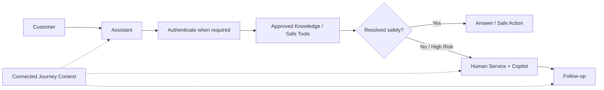

## Technology

- web/mobile/chat/voice channels as product need requires;
- shared AI Platform rather than a separate chatbot backend;
- RAG over approved knowledge;
- authentication/authorization boundaries;
- tool permissions;
- sentiment/confidence/escalation policy;
- connected journey/case context;
- deterministic safe operations through Core APIs;
- human handoff.

## Vision 2030 contribution

Begins the **Client-Facing / External Intelligence** path: intelligent interaction, proactive guidance and connected customer engagement.

## AI-Enhanced Banking contribution

Resolves the Assistant model:

- high-volume bounded intents;
- answer/guide/process initiation;
- safe actions where policy permits;
- intelligent handoff with context;
- customer does not restart the story at every channel.

## BKT relation

BKT is mainly an internal credit Copilot reference, so this phase is not driven primarily by BKT. It reuses the same shared foundation created by the earlier BKT-like loan phases.

---

# STEP 5 — Advisor Intelligence

## What we build

Expert-facing intelligence for bankers, relationship managers and specialists.

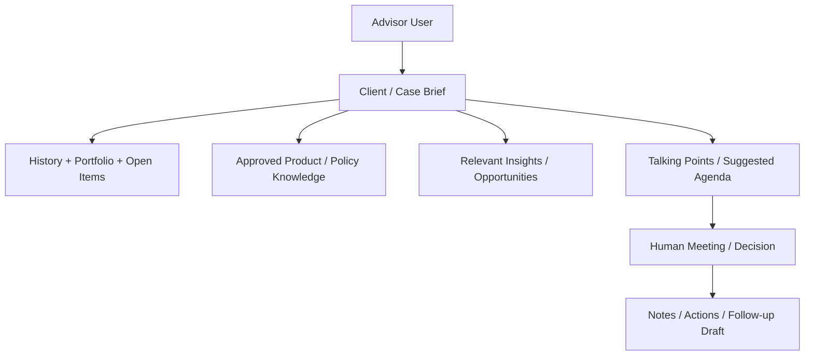

## Technology

- shared AI Platform;
- customer/case 360 data sources;
- approved knowledge RAG;
- internal/external governed tools where appropriate;
- AI Provider Gateway;
- multilingual drafting where required;
- audit and human control.

## Vision 2030 contribution

Advances **External AI Intelligence** through contextual engagement, recommendations and proactive support while keeping professional judgment human-led.

## AI-Enhanced Banking contribution

Resolves the Advisor model:

- meeting preparation;
- client context;
- product/policy lookup;
- in-meeting support;
- notes/action items;
- follow-up drafting.

---

# STEP 6 — Predictive / Adaptive Connected Intelligence

## What we build

Only after the earlier foundations generate trustworthy operational data and feedback, introduce broader predictive and adaptive intelligence.

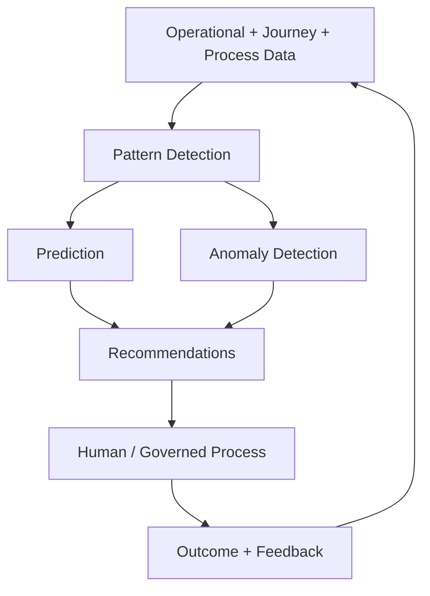

Candidate capabilities:

- process bottleneck prediction;
- process-completion/error prediction;
- data-quality and metadata recommendations;
- anomaly/risk pattern discovery;
- product/client behavioral insights;
- next-best-action optimization;
- future justified multi-agent collaboration;
- continuous evaluation and feedback loops.

## Technology

- historical/event data pipelines;
- observability/evaluation;
- RAG/knowledge where relevant;
- analytical/ML models where deterministic predictive models are preferable to LLM reasoning;
- Agent Framework orchestration for multi-step governed workflows;
- provider-independent LLM routing;
- on-prem/hybrid/cloud model deployment;
- shared audit and feedback models.

## Vision 2030 contribution

This is where the broader Vision 2030 goals of **observe -> learn -> analyze -> recommend -> optimize** become operational across DDC, BPMN, product, risk, analytics and client-facing intelligence.

## BKT relation

The core BKT loan/Copilot patterns should already be delivered in Steps 1-3. Step 6 extends beyond the visible BKT demonstration into the larger Vision 2030 target.

---

## 4. One-Table Roadmap

| Step | Main deliverable | Primary experience | Main technology | Vision 2030 resolved | BKT / banking-reference resolved |
|---|---|---|---|---|---|
| **0** | Learning + technical spike | Architect/developer | Syncfusion, .NET, Agent Framework spike | Foundation | Agent + document-tool mechanics |
| **1** | Document & Financial Intelligence MVP | Employee review | Angular, Syncfusion, ASP.NET Core, Agent Framework, deterministic .NET | First internal intelligence vertical slice | Extraction, spreading, ratios, warnings, AI explanation, HITL |
| **2** | APS Loan Copilot | Copilot | DevExtreme, AI Platform API, Tools, Core APIs | Intelligence embedded in Product Suite | Main BKT-like UX, commands, summaries, draft conclusion |
| **3** | Core/DDC/BPMN Intelligence | Copilot / Operations | Core/DDC/BPMN APIs, Tool Registry, shared context | DDC/workflow/internal intelligence foundation | Missing docs, blockers, rule/authority explanation, next step |
| **4** | Customer Assistant | Assistant | Channels, RAG, auth, safe tools, handoff | Client-facing intelligence begins | Connected service model rather than BKT-specific capability |
| **5** | Advisor Intelligence | Advisor | RAG, 360/context data, drafting, governed tools | External/predictive engagement foundation | Banking Advisor reference |
| **6** | Predictive / Adaptive Intelligence | Connected Intelligence | Event/history data, ML/AI, evaluation, routing, agent orchestration | Observe/learn/predict/recommend/optimize | Beyond BKT into Vision 2030 |

---

## 5. Technology Architecture That Survives All Steps

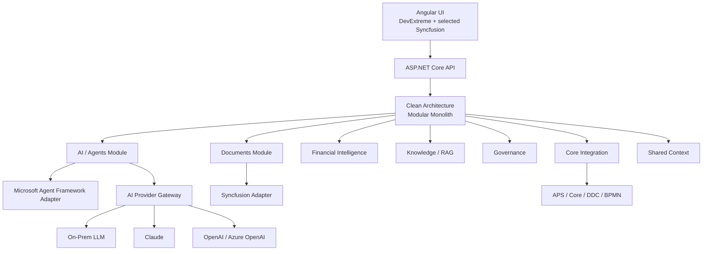

### Permanent architecture rules

- Clean Architecture + Modular Monolith first.
- Provider/framework independence through adapters.
- Existing APS UI remains Angular + DevExtreme.
- Syncfusion is preferred for document-heavy runtime capabilities where valuable; it is not the platform.
- Microsoft Agent Framework is the preferred MVP orchestration candidate, behind our own abstraction.
- LLM providers are replaceable; on-prem, hybrid and approved cloud are supported by design.
- Deterministic enterprise engines retain authority.
- Consequential outcomes require human review/approval.
- Structured outputs, evidence, traceability and audit are first-class.
- Assistant, Copilot and Advisor share one platform foundation.

---

## 6. What We Do NOT Build at the Beginning

To keep delivery realistic, Steps 0-1 do **not** attempt to build:

- full customer Assistant;
- full Advisor;
- broad multi-agent architecture;
- complete enterprise RAG;
- autonomous lending decisions;
- production write-back across the entire Core;
- all Vision 2030 predictive scenarios;
- microservices without an operational need;
- every Syncfusion AI feature.

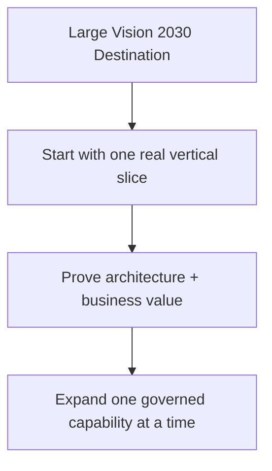

---

## 7. Definition of Progress

We should not measure progress by number of AI features or number of agents.

At every step ask:

1. Is there a real business workflow/user?
2. Is the AI role clear: understand, retrieve, analyze, explain, recommend or draft?
3. Is deterministic authority kept outside the LLM?
4. Are inputs/outputs structured where business systems consume them?
5. Is evidence available?
6. Is human review placed correctly for the risk level?
7. Is the provider/framework replaceable?
8. Is the capability reusable by later Assistant/Copilot/Advisor experiences?
9. Can management see measurable value?

This sequence keeps the MVP small while continuously building toward the Vision 2030 destination and the BKT-like credit intelligence experience.
