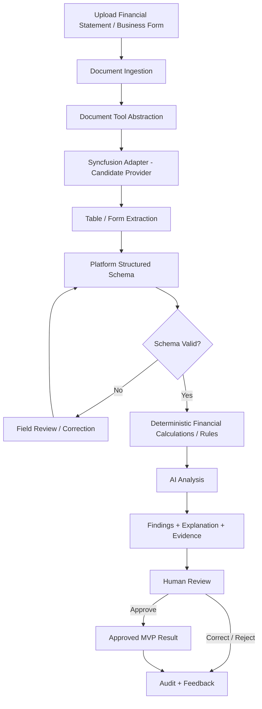
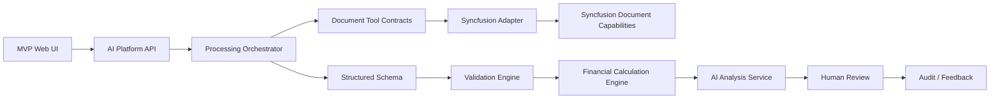
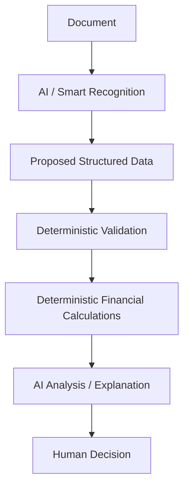

# MVP — Document & Financial Intelligence

**Status:** Proposed first vertical slice  
**Goal:** Validate reusable Enterprise AI Intelligence Platform capabilities through a standalone .NET document/financial-intelligence workflow before coupling to a complete banking solution.

## 1. MVP Question

Can the platform reliably turn a real business/financial document into validated structured data, deterministic financial results, evidence-backed AI findings, and a human-reviewed outcome while keeping document providers and AI models replaceable?

## 2. MVP End-to-End Flow



## 3. MVP Components

The first build should contain only the components needed to validate the flow:

| Component | MVP responsibility |
|---|---|
| MVP Web UI | Upload document; show extracted fields/table; show evidence, validation warnings, calculations, AI findings; allow correction/approval/rejection. |
| AI Platform API | Own processing lifecycle and expose the MVP workflow. |
| Document Tool Contracts | Vendor-neutral contracts for extraction/form recognition and any required deterministic document operation. |
| Syncfusion Adapter | Candidate implementation using the capabilities validated in Syncfusion 2026 Volume 1/2 research. |
| Structured Schema | Platform/domain-owned representation of extracted financial/form data. |
| Validation Engine | Required fields, types, totals, period/currency/unit consistency and other deterministic validation. |
| Financial Calculation Engine | A small set of deterministic ratios/calculations selected for the test document. |
| AI Analysis Service | Explain validated results and produce structured findings/recommendations. |
| Evidence Model | Link extracted values/findings to document source where provider support allows it. |
| Review/Audit Store | Persist processing steps, corrections, approvals/rejections, tool/model metadata, and feedback. |

## 4. Component Interaction



## 5. Minimum Demonstration Scenario

Use at least one realistic financial statement or financial table and one structured business form if practical. The MVP should demonstrate:

1. Upload.
2. Extraction into a defined schema.
3. Visual field/table review against source evidence.
4. Correction of an extraction error.
5. Deterministic validation.
6. Deterministic financial calculation(s).
7. AI explanation/analysis based on validated data and deterministic results.
8. Human approval/rejection.
9. Complete audit trail of the processing path.

## 6. MVP Output Shape

The final result should be structured, not only prose.

```text
MvpAnalysisResult
  Document
  ExtractedData
  ValidationResults[]
  FinancialMetrics[]
  AiFindings[]
  Evidence[]
  ReviewDecision
  AuditReference
```

Exact schemas will be designed during implementation planning; this illustrates the ownership boundary.

## 7. AI vs Deterministic Responsibility



**AI may:** understand, extract/classify where appropriate, summarize, explain, detect patterns/anomalies, recommend, and draft.

**AI must not be authoritative for:** financial arithmetic, thresholds, validation rules, permissions, workflow transitions, final consequential decisions, or system-of-record writes.

## 8. Syncfusion Scope in MVP

Syncfusion is initially evaluated for:

- table/data extraction;
- form recognition;
- document processing operations exposed through AI Agent Tools;
- spreadsheet processing where relevant to the selected financial scenario.

Syncfusion viewer/editor UX features are optional unless they directly improve evidence review. The MVP must not expose Syncfusion-specific contracts above the provider adapter.

## 9. Success Criteria

The MVP is successful if it proves that:

- a real document can be transformed into a usable structured schema;
- users can verify and correct extracted values;
- deterministic validation/calculation is clearly separated from AI reasoning;
- AI findings are based on validated business data and evidence;
- consequential output remains human-controlled;
- the full processing path is auditable;
- Syncfusion can be isolated behind a provider abstraction;
- the architecture is reusable for later Loan Copilot, DDC, BPMN, validation, reporting, and other Vision 2030 scenarios.

## 10. Explicitly Out of Scope

- Full banking/Core integration.
- Automatic loan approval/rejection.
- Production write-back.
- Broad RAG/enterprise knowledge platform unless required by the selected analysis scenario.
- Autonomous agents modifying workflows/rules/schemas.
- Building all Syncfusion viewer/editor features.
- EPIC/Feature/Task decomposition before MVP scope approval.

## 11. Next Discovery Tests

Before implementation scope is frozen, test Syncfusion against representative documents and capture:

- extraction accuracy and correction rate;
- table hierarchy preservation;
- form-field mapping quality;
- source/evidence coordinates or references;
- latency and resource usage;
- scanned-document behavior;
- multilingual behavior;
- deployment/data-residency constraints;
- provider/model dependencies and licensing.
