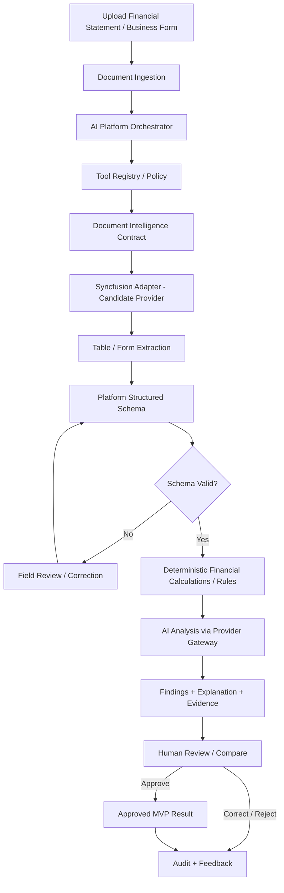
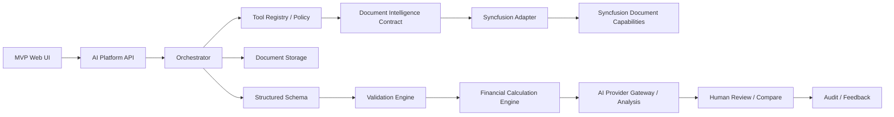
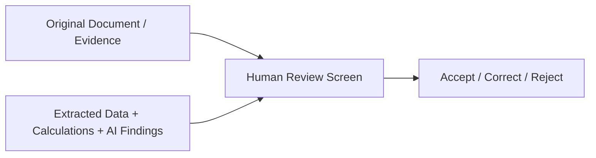
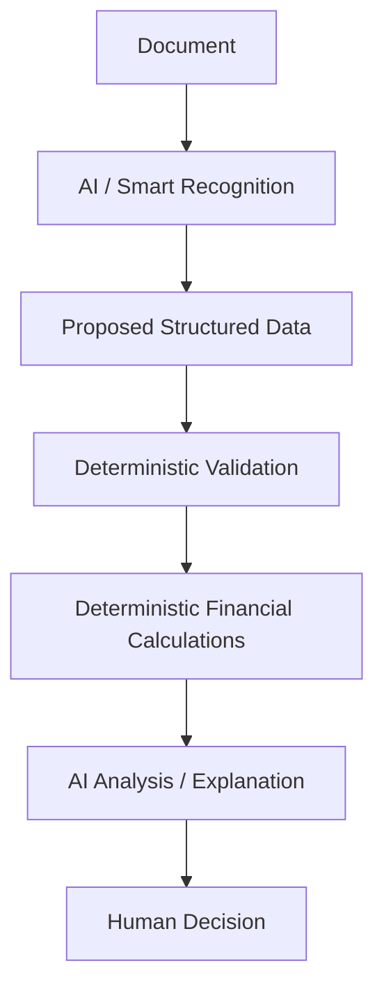

# MVP — Document & Financial Intelligence

**Status:** Proposed first vertical slice  
**Goal:** Validate reusable Enterprise AI Intelligence Platform capabilities through a standalone .NET document/financial-intelligence workflow before coupling to a complete banking solution.

## 1. MVP Question

Can the platform reliably turn a real business/financial document into validated structured data, deterministic financial results, evidence-backed AI findings, and a human-reviewed outcome while keeping document providers and AI models replaceable?

## 2. MVP End-to-End Flow



## 3. MVP Components

| Component | MVP responsibility |
|---|---|
| MVP Web UI | Upload; show source/evidence beside extracted fields, validation warnings, calculations and AI findings; allow correction/approval/rejection. |
| AI Platform API | Expose the processing workflow and central platform boundary. |
| Processing Orchestrator | Coordinate the document-to-analysis lifecycle. |
| Tool Registry / Policy | Resolve permitted tools and keep tool availability/authorization explicit. MVP implementation can be small but the boundary must exist. |
| Document Intelligence Contract | Vendor-neutral extraction/form-recognition contract. |
| Syncfusion Adapter | Candidate implementation using capabilities validated in Syncfusion research. |
| Document Storage Abstraction | Manage input/generated artifacts without coupling orchestration to local/cloud storage. |
| Structured Schema | Platform/domain-owned representation of extracted financial/form data. |
| Validation Engine | Required fields, types, totals, period/currency/unit consistency and other deterministic validation. |
| Financial Calculation Engine | Small set of deterministic ratios/calculations selected for the test document. |
| AI Provider Gateway / Analysis | Central approved model access; explain validated results and produce structured findings/recommendations. |
| Evidence Model | Link extracted values/findings to document source where provider support allows it. |
| Review/Audit Store | Persist processing/tool events, corrections, approvals/rejections, model/provider metadata and feedback. |

## 4. Component Interaction



## 5. Minimum Demonstration Scenario

Use at least one realistic financial statement or financial table and one structured business form if practical. Demonstrate upload, extraction into a defined schema, visual evidence review, correction of an extraction error, deterministic validation, deterministic financial calculations, AI analysis based on validated data, human approval/rejection, and an auditable processing path.

The UI should favor a reviewable evidence experience rather than making a generic chat window the center of the MVP.



## 6. MVP Output Shape

The final result should be structured, not only prose.

```text
MvpAnalysisResult
  Document
  ExtractedData
  ValidationResults[]
  FinancialMetrics[]
  AiFindings[]
  Evidence[]
  ReviewDecision
  AuditReference
```

Exact schemas will be designed during implementation planning; this illustrates the ownership boundary.

## 7. AI vs Deterministic Responsibility



**AI may:** understand, extract/classify where appropriate, summarize, explain, detect patterns/anomalies, recommend, draft, and select permitted tools.

**AI must not be authoritative for:** financial arithmetic, thresholds, validation rules, permissions, tool authorization, workflow transitions, final consequential decisions, or system-of-record writes.

## 8. Syncfusion Scope in MVP

Syncfusion is initially evaluated for table/data extraction, form recognition, document-processing operations exposed through AI Agent Tools, and spreadsheet processing where relevant to the selected financial scenario. Syncfusion viewer/editor UX features are optional unless they directly improve evidence review.

The MVP must not expose Syncfusion-specific contracts above the provider adapter.

## 9. Architecture Findings Preserved but Not Expanded into MVP Features

Research also confirmed useful later platform patterns: deterministic Document Processing (create/modify/convert/redact/sign), pluggable document storage, streamed tool activity, contextual/inline AI experiences, side-by-side review, and bring-your-own AI provider patterns. These shape boundaries but should not inflate the first MVP.

## 10. Success Criteria

The MVP is successful if a real document can be transformed into a usable structured schema; users can verify/correct extracted values; deterministic validation/calculation is separated from AI reasoning; AI findings use validated business data/evidence; consequential output remains human-controlled; the path is auditable; provider boundaries remain replaceable; and the architecture can later support Loan Copilot, DDC, BPMN, validation, reporting and other Vision 2030 scenarios.

## 11. Explicitly Out of Scope

- Full banking/Core integration.
- Automatic loan approval/rejection.
- Production write-back.
- Broad RAG/enterprise knowledge unless required by the selected scenario.
- Autonomous agents modifying workflows/rules/schemas.
- Building all Syncfusion viewer/editor features.
- General writing, grammar and translation capabilities.
- EPIC/Feature/Task decomposition before MVP scope approval.

## 12. Next Discovery Tests

Before implementation scope is frozen, test Syncfusion against representative documents and capture extraction accuracy/correction rate, table hierarchy preservation, form-field mapping, evidence references, latency/resource use, scanned and multilingual behavior, storage/deployment/data-residency constraints, provider/model dependencies, tool authorization integration, and licensing.
