# MVP v0.1 — Management Demo

**Status:** Approved implementation boundary  
**Purpose:** Deliver a small, management-presentable vertical slice that proves the Enterprise AI Intelligence Platform direction without attempting to build the full Vision 2030 architecture.

## 1. Goal

Demonstrate that a real financial/business document can be transformed into structured data, validated deterministically, analyzed by AI, reviewed by a human, and traced end-to-end.

This MVP is intentionally small. It proves the architecture; it does not implement the full platform.

## 2. Management Story

### Today

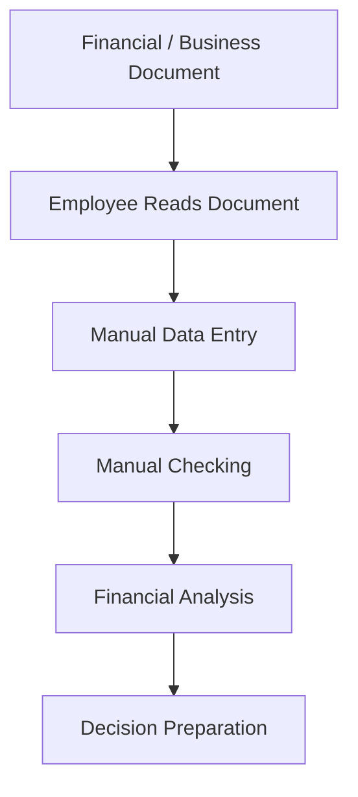

### With MVP v0.1

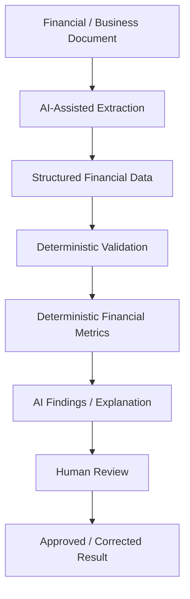

## 3. MVP Scope — Six Visible Capabilities

1. **Upload one supported financial/business document type.**
2. **Extract a small predefined structured schema** from the document.
3. **Show source/evidence beside extracted values** and allow correction.
4. **Run 3–5 deterministic financial metrics / validations.**
5. **Generate 3–5 structured AI findings** such as risk, anomaly, trend, explanation, or recommendation.
6. **Human review** with Accept / Correct / Reject and a basic audit record.

## 4. End-to-End Flow

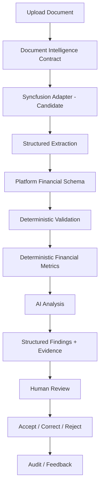

## 5. Minimal Architecture

The MVP should preserve important platform boundaries from day one, without implementing every future capability.

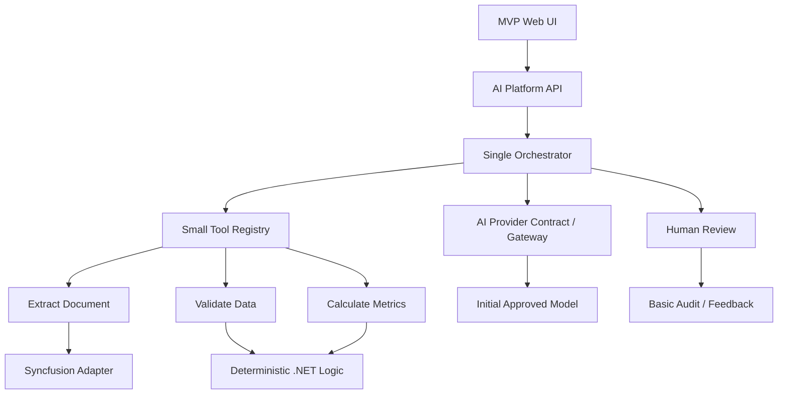

## 6. Required Architecture Boundaries

### Model Provider Boundary

Do not hardwire the application to one model provider.

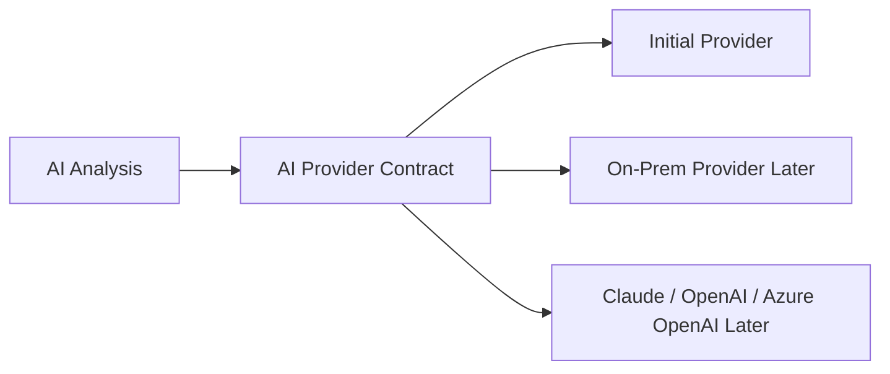

A sophisticated routing engine is **not** required in v0.1, but the interface boundary must exist.

### Document Provider Boundary

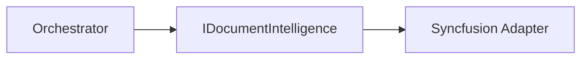

Syncfusion is a candidate provider, not the platform contract.

### Tool Boundary

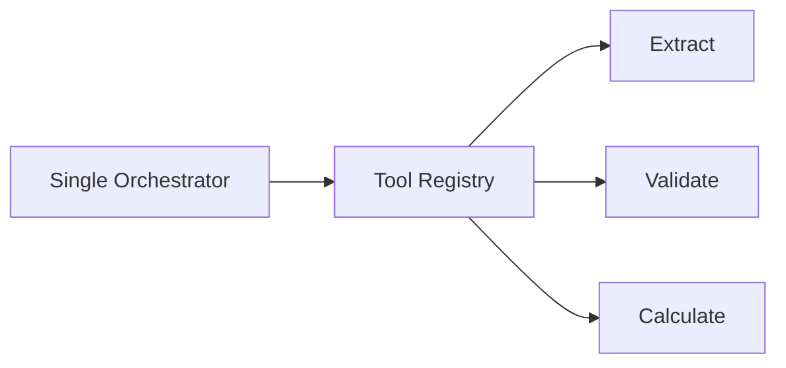

This creates the foundation for later agentic workflows without requiring multi-agent architecture now.

## 7. AI vs Deterministic Responsibility

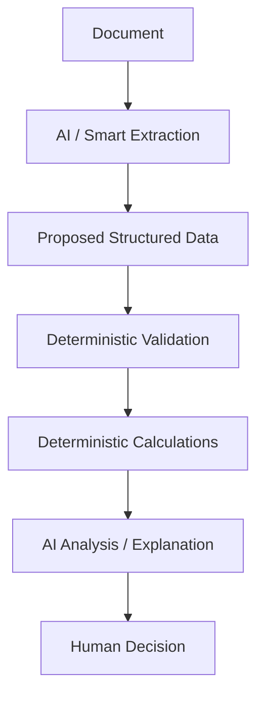

### AI May

- understand and extract document content;
- classify or normalize where appropriate;
- explain results;
- detect patterns/anomalies;
- summarize;
- recommend;
- draft findings.

### AI Is Not Authoritative For

- financial arithmetic;
- thresholds and validation rules;
- permissions;
- workflow transitions;
- final consequential decisions;
- system-of-record writes.

## 8. Explicitly Out of Scope for v0.1

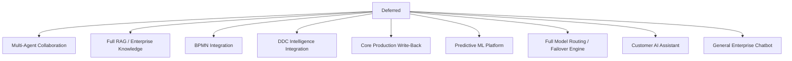

Also deferred:

- autonomous workflow/rule/schema changes;
- full document editor feature set;
- advanced agent memory;
- broad multi-document support;
- generalized enterprise document processing;
- full evaluation/observability platform.

## 9. Suggested Implementation Sequence

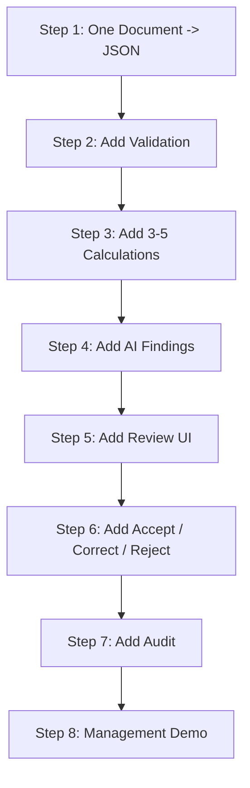

Every step should produce a working vertical slice rather than building all infrastructure first.

## 10. UI Principle

The MVP should be evidence-first rather than chatbot-first.

```text
--------------------------------------------------
| Original Document / Evidence                   |
--------------------------------------------------
| Extracted Data | Validation | Financial Metrics|
--------------------------------------------------
| AI Findings / Explanation                     |
--------------------------------------------------
| Accept | Correct | Reject                     |
--------------------------------------------------
```

The user should be able to understand where a result came from and correct extraction before consequential use.

## 11. Management Demo Message

The demo should communicate:

> We are not building a chatbot. We are building a reusable intelligence layer that can understand enterprise documents, work with deterministic business logic, explain findings, preserve human control, and later integrate with Core, DDC, BPMN, and other Vision 2030 capabilities.

After the MVP demonstration, show the expansion path:

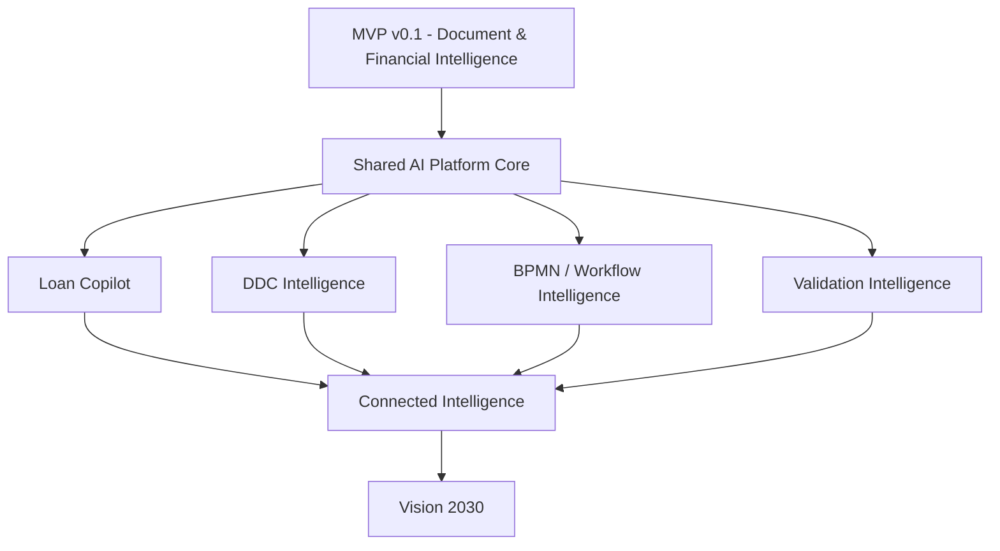

## 12. Success Criteria

MVP v0.1 is successful when:

- one real target document can be processed end-to-end;
- important values are extracted into a defined schema;
- the user can compare extracted values with source evidence and correct errors;
- deterministic calculations are clearly separated from AI reasoning;
- AI produces structured, understandable findings;
- a human can accept/correct/reject the result;
- the processing path is auditable;
- document and model providers remain replaceable behind interfaces;
- management can clearly understand the business value and the path toward Vision 2030.

## 13. Post-Demo Progression

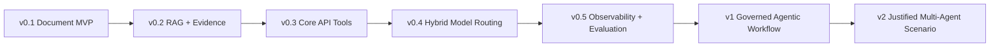

The roadmap may change based on MVP findings. Multi-agent architecture should be introduced only where a real collaboration boundary and measurable benefit are demonstrated.
