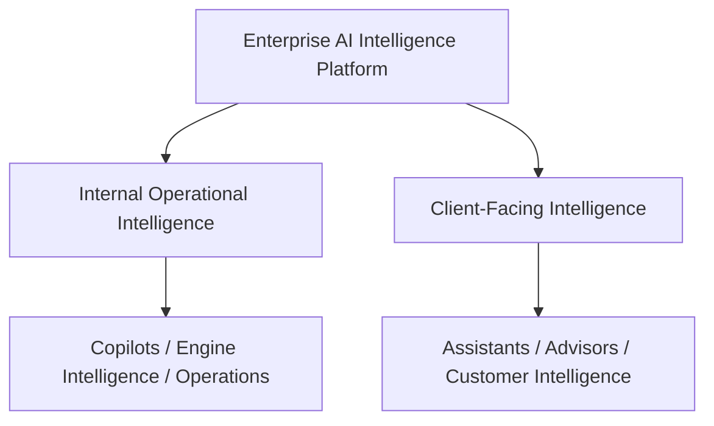
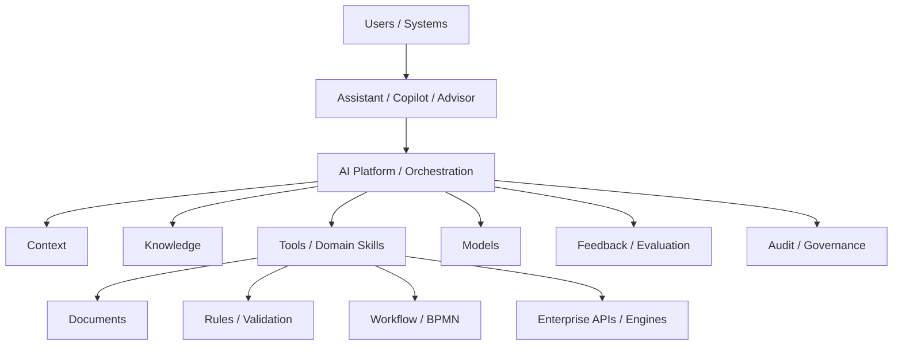
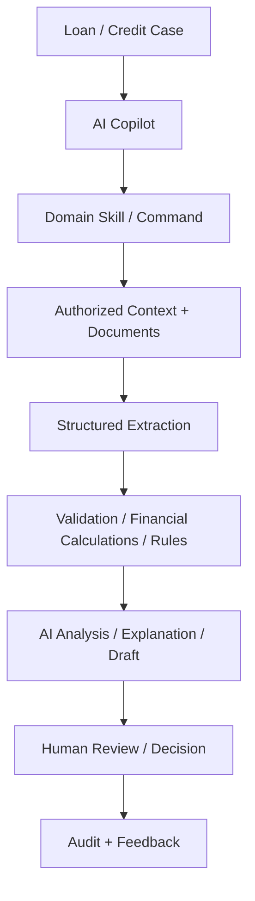
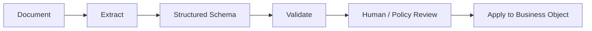
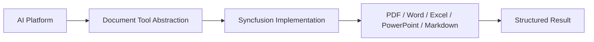
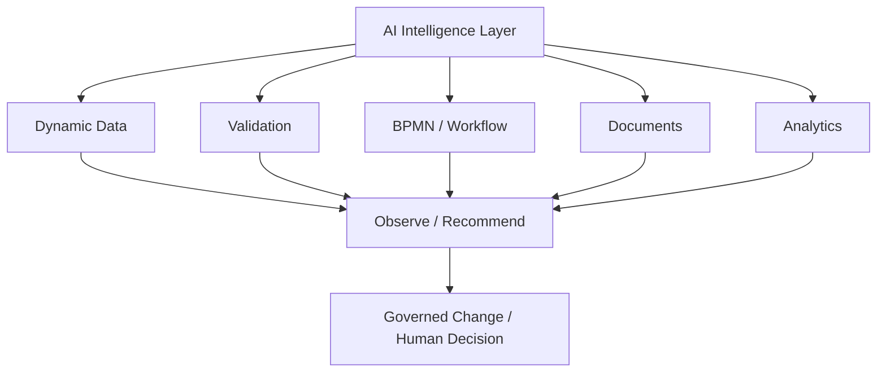
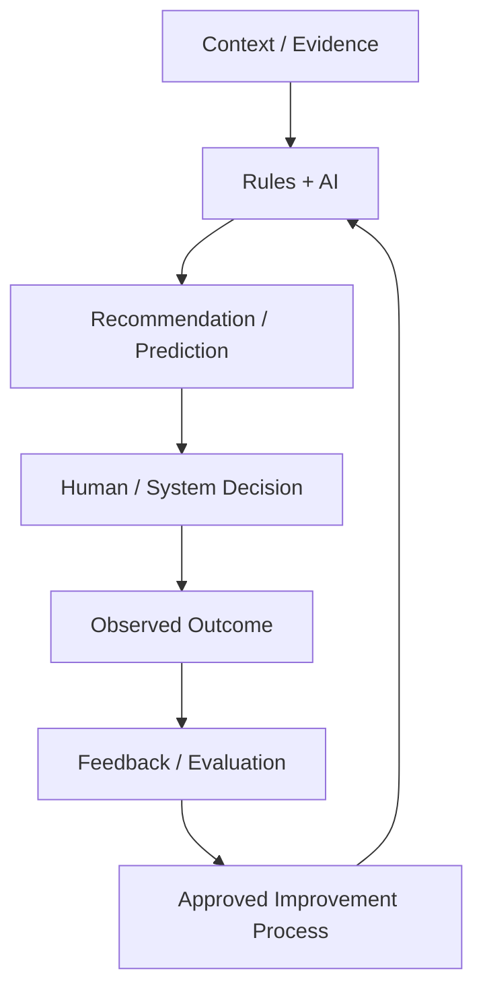
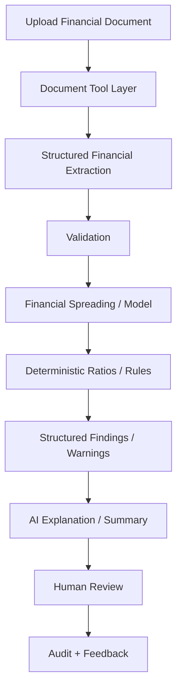
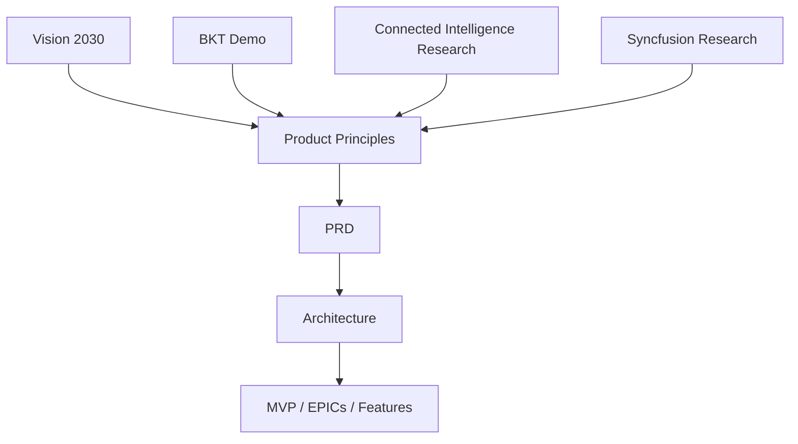

# AI Platform — Product Requirements Document

**Version:** 0.3 (Living Draft)  
**Status:** Discovery / Product Definition  
**Last updated:** 2026-08-21

## 1. Executive Summary

The AI Platform is a reusable **Enterprise AI Intelligence Platform** for financial and enterprise applications. It is intended to augment existing deterministic systems and workflows with contextual AI analysis, document intelligence, recommendations, explanation, prediction, governed actions, and measurable feedback — not to create another isolated chatbot.

The platform combines authorized application context, approved knowledge, specialized tools, document intelligence, deterministic business rules/calculations, AI reasoning, human oversight, auditability, and evaluation.

The initial product validation will focus on internal Copilot and Document & Financial Intelligence scenarios while preserving a broader path toward the Vision 2030 internal and client-facing intelligence model.

## 2. Strategic Vision

Vision 2030 is the primary strategic source for this product direction. It describes a transition from automation toward connected, adaptive intelligence across enterprise engines and business workflows.

The platform should support two broad intelligence directions:

The long-term goal is connected intelligence: AI capabilities share governed context, knowledge, tools, rules, feedback, and audit infrastructure instead of each application or module implementing an isolated AI stack.

## 3. Product Principles

1. **Connected intelligence over isolated AI.** Build a shared intelligence foundation reusable across applications and roles.
2. **Augment deterministic engines; do not replace them with an LLM.** Rules, calculations, workflow state, and authoritative business logic remain deterministic.
3. **Structured data before prose where business processing depends on the result.** Document extraction and AI outputs should use defined schemas when they feed validation, rules, workflows, or APIs.
4. **Human control for consequential decisions.** AI may analyze, draft, explain, and recommend; consequential financial decisions/actions require explicit governed authority and human oversight where appropriate.
5. **Trust is a platform capability.** Authentication, authorization, approved sources, data protection, hallucination controls, explainability, audit, and evaluation are built into the platform.
6. **Models are replaceable dependencies.** Durable advantage comes from context, data, tools, rules, workflows, governance, feedback, and product integration.
7. **Domain skills over unrestricted agent behavior.** Business actions should be exposed as governed skills/tools/commands with explicit inputs, permissions, outputs, and audit behavior.
8. **Observe and recommend before autonomous adaptation.** Learning and optimization begin with measurable feedback and governed recommendations; uncontrolled self-modification is not an initial product goal.
9. **Build vertical slices that validate the platform.** MVPs should be small enough to learn quickly but architected as reusable platform capability rather than throwaway demos.
10. **Preserve context across experiences.** Future Assistant, Copilot, and Advisor experiences should share context and support clean handoffs rather than creating separate AI silos.

## 4. Problem Statement

Traditional enterprise AI implementations are often isolated chatbots with limited business context and limited ability to perform reliable actions. Financial applications require stronger guarantees around data access, deterministic calculations, business rules, workflow authority, traceability, explainability, and human control.

The platform must bridge probabilistic AI capabilities with trusted enterprise systems without allowing the model to become the system of record or authoritative business engine.

## 5. Goals

- Embed AI intelligence into existing business workflows and applications.
- Provide a shared AI layer reusable by multiple modules and products.
- Support Internal Operational Intelligence and future Client-Facing Intelligence.
- Allow AI agents to access authorized business context through controlled tools/APIs.
- Process business documents and convert relevant content into structured data.
- Separate deterministic rules/calculations from probabilistic LLM reasoning.
- Provide structured findings, warnings, recommendations, drafts, and explanations.
- Support domain-specific skills/commands instead of relying only on free-form chat.
- Support human-in-the-loop approval for consequential actions and decisions.
- Provide comprehensive auditability of AI requests, context, tool calls, outputs, human decisions, and actions.
- Capture feedback needed to evaluate whether recommendations were accepted, rejected, corrected, and ultimately useful.
- Support approved knowledge sources and retrieval mechanisms.
- Keep AI providers/models and specialized tool vendors replaceable where practical.
- Validate core platform capabilities independently before introducing unnecessary coupling to a complete enterprise application.

## 6. Non-Goals — Initial Scope

The initial platform is not intended to:

- Allow an LLM to independently make final consequential financial decisions.
- Use an LLM as the authoritative calculator for deterministic financial calculations.
- Allow unrestricted direct access from an LLM to production databases or services.
- Allow AI to autonomously rewrite production workflows, rules, schemas, or policies without governance.
- Build a separate AI stack for every business module.
- Depend completely on one AI model or one document-processing vendor.
- Require integration with a complete banking solution before core AI/document capabilities can be validated.
- Claim uncontrolled real-time "self-learning" without a defined feedback, evaluation, approval, and deployment process.

## 7. Users and Interaction Models

### 7.1 AI Assistant — Customer
Customer-facing self-service and guided actions with controlled access to authorized data/services, contextual responses, and intelligent escalation/handoff.

### 7.2 AI Copilot — Internal Employee
Context-aware internal assistant embedded in enterprise workflows. It can aggregate business context, retrieve knowledge, process documents, run governed skills/tools, surface warnings, explain deterministic results, and create drafts/recommendations.

Internal Copilot remains the leading early interaction model because it provides strong human oversight while delivering operational value.

### 7.3 AI Advisor — Relationship Manager / Expert
Advanced assistance before, during, and after customer engagement: preparation, contextual recommendations, talking points, summaries, action items, follow-up drafting, and future CRM updates through governed tools.

### 7.4 Administrator / Governance User
Configures access, knowledge sources, tools, policies, models, monitoring, audit, and evaluation controls.

## 8. Platform Capability Model

### Context
Authorized business context from customer, CRM, loans, accounts, dynamic data, workflows, documents, analytics, and other application modules.

### Knowledge
Approved policies, procedures, product information, documentation, and other governed knowledge sources.

### Tools and Domain Skills
Controlled capabilities exposed to AI agents. Skills should have explicit contracts, permissions, structured outputs where appropriate, and auditable execution.

### Rules and Deterministic Engines
Validation, eligibility, calculations, workflow state, and other authoritative logic remain outside the LLM.

### Intelligence
LLM/AI capabilities are used for language understanding, classification, extraction support, reasoning where appropriate, summarization, explanation, recommendations, drafting, and prediction.

### Feedback and Evaluation
The platform should progressively capture recommendation → decision → outcome relationships so quality and business value can be measured and improvements can be governed.

## 9. Initial Use Case — Loan Application Copilot

A user working with a loan/credit case can invoke governed Copilot skills against authorized case context.

Candidate capabilities include:

- Extract and classify submitted documents.
- Detect missing required documents using authoritative requirement configuration plus AI-assisted matching/classification.
- Extract financial statements into a structured financial model.
- Run deterministic financial ratios and configured rules.
- Explain failed rules and warnings.
- Summarize the application and evidence.
- Draft credit proposals, conclusions, executive summaries, or conditions for human review.
- Inspect workflow gates/blockers and suggest next actions without replacing workflow authority.

## 10. Document-to-Business-Object Pattern

Document processing must not stop at free-form AI text when downstream business processing requires structured information.

The platform should support documents such as PDF, Word, Excel, images, reports, and other relevant business formats. Exact MVP formats remain to be finalized.

## 11. Document Tool Layer and Syncfusion

Syncfusion Document Processing AI capabilities are under evaluation as a specialized document provider, not as the entire AI Platform.

The reviewed Syncfusion material separates development-time Agent Skills, Agentic UI Builder and AI Coding Assistant capabilities from runtime AI Agent Tools. Runtime Agent Tools are relevant to the product because they can support dynamic document workflows such as extraction, redaction, conversion, and document/report processing.

**Status:** Under Evaluation. Architecture must preserve an abstraction boundary so vendor choice does not define the entire platform.

## 12. Business Rules and Deterministic Calculations

A core design principle is separation between deterministic business logic and LLM reasoning.

Examples such as financial ratios, eligibility thresholds, date calculations, fees, repayment calculations, policy rules, and workflow state should be executed by deterministic services/engines where possible. AI can explain and correlate these results but is not their authority.

## 13. Intelligent Enterprise Engines — Strategic Direction

Vision 2030 extends beyond a single Copilot. The long-term platform should augment existing engines with intelligence while preserving their deterministic authority.

Candidate domains include:

- Dynamic Data / DDC intelligence
- Validation intelligence
- BPMN / workflow intelligence
- Document intelligence
- Reporting / analytics intelligence
- Collaboration/activity intelligence

Examples of future intelligence include detecting data-quality gaps, suggesting data structures/metadata, analyzing workflow bottlenecks, recommending rule improvements, predicting operational risks, and identifying redundant configuration. These are strategic directions, not committed MVP scope.

## 14. Feedback and Learning Model

"Learning" must be defined as a governed engineering capability, not a vague promise that the system changes itself.

For each future adaptive use case, architecture must specify whether AI may only observe, recommend, predict, retrain offline, propose configuration changes, or execute changes — and what approval is required.

## 15. Agent and Orchestration Layer

The platform is expected to require an orchestration layer responsible for coordinating context, knowledge retrieval, domain skills/tools, document tools, deterministic engines, models, permissions, audit, and evaluation.

The exact agent framework and orchestration architecture remain **TBD** during discovery.

## 16. Integrations — Candidates

Potential integration categories include:

- Core business APIs
- Customer and CRM
- Loan applications
- Document repositories
- Dynamic data / DDC/DAC services
- BPM/workflow engines
- Validation/rules engines
- API platforms/integration layers
- Communication/social channels
- Reporting and analytics
- Identity and access management

Deep integration with a complete banking SPA/.NET solution remains deferred until the standalone platform vertical slice is validated. The standalone implementation must nevertheless be reusable so later integration does not require a rewrite.

## 17. Security, Governance and Trust

The platform must be designed for enterprise and financial-services controls, including:

- Authentication and authorization
- User-context-aware data access
- Tool/action authorization
- Data protection
- Approved knowledge sources
- Prompt/context protection
- Hallucination risk controls
- Human-in-the-loop oversight
- Explainability and provenance
- Audit trail
- Model/provider governance
- Sensitive-data handling
- Environment separation
- Monitoring and observability
- Evaluation and quality controls
- Transparent handling of AI-assisted actions where required

Detailed requirements remain **TBD**.

## 18. Functional Requirements — Capability Areas

Detailed requirements will be decomposed after additional discovery and architecture work. Current capability areas are:

- Context retrieval
- Knowledge retrieval
- Domain skill/tool execution
- Document processing
- Structured extraction
- Validation
- Rule/calculation execution
- AI reasoning
- Structured recommendations/findings
- Draft generation
- Explanations
- Workflow awareness
- Human approval/review
- Audit and traceability
- Feedback capture
- Evaluation

## 19. Non-Functional Requirements

To be defined during architecture and MVP definition. Areas include security, performance, scalability, availability, reliability, observability, auditability, extensibility, model portability, vendor portability, data privacy, and cost controls.

## 20. MVP — Proposed Direction

**Status: Proposed direction — not yet finalized.**

The preferred first vertical slice is **AI Platform MVP — Document & Financial Intelligence**.

Syncfusion is a candidate implementation enabler, not the name or boundary of the MVP.

The initial UI should remain lightweight. MVP effort should prioritize document tools, structured contracts, deterministic calculations/rules, orchestration, guardrails, auditability, feedback, and evaluation.

### Subsequent Integration Direction

After the standalone capability is proven:

## 21. Future / Phase 2+

Candidate capabilities include banking-platform integration, production-grade customer/loan context, customer AI Assistant, AI Advisor, cross-module intelligence, workflow intelligence, dynamic-data intelligence, validation intelligence, broader knowledge/RAG, proactive recommendations, multi-agent scenarios, and governed adaptive/learning capabilities.

These remain hypotheses, not committed scope.

## 22. Open Questions

- Which exact financial documents and schemas should the first MVP support?
- Which ratios/rules are sufficient to prove the deterministic layer?
- Which AI/LLM provider(s) should be supported initially?
- Cloud, on-premises, or hybrid deployment?
- Which agent/orchestration framework should be used?
- What responsibilities should Syncfusion AI Agent Tools own?
- Is additional OCR/extraction technology required beyond the evaluated Syncfusion capabilities?
- How should the Rules/Validation Engine be designed or integrated?
- What knowledge/RAG architecture is required for the first and later use cases?
- What forms of agent memory are required, if any?
- Which actions can AI execute automatically versus requiring approval?
- What provenance/explainability is required per output?
- What audit information must be persisted?
- What feedback/outcome data can be captured in the MVP?
- What evaluation metrics determine MVP success?
- Which core systems should be integrated first after the standalone MVP?
- Which parts of the standalone prototype must be independently deployable/reusable from the start?

## 23. Decision Log

| ID | Decision / Hypothesis | Status | Rationale |
|---|---|---|---|
| D-001 | Build a shared AI platform rather than isolated module-specific AI solutions. | Proposed | Supports connected intelligence and reuse. |
| D-002 | Keep deterministic calculations, rules, and authoritative workflow state outside the LLM. | Proposed | Reliability, testability, auditability, and repeatability. |
| D-003 | Evaluate Syncfusion Document Processing AI Agent Tools behind a Document Tool abstraction. | Under Evaluation | Provides specialized document capabilities without making the platform vendor-defined. |
| D-004 | Use human-in-the-loop for consequential financial decisions/actions. | Proposed | Governance, risk control, and accountability. |
| D-005 | Treat AI models as replaceable platform dependencies rather than the product itself. | Proposed | Durable value comes from context, tools, data, governance, and integration. |
| D-006 | Prioritize internal AI Copilot as the leading early interaction model. | Proposed | Lower-risk, governable, high-value starting pattern. |
| D-007 | Prefer a standalone Document & Financial Intelligence vertical slice before deep banking-platform integration. | Proposed | Separates platform-learning risks from enterprise integration complexity. |
| D-008 | Keep the initial MVP UI lightweight and prioritize reusable backend/tooling capability. | Proposed | Focuses learning on highest-risk platform capabilities. |
| D-009 | Introduce governed domain skills/commands as a core interaction pattern. | Proposed | Makes agent behavior explicit, permissionable, testable, and auditable. |
| D-010 | Capture recommendation → decision → outcome feedback as the basis for evaluation and future learning. | Proposed | Makes improvement measurable and avoids vague self-learning claims. |
| D-011 | AI may augment enterprise engines, but engines remain authoritative for deterministic execution. | Proposed | Aligns Vision 2030 with safe, testable architecture. |

## 24. Research and References

### Primary strategic source

- **Vision 2030 — From Automation to Intelligence: Unified AI Framework for Self-Learning and Adaptive Banking Systems** — strategic direction for internal/client-facing intelligence and AI-augmented enterprise engines.

### Reviewed reference patterns

- **BKT AI Demonstration (Parts 1–3)** — one demonstration split for analysis; reference patterns for embedded credit Copilot, domain commands, document extraction, financial spreading, rules/warnings, workflow awareness, drafting, and human review.
- **Fintech News Switzerland — AI in Banking: Moving from Chatbots to Connected Intelligence** — external pattern for Assistant/Copilot/Advisor roles, shared context, trust/governance, and internal Copilot as a practical starting point.
- **Syncfusion — AI-Powered Development with Document Processing Components** — technology research covering Agent Skills, Agentic UI Builder, AI Agent Tools, and AI Coding Assistant; runtime Agent Tools are being evaluated for the Document Tool Layer.

Detailed analyses are maintained under `docs/research/` so research evidence remains separate from committed product requirements.

---

## Change Log

### v0.3 — 2026-08-21

- Elevated Vision 2030 as the primary strategic source.
- Reframed the product as an Enterprise AI Intelligence Platform.
- Added explicit Product Principles.
- Added Internal Operational Intelligence vs Client-Facing Intelligence direction.
- Added governed domain skills/commands.
- Added document-to-business-object structured processing pattern.
- Added AI-augmented deterministic enterprise engines as a strategic direction.
- Added feedback/evaluation loop and clarified the meaning of future learning/adaptation.
- Consolidated BKT Parts 1–3 as one demonstration source.
- Refined Syncfusion's role as a candidate Document Tool provider rather than the platform itself.
- Refined the MVP to Document & Financial Intelligence.
- Added mandatory diagrams/flows throughout major concepts.

### v0.2 — 2026-08-21

- Added the proposed standalone .NET + Syncfusion first-MVP direction.
- Separated validation of AI/document capabilities from later banking-platform integration.
- Clarified that the prototype should be reusable platform capability rather than throwaway demo code.
- Added lightweight-UI guidance for the initial MVP.

### v0.1 — 2026-08-21

- Created initial living PRD.
- Added Connected Intelligence concept.
- Added Assistant / Copilot / Advisor interaction models.
- Added initial Loan Application Copilot use case.
- Added Document Intelligence and Syncfusion evaluation.
- Established deterministic rules/calculations versus LLM reasoning principle.
