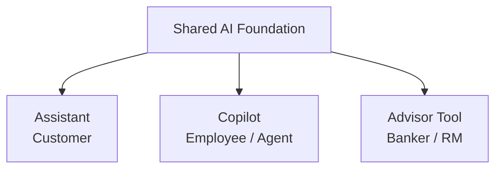
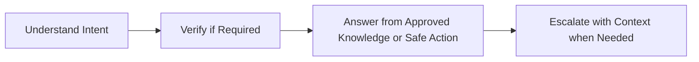
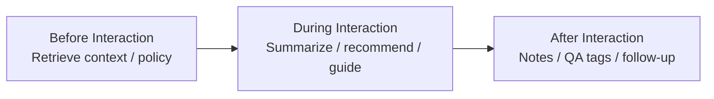
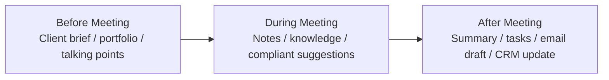
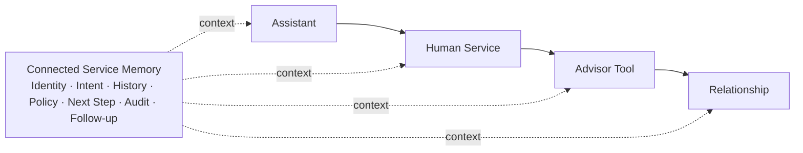
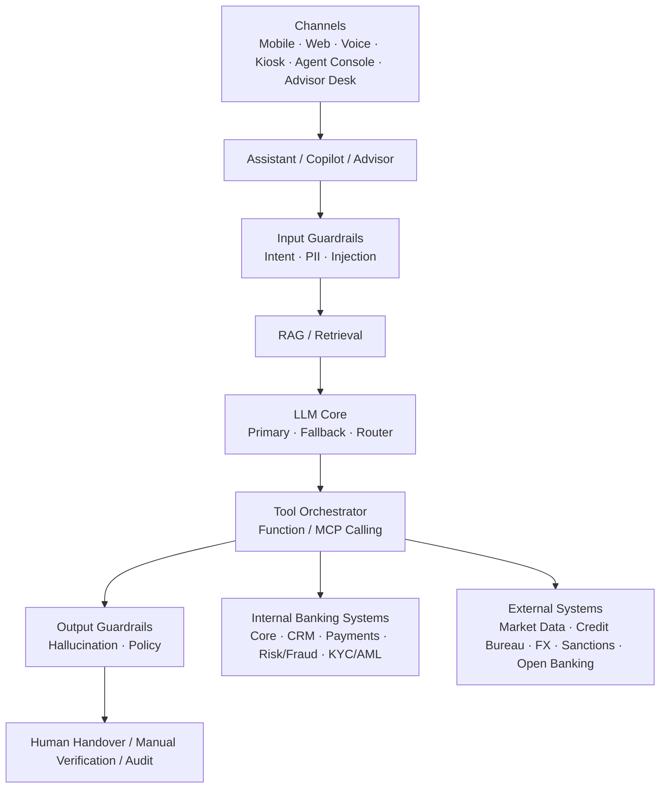
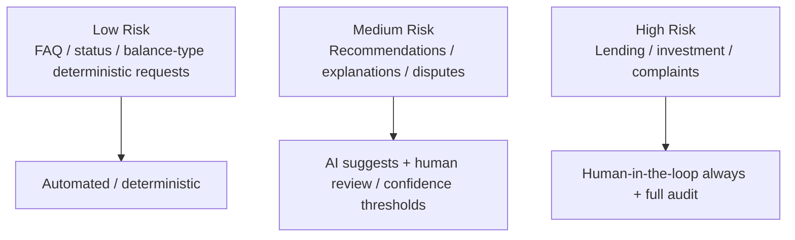
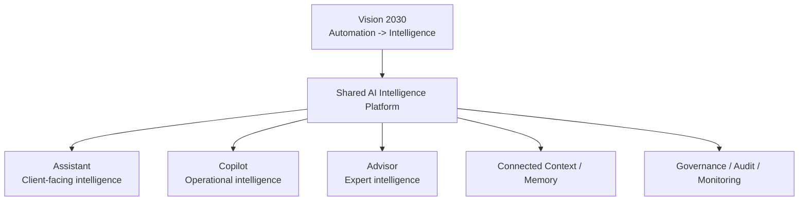

# AI-Enhanced Banking — Connected Service Research

**Source:** `1. 2026_04_AI_Enhanced_Banking.pdf` (Netcetera webinar, 23 Apr 2026)  
**Status:** Research input for Enterprise AI Intelligence Platform  
**Purpose:** Capture source-supported concepts that refine the platform big picture without turning the presentation into product requirements by default.

## 1. Source Framing

The presentation argues that banking AI should not be designed as isolated chatbots. It defines three distinct user-facing AI roles built on a shared foundation:

- **Assistant** — customer-facing self-service for high-volume, bounded intents;
- **Copilot** — employee/operations support for retrieval, summarization, drafting and safer resolution paths;
- **Advisor Tool** — banker/relationship-manager support for preparation, client context, knowledge and follow-up.

The source explicitly says the shared foundation should include approved knowledge, orchestration, integration, multilingual support, analytics, model monitoring and auditability.

## 2. Source-Supported Role Differences

| Dimension | Assistant | Copilot | Advisor Tool |
|---|---|---|---|
| Primary user | Customer | Contact-center/operations agent | Relationship manager / banker |
| Primary goal | Self-service resolution | Employee effectiveness | Better-informed conversations |
| Knowledge | FAQ, product info, status | Policy, procedures, CRM | Client history, markets, portfolio |
| Interaction | Chat, voice, mobile | Embedded/side-panel during work | Meeting preparation, outreach |
| Decision posture | Low-risk, deterministic | Suggests; human decides | Informs; human decides |
| Escalation | Human handoff with context | Flags complex cases | Final human layer |

## 3. Source-Supported Assistant Principles

The presentation recommends starting with simple, repeatable, high-volume intents, including information/guidance, process initiation and safe actions. It also stresses four journey steps: understand, verify, answer/act, and escalate.

Key design principles from the source:

- financial information such as balances, rates and fees should be deterministic;
- always provide a human path;
- respect authentication boundaries;
- use visual/step-by-step guidance rather than text only;
- ground responses in approved content;
- detect sentiment/urgency and adapt escalation behavior.

## 4. Source-Supported Copilot Capabilities

The presentation defines four core Copilot capabilities:

1. real-time guidance;
2. case summarization;
3. knowledge retrieval using approved sources;
4. response drafting for human review.

It also frames Copilot value across the full interaction lifecycle:

This reinforces an employee-augmentation model rather than autonomous decision making.

## 5. Source-Supported Advisor Capabilities

For bankers/relationship managers, the presentation positions AI around preparation, in-meeting support and follow-up.

The source explicitly frames the role as **reducing searching and preparation friction, not replacing professional judgment**.

## 6. Connected Service Model

A central source finding is that Assistant, human service, Advisor Tool and the wider relationship journey should share context and hand off cleanly. The presentation calls for a connected service memory carrying:

- identity;
- intent;
- history;
- policy basis;
- next step;
- audit trail;
- follow-up.

**Product interpretation:** this strongly supports our Connected Intelligence direction: multiple experiences should share governed context instead of each building its own isolated memory/data model.

## 7. System Architecture Pattern from the Source

The presentation's architecture shows multiple channels feeding Assistant/Copilot/Advisor experiences, surrounded by a guardrail perimeter and connected to internal banking systems, approved knowledge and external systems.

This is a **source architecture pattern**, not an implementation mandate. In our product, MCP, specific guardrail technologies, and exact retrieval stack remain subject to architecture decisions.

## 8. Risk-Proportionate Governance

The source proposes three broad risk tiers:

It also emphasizes authentication boundaries from pre-auth general information through post-auth account data and enhanced verification, with human-required handling for very high-risk scenarios.

**Product interpretation:** our Governance module should eventually own risk classification, authentication/authorization context, confidence/escalation policy, human-review requirements, and audit behavior rather than embedding these rules inside individual prompts.

## 9. Measurement Principles

The presentation recommends measuring journeys rather than optimizing only for chatbot containment. It groups measures into:

- customer outcomes;
- employee effectiveness;
- risk/compliance;
- economics/growth.

Examples include first-contact resolution, handoff quality, retrieval time, after-call work, hallucination/policy adherence, audit completeness, cost-to-serve and repeat-contact reduction.

**Product interpretation:** evaluation/observability should include business-journey metrics, not only LLM metrics such as latency or token usage.

## 10. Research Impact on Our Product Direction

### Confirms

- Connected Intelligence rather than isolated AI implementations.
- Human augmentation over AI replacement for complex/high-impact banking work.
- Deterministic authority for financial information and business rules.
- Approved/grounded knowledge for enterprise answers.
- Human handoff and continuity of context.
- Auditability, monitoring and governance as platform-level capabilities.
- Copilot as a strong first employee-facing adoption path.

### Refines

The platform should explicitly support **three experience roles** — Assistant, Copilot and Advisor — on top of one shared foundation. These are experience/persona patterns, not separate platform backends.

### Does Not Automatically Become a Requirement

The following remain research ideas until validated for Aspekt/client needs:

- all assistant intents shown in the presentation;
- autonomous card blocking or dispute processing;
- full contact-center Copilot;
- market/portfolio Advisor use cases;
- MCP as mandatory integration protocol;
- exact risk tier examples or thresholds;
- the specific metrics/ROI figures cited by the presentation.

## 11. Relationship to Vision 2030

The presentation provides a useful interaction/experience model for Vision 2030's broader move from automation to intelligence:

This research therefore strengthens the idea that Vision 2030 should be delivered as one shared intelligence foundation exposed through different user experiences and domain capabilities.
