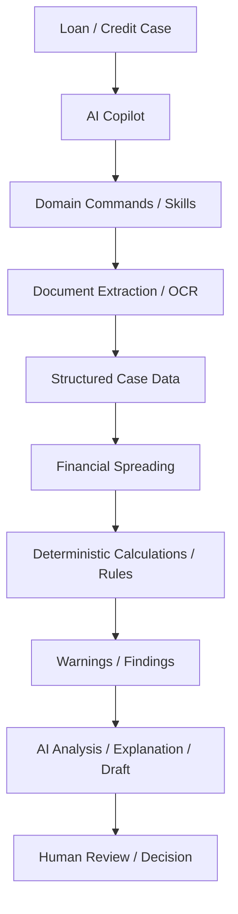
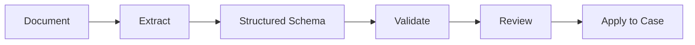
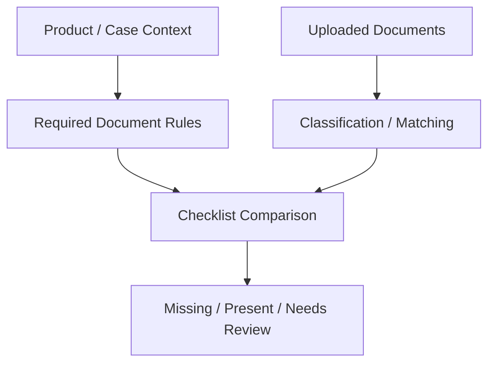
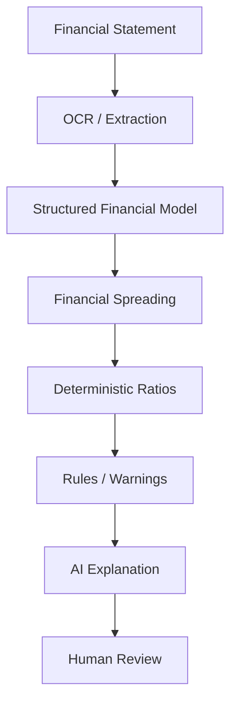
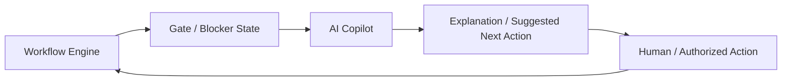
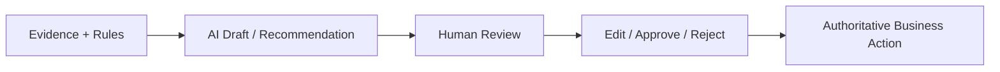

# BKT AI Demonstration — Consolidated Analysis

**Source:** One AI demonstration split into three parts for analysis  
**Status:** Reviewed research / reference implementation pattern  
**Purpose:** Capture useful product patterns demonstrated in the loan/credit workflow without treating the demonstration as a specification to clone.

## Demonstrated Pattern

The demonstration shows an AI Copilot embedded in a loan/credit-analysis workflow rather than an isolated chatbot. The observed pattern combines business commands, document processing, structured financial data, deterministic warnings/calculations, drafting, workflow awareness, and human review.

## Domain Commands / Skills

The Copilot exposes task-oriented actions rather than relying only on free-form chat. Observed examples include document extraction, ID/business-registration extraction, financial-statement OCR, document classification, missing-document checks, financial analysis, draft credit proposal/conclusion, executive summary, suggested conditions, and authority explanation.

### Product interpretation

A future Copilot should support governed **domain skills/commands** with explicit inputs, permissions, outputs, and audit behavior.

## Document-to-Case Pattern

A strong pattern is that document processing should not end with a prose response. Extracted information should become structured data that can be validated and, after appropriate review, applied to the business case.

## Required Documents and Missing-Document Detection

The demonstration includes required-document/checklist behavior. Our interpretation is that authoritative document requirements should come from product/rule configuration, while AI can assist with classification, matching, extraction, explanation, and detection of missing evidence.

## Financial Spreading

The demonstration shows financial-statement processing feeding structured financial information and analysis. This is especially relevant to the proposed standalone MVP.

## Deterministic Rules vs AI Reasoning

Warnings such as threshold breaches or ratio checks reinforce the design principle that calculations and deterministic policy checks should be executed outside the LLM. AI can explain, summarize, correlate evidence, and help the user understand the result.

## Workflow Awareness

The demonstration includes workflow gates/blockers. This suggests a useful future integration pattern: AI may inspect workflow state and assist users in resolving blockers, but the workflow engine remains authoritative for process state and execution.

## Draft, Review, Decide

The use of draft proposals, conclusions, and summaries supports a human-in-the-loop pattern for consequential work.

## MVP Relevance

The strongest standalone vertical slice derived from the demonstration is **Document & Financial Intelligence**: ingest financial documents, extract structured data, validate it, calculate deterministic ratios, run rules, produce AI explanations/findings, and capture human review/audit.

This validates platform capabilities without requiring immediate coupling to a complete banking application.
