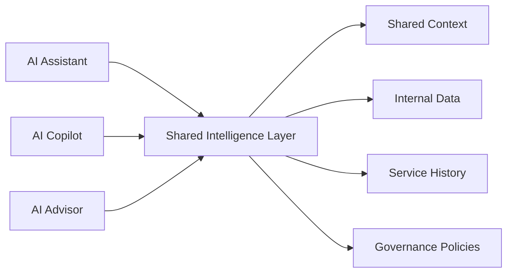
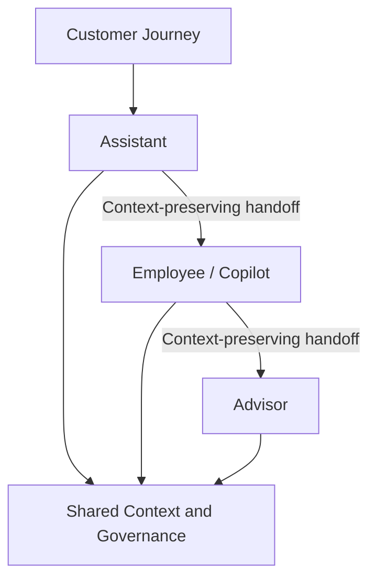
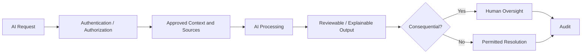
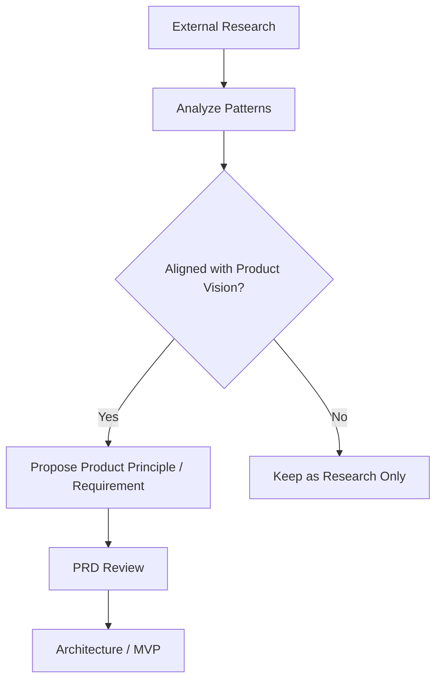

# Connected Intelligence — Research Analysis

**Source:** Fintech News Switzerland, *AI in Banking: Moving from Chatbots to Connected Intelligence*, 15 June 2026  
**Status:** Reviewed research source  
**Purpose:** Capture external patterns that may inform the AI Platform. This document is research evidence, not automatically committed product scope.

## Core Thesis

The source argues that banking AI creates more value as a connected service ecosystem than as an isolated chatbot. It describes three complementary roles: customer-facing AI Assistants, employee AI Co-pilots, and relationship-management AI Advisor tools. The strongest value emerges when these roles share context, hand off cleanly, and operate within clear limits.

## Source-Derived Patterns

### AI Assistant

The source positions Assistants as customer self-service for repetitive interactions and safe guided actions. Important patterns are contextual responses, secure execution, escalation when needed, and measuring successful resolution rather than only chatbot containment.

### AI Copilot

The source positions Co-pilots behind employees. They aggregate context from multiple systems, retrieve relevant products/policies, recommend actions, and summarize interactions. The intended outcome is faster handling, less administration, improved consistency, and better compliance.

### AI Advisor

Advisor tools support relationship managers before, during, and after customer engagement: gathering context, suggesting talking points, capturing notes, identifying opportunities, creating summaries/action items, drafting follow-up, and updating CRM. The source explicitly frames this as decision support rather than automated advice.

## Connected Intelligence Principle

The source's central architectural implication is that the three roles should not become separate AI silos.

The competitive advantage is described as the ability to connect internal data, service history, customer intent, and governance policies into shared intelligence, rather than relying on the model itself as the differentiator.

## Trust and Governance

The source identifies authentication, approved sources, careful data handling, hallucination prevention, auditability, human-in-the-loop oversight for consequential decisions, explainability, and transparency as essential banking AI controls.

## Recommended Starting Pattern

The source recommends an internal AI Copilot as a practical starting point because it is lower-risk, easier to govern, and can deliver operational value while humans remain in control. Expansion can then move toward customer Assistants and Advisor tools.

## Product Interpretation

The following are our interpretation of the source, not direct requirements from the article:

- The platform should provide a shared intelligence foundation rather than separate stacks for Assistant, Copilot, and Advisor experiences.
- Context continuity and handoff should eventually become platform capabilities.
- Models should remain replaceable dependencies; governed context, tools, data, and controls are more durable platform assets.
- Internal Copilot scenarios are a strong candidate for early product validation.
- Trust controls must be designed as platform capabilities, not bolted onto individual use cases.

## Relationship to Vision 2030

Connected Intelligence externally reinforces the broader direction in Vision 2030: intelligence should span systems and workflows instead of being implemented as isolated AI features. Vision 2030 remains the strategic internal source; this article provides external validation and customer-service-oriented patterns.

## Research-to-Product Flow

