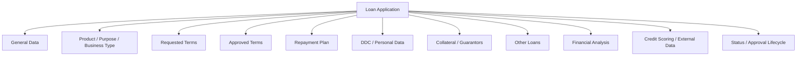
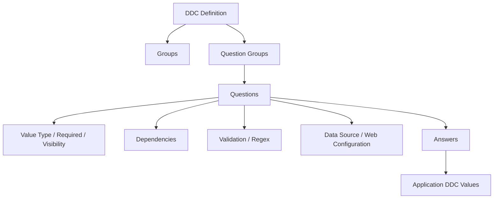
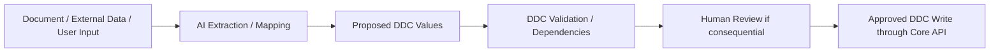
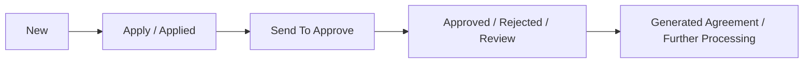
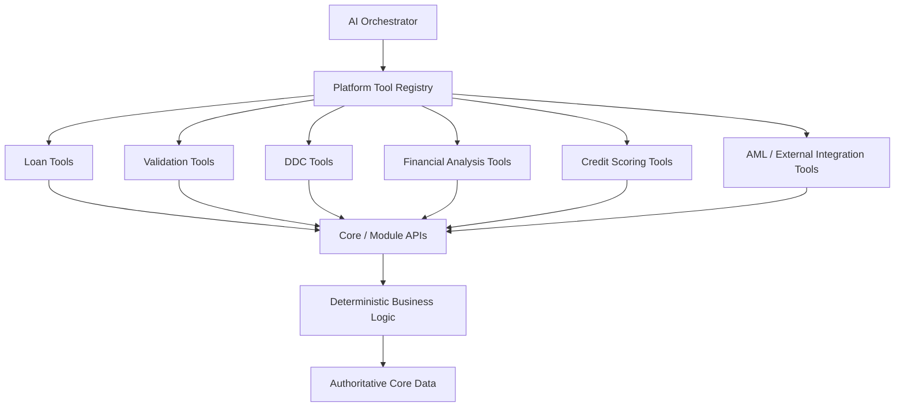
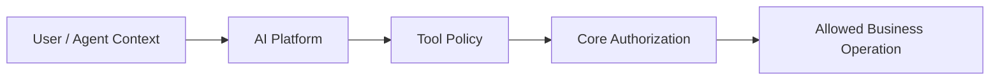
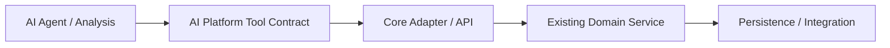
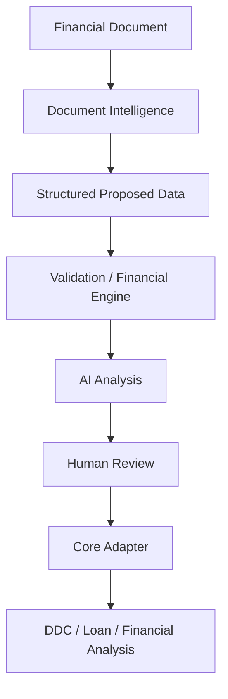

# Core Backend — Capability Research for Enterprise AI Intelligence

**Status:** Current-state discovery  
**Scope:** APS/Core backend, Loan domain, DDC, application lifecycle, modular solution structure, roles, validations, integrations and related business capabilities shown in supplied screenshots/files  
**Purpose:** Identify deterministic capabilities that should remain in Core and be exposed to the AI Platform through governed APIs/tools rather than rebuilt inside LLM workflows.

## 1. Source Facts

The supplied backend material shows a modular .NET architecture with domain packages/projects such as `Aspekt.Loan.Api`, `Aspekt.Loan.Core`, `Aspekt.Loan.Forms`, `Aspekt.Loan.Persistence`, and a WebApi host. The wider dependency model includes Core/Shared/Authentication/Licensing/Notifications/DMS/Settings/Registers/Validation/UserManagement/Reporting/Loan/BankStatement/AML/Card/Commission/Account/CashDesk/CRM/GeneralLedger/FixedAsset/Mobile/Merchant/CreditScoring/Integrations and many cross-module packages.

The Loan Application domain contains authoritative application data such as amount, installments, fees, interest, status, product, currency, dates, officer/office, requested/approved values, repayment plan and related business data.

The supplied enums show explicit application statuses, application types, payment/principal frequencies, DDC question value types and a broad role model including an `AGENT` role value.

## 2. Loan Application Domain



This confirms that the AI Platform should not own the authoritative loan model. It should consume governed context from Core and return advisory/structured intelligence.

## 3. DDC as a Dynamic Data / Context Engine

The supplied DB diagrams show DDC concepts including groups, question groups, questions, answers, dependencies, regular expressions/validation, web/data-source configuration, translation, parameters/modules and application-specific DDC answers.



### Product Interpretation

DDC should be treated as a strategic source of structured enterprise context, not replaced by an AI schema generator. AI may help populate, classify, explain or analyze DDC data, but DDC metadata, validation, dependencies and authoritative values remain deterministic.



## 4. Application Lifecycle and Status History

The supplied application configuration and status model show an explicit lifecycle including New, Apply, Applied, SendToApprove, Approved, Rejected, Review and other statuses. A status-change table records transitions and timing data such as previous/current status and minutes from previous status/creation.



### Future Intelligence Potential

Status history can support later process intelligence such as:

- bottleneck detection;
- time-in-stage analysis;
- SLA risk prediction;
- likely next-step prediction;
- unusual path detection;
- recommendations for officer attention.

These are advisory analytics. Status transitions themselves remain governed by Core/BPMN rules.

## 5. Existing Deterministic Capabilities Visible from Application Configuration

The supplied Application Edit JSON shows existing actions and integrations including:

- application status actions and approval flow;
- refresh related contacts / other loans;
- blacklist/AML checks;
- financial analysis assignment/navigation;
- collateral and guarantor handling;
- credit committee members;
- ASAN Finance checks;
- ACB scoring request;
- MKR checks/calculations;
- credit scoring calculation;
- agreement generation;
- validation navigation;
- comments, reviews, activities and histories;
- external service data views.

This is important because many future AI tools can wrap existing business operations instead of creating new implementations.

## 6. Core as Governed Tool Provider



Candidate future tool examples include read-only context retrieval, validation, deterministic calculation, status/history lookup, DDC schema/value retrieval, scoring retrieval and approved business actions. Exact tool contracts must be designed later and should reuse existing API/service boundaries where practical.

## 7. Role / Authorization Implication

The role model includes many business roles and an `AGENT` role entry. This is useful evidence that agent access can be represented inside existing security concepts, but it does **not** by itself define adequate AI authorization.

The AI Platform should preserve user identity/role context and enforce tool-level permissions and approval policies.



An agent must not gain broader rights than the user/workflow it represents.

## 8. Deterministic vs AI Responsibility

### Keep in Core / Deterministic Services

- loan arithmetic and repayment-plan calculation;
- interest, fee and EIR-related authoritative calculation;
- validation rules;
- application status transitions;
- permissions and role enforcement;
- DDC dependency/validation rules;
- scoring engines where already deterministic;
- system-of-record writes;
- approved integrations/business actions.

### Appropriate AI Responsibilities

- extraction/mapping from unstructured inputs;
- explanation of existing Core results;
- anomaly/pattern detection;
- summarization of application context;
- recommendations and next-best-action proposals;
- process-delay prediction;
- drafting notes/reviews;
- selecting permitted tools through the orchestrator;
- generating structured proposed values for human/Core validation.

## 9. Backend Integration Rule

Avoid direct model/database coupling:

```text
LLM -> Core Database    X
LLM -> Stored Procedure X
LLM -> unrestricted internal service X
```

Prefer:



This preserves authorization, validation, transaction boundaries, observability and vendor/model independence.

## 10. Relevance to First MVP

The first Document & Financial Intelligence MVP should initially remain standalone enough to validate extraction, structured schemas, financial calculations, AI analysis and human review. However, the Core research changes how later integration should be designed:



Production integration should map reviewed outputs into existing Loan/DDC/Financial Analysis structures rather than inventing parallel banking data stores.

## 11. Current Conclusion

The existing Core backend already contains much of the deterministic domain authority that Vision 2030 requires. The Enterprise AI Intelligence Platform should therefore be an **augmentation and orchestration layer**, not a replacement business engine.

The strongest future architecture direction is to expose selected Core capabilities as governed tools/APIs while keeping DDC, Loan, Validation, Credit Scoring, AML, workflow/status authority and other system-of-record responsibilities in the existing enterprise platform.
