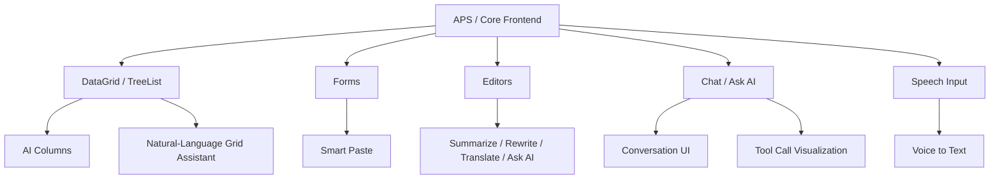
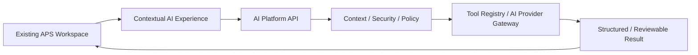
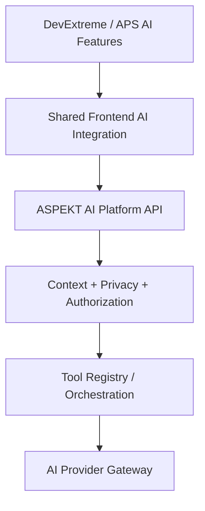
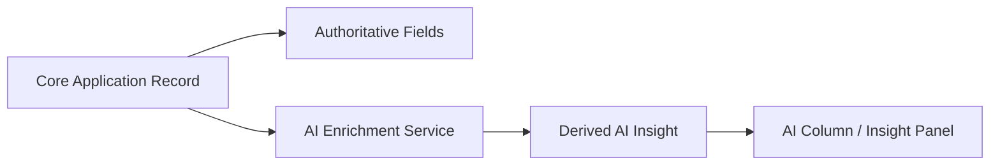
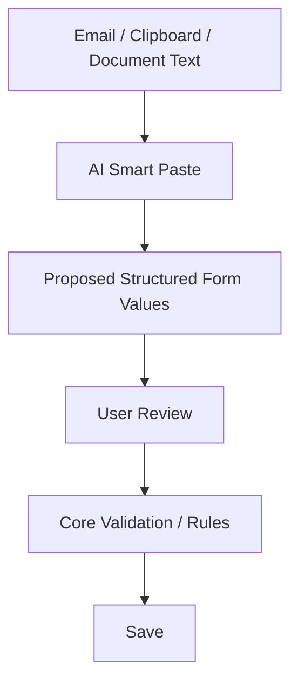
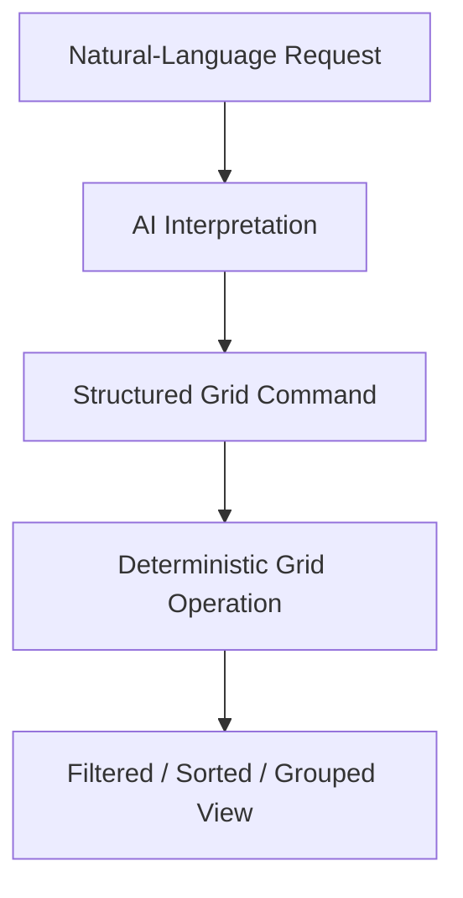
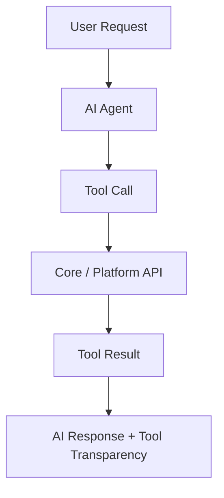
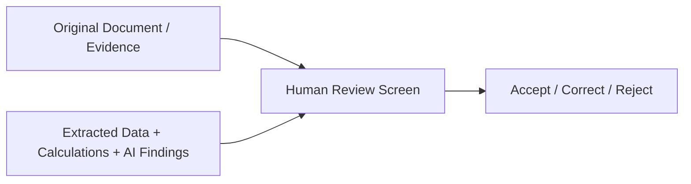

# Core Frontend — AI Capability Research

**Status:** Current-state discovery  
**Scope:** APS/Core frontend and DevExtreme AI-ready UI capabilities shown in supplied screenshots  
**Purpose:** Capture what the existing frontend can already support so the Enterprise AI Intelligence Platform can reuse current UI capabilities instead of building a separate AI UI stack.

## 1. Source Facts

The supplied frontend material shows the current APS/Product Suite using Angular/DevExtreme-style enterprise screens and several DevExtreme AI-related capabilities that can be integrated into that front-end stack.

Observed capabilities include:

- Speech-to-Text based on the browser Web Speech API / `SpeechRecognition` interface.
- AI Columns in DataGrid and TreeList for AI-generated/derived values.
- Chat component integrations with AI services.
- Tool/function-call visualization in chat, shown as **under active development**.
- DataGrid AI Assistant for natural-language sort/filter/search/group/configuration, shown as **under active development**.
- Smart Paste for converting unstructured clipboard text into proposed form-field values.
- HTML Editor AI actions such as summarize, proofread, expand, shorten, change style/tone, translate, Ask AI, and custom prompt commands.
- Existing APS business screens such as the Applications grid and Application edit form, which provide real enterprise workspaces where AI experiences can be embedded.

## 2. Frontend Capability Map



## 3. Product Interpretation

The current frontend is already capable of hosting multiple **AI Experience Layer** patterns. The platform should therefore avoid assuming that AI must live in a separate chatbot application.



Candidate experience patterns include:

- chat/copilot;
- inline AI actions;
- AI columns;
- smart form filling;
- natural-language grid interaction;
- review/compare panels;
- voice input;
- transparent tool execution.

## 4. Connected Intelligence Rule

The frontend should not independently integrate each component with a separate AI provider.

Avoid:

```text
Grid -> OpenAI
Form -> Azure OpenAI
Editor -> another model
Chat -> another provider
```

Prefer:



This keeps model selection, security, audit, policy and provider routing centralized.

## 5. Authoritative Core Data vs AI-Derived Data

AI-generated values shown in grids or forms must remain distinguishable from authoritative Core data.



Examples:

- Requested Amount, Status, Product, Currency = authoritative Core data.
- Risk Summary, Missing Information, Attention Required, Suggested Next Action = advisory AI data unless separately approved and written through governed Core APIs.

For consequential AI-derived fields, preserve provenance such as evidence, confidence, generation time, model/version and explanation where practical.

## 6. Smart Paste Pattern

Smart Paste is particularly relevant to enterprise data entry because it can transform unstructured text into proposed form values while preserving deterministic Core validation.



AI proposes; Core remains authoritative.

## 7. Natural-Language Grid Pattern

Natural-language interaction with DataGrid/TreeList should ideally produce structured UI commands rather than arbitrary application actions.



This aligns with the platform rule to prefer structured outputs over free-form prose when AI results drive business-system behavior.

## 8. Tool Call Visualization

The shown DevExtreme capability is under active development, so it must not be treated as a production dependency yet. The architectural pattern is still useful:



This supports explainability and operational transparency for governed agent workflows.

## 9. MVP Relevance

The first Document & Financial Intelligence MVP should not attempt to implement every frontend AI feature. The highest-value UI pattern is a reviewable screen that places source/evidence beside extracted data, deterministic calculations and AI findings.



Chat, speech input, general writing assistance and advanced grid assistants are useful future capabilities but should not inflate the first MVP.

## 10. Current Conclusion

The existing frontend stack is **AI-ready enough to host the Enterprise AI Intelligence Platform experience layer**. The strategic need is therefore not a new AI UI framework, but a shared integration boundary between existing APS UI components and the centralized AI Platform.

The frontend should remain a presentation/context surface; authorization, tool execution, model routing, enterprise data policy, deterministic calculations and system-of-record responsibility remain outside the UI.
