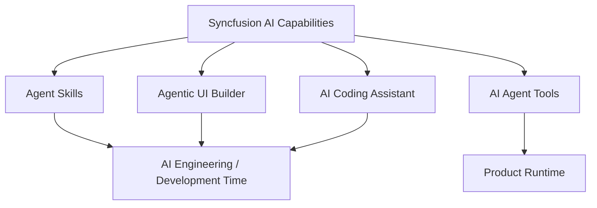
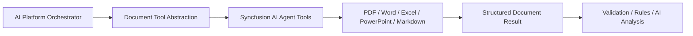
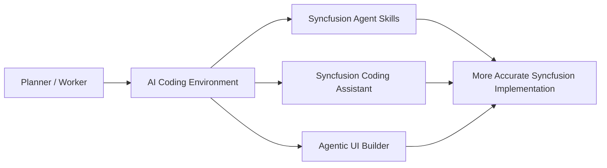
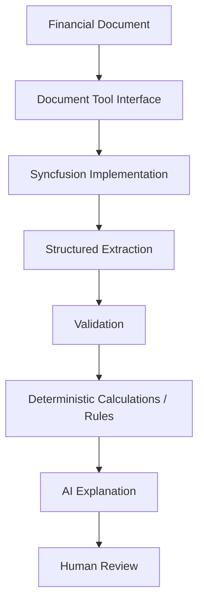

# Syncfusion AI Tools — Research Analysis

**Source:** Syncfusion, *AI-Powered Development with Syncfusion Document Processing Components*, updated 31 July 2026  
**Status:** Under evaluation  
**Purpose:** Identify where Syncfusion AI capabilities may support the AI Platform and the AI Engineering workflow without making Syncfusion the platform itself.

## Available AI Tool Categories

The reviewed Syncfusion documentation describes four categories:

- **Agent Skills** — provide AI coding assistants with real Syncfusion API knowledge and document/code skills.
- **Agentic UI Builder** — generates production-oriented UI using Syncfusion components from natural-language prompts.
- **AI Agent Tools** — runtime document tools for AI agents, including document workflows such as extraction, redaction, conversion, and report/document creation.
- **AI Coding Assistant** — documentation-backed coding help in development environments.

## Product Runtime Interpretation

For the AI Platform, the most relevant capability currently appears to be **AI Agent Tools** because the documentation describes runtime handling of PDF, Word, Excel, PowerPoint, and Markdown operations, including extraction, redaction, and conversion.

Syncfusion should remain behind a document-tool abstraction so that product architecture is not defined by a single vendor.

## AI Engineering Interpretation

Agent Skills, Agentic UI Builder, and the AI Coding Assistant may improve the development workflow for Claude, Copilot, or other compatible coding assistants. These capabilities belong conceptually to the AI Engineering Playbook rather than to the product runtime architecture.

## Product Decisions Not Yet Made

The reviewed source does not determine:

- the AI Platform orchestration framework;
- the LLM/model provider;
- the full document architecture;
- whether Syncfusion is sufficient for every OCR/extraction requirement;
- how document extraction schemas are defined and validated;
- the storage architecture;
- the rules engine;
- production security and deployment topology.

These remain architecture/MVP questions.

## Current Working Hypothesis

Use Syncfusion as a **specialized document capability provider** for the first Document & Financial Intelligence vertical slice, while preserving platform-level abstractions around document operations.

