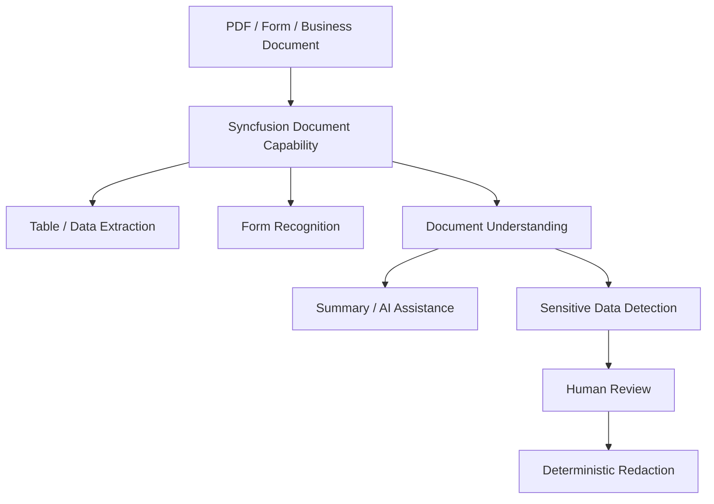
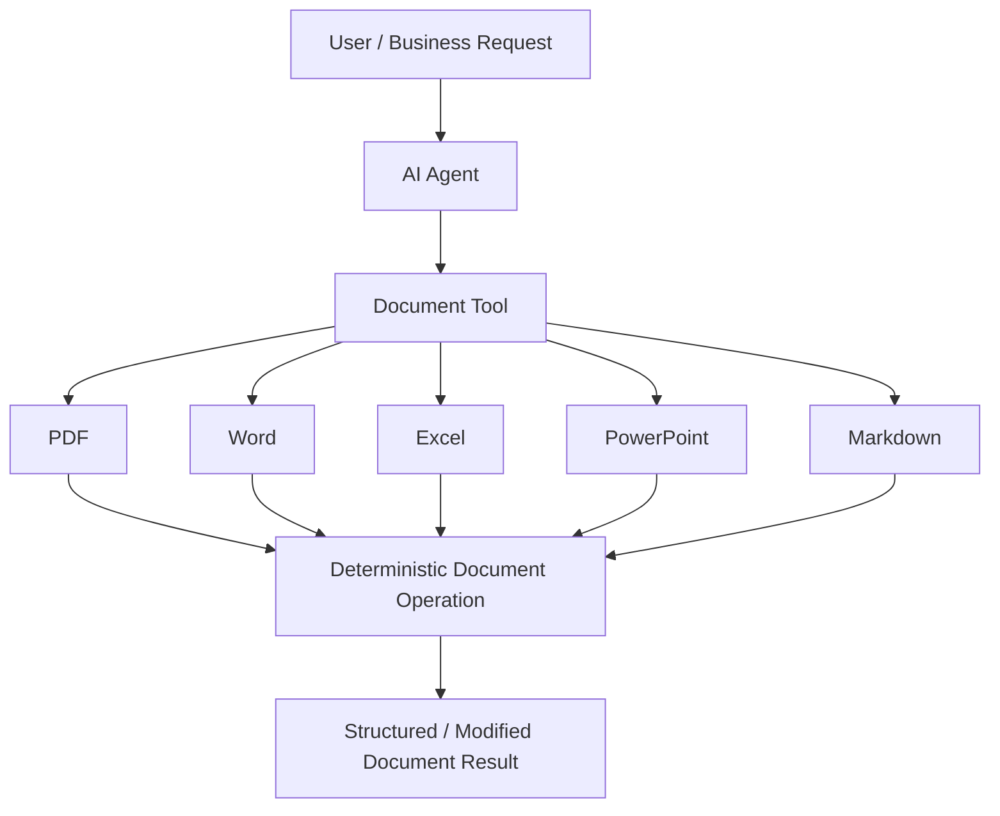
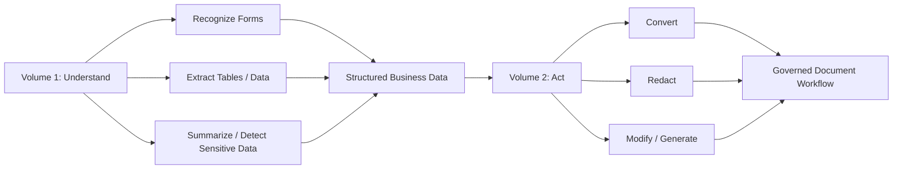
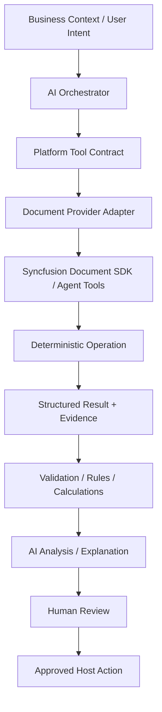
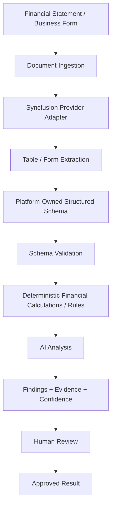

# Syncfusion Document Solutions — Research Analysis

**Sources reviewed:** Syncfusion Essential Studio Document Solutions 2026 Volume 1 and 2026 Volume 2 videos/descriptions  
**Status:** Evaluated for first MVP discovery  
**Purpose:** Identify reusable Syncfusion document capabilities that may accelerate the Enterprise AI Intelligence Platform without making Syncfusion the platform itself.

## Research Rule

Syncfusion is evaluated as a **tool/provider/enabler**. Product requirements and platform architecture remain vendor-independent. Source facts are separated from product interpretation below.

## Source Facts — 2026 Volume 1

The reviewed Volume 1 material demonstrates or documents:

- Smart data/table extraction and form recognition capabilities in the Document SDK.
- Blazor Smart PDF Viewer AI-assisted document experiences, including summarization and smart redaction.
- PDF/document processing improvements and editor/viewer enhancements.
- Developer workflow improvements such as ready-to-use editor templates/extensions.

The strategically relevant runtime pattern is document understanding: recognize structured content, extract business-relevant data, and support governed document operations.

## Source Facts — 2026 Volume 2

The reviewed Volume 2 material demonstrates or documents:

- A new Markdown Library.
- AI Agent Tools for document processing.
- Agent-driven deterministic operations across document formats such as PDF, Word, Excel, PowerPoint, and Markdown.
- A demonstrated document-processing agent workflow that can locate sensitive information and invoke permanent PDF redaction.
- Markdown-to-Excel conversion/structuring.
- Smart Spreadsheet improvements and Excel workflow automation.
- Additional PDF Viewer, DOCX Editor, and Spreadsheet Editor improvements that are primarily supporting UI/editor capabilities.

## Product Interpretation

Volume 1 and Volume 2 form a useful progression:

This supports a broader definition of **Document Intelligence** than OCR alone. The platform may need to understand, structure, validate, analyze, and perform controlled actions on documents.

## Runtime vs Development-Time Classification

### Runtime Product Capabilities

High-value runtime candidates:

- structured table/data extraction;
- form recognition;
- document summarization and document-aware assistance;
- sensitive-data detection and governed redaction;
- deterministic document conversion/transformation;
- AI Agent Tools for controlled document operations;
- spreadsheet processing/automation relevant to financial documents.

### Development-Time / AI Engineering Capabilities

Developer templates, VS Code extensions, Agent Skills, Agentic UI Builder, and coding-assistant capabilities belong to the AI Engineering stream. They may improve implementation productivity but must not be represented as runtime AI Platform capabilities.

## Reusable Architecture Pattern

The most important pattern is **AI reasons; deterministic tools execute**.

Agents should not couple directly to Syncfusion APIs. A platform-owned abstraction preserves vendor independence and allows individual capabilities to be replaced.

Candidate contracts include:

- `IDocumentExtractor`
- `IFormRecognizer`
- `IDocumentConverter`
- `IDocumentRedactor`
- `ISpreadsheetProcessor`
- `IDocumentGenerator`

These names are architecture hypotheses, not final API contracts.

## First MVP Relevance

The strongest first-MVP candidates are:

1. Smart table/data extraction from financial documents.
2. Form recognition into a defined structured schema.
3. Spreadsheet/financial data processing.
4. Deterministic document operations exposed behind a platform tool abstraction.
5. Human review before authoritative application of extracted or consequential data.

## Lower-Priority Supporting Capabilities

The following are useful but should not drive the first MVP scope by themselves:

- PDF annotation comment filtering;
- partial ink annotation erasing;
- DOCX bidirectional formatting;
- subscript/superscript formatting;
- general editor/viewer UX enhancements.

## Risks and Unknowns

The videos do not establish production suitability for our banking/financial scenarios. We still need evidence for:

- accuracy on real financial statements and banking forms;
- scanned vs digitally generated PDFs;
- multi-page and complex tables, merged cells, nested rows, totals, periods, currencies, and units;
- multilingual documents and handwriting;
- confidence/evidence metadata and schema control;
- on-premise/offline deployment boundaries and external AI dependencies;
- security, auditability, throughput, licensing, and operational cost;
- password-protected and digitally signed documents;
- whether Smart Spreadsheet preserves financial semantics rather than only spreadsheet presentation;
- exact technical model of AI Agent Tools and how they integrate with our orchestration/tool contracts.

## Current Conclusion

The reviewed Syncfusion material **confirms rather than changes** the current product direction. Syncfusion is a serious candidate for the specialized document capability layer of the first **Document & Financial Intelligence** vertical slice, while the Enterprise AI Intelligence Platform retains ownership of orchestration, schemas, validation, deterministic rules/calculations, governance, audit, human approval, and host integration.

No conclusion has been made that Syncfusion must be the final production provider.
