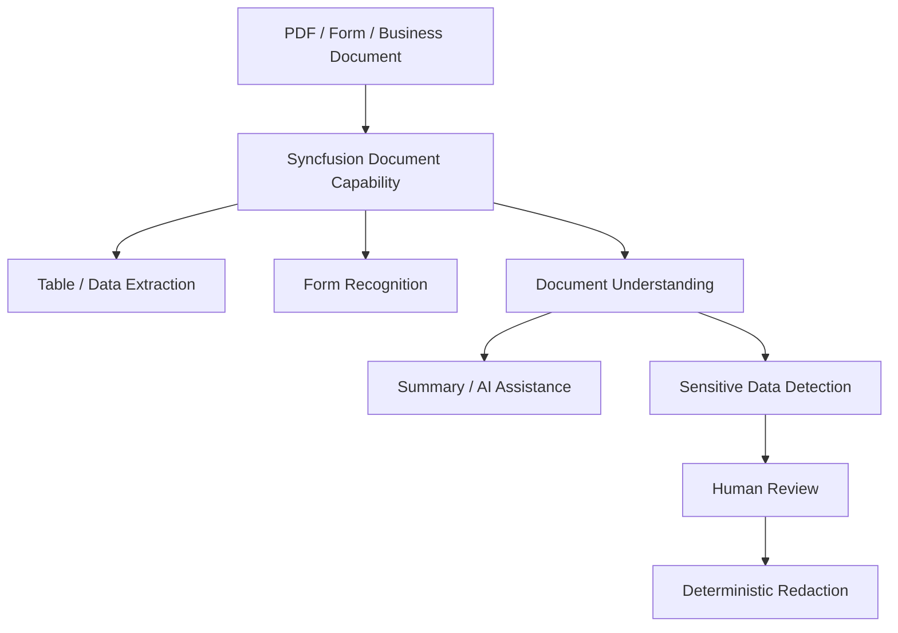
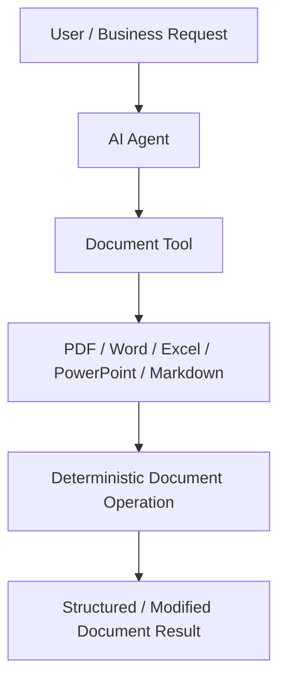
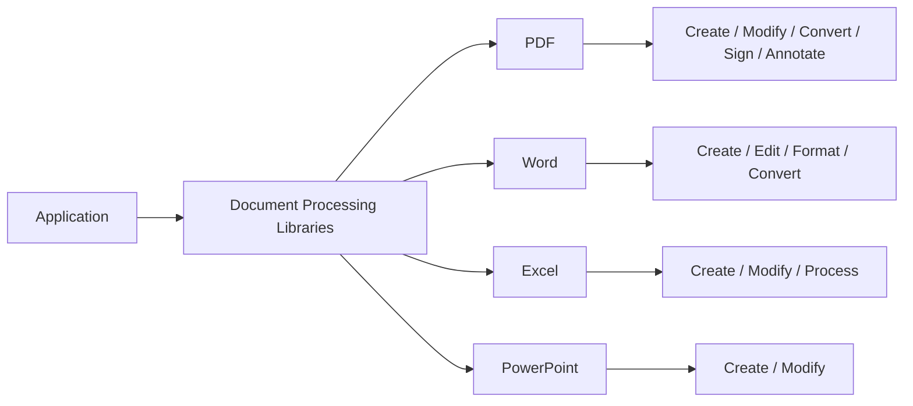
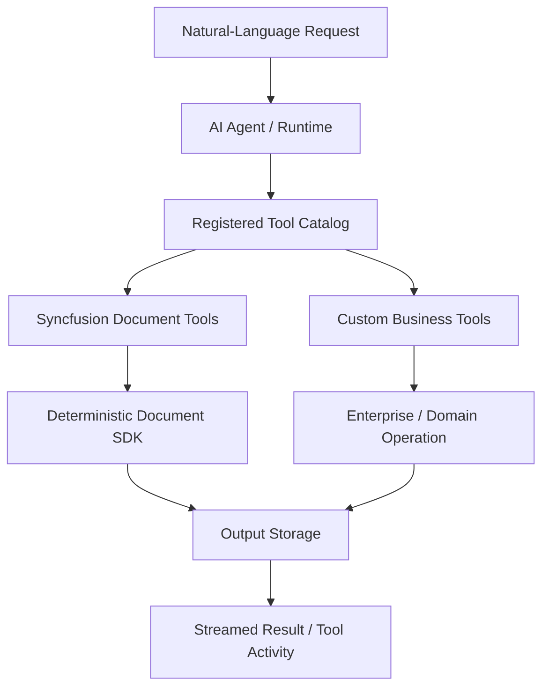
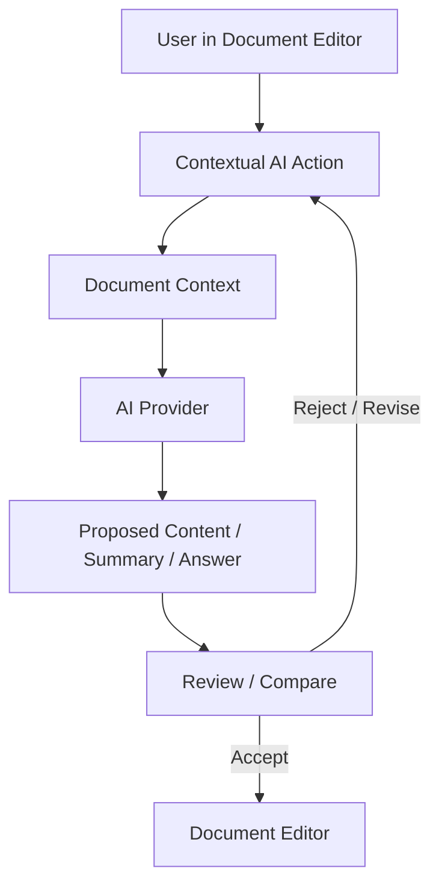
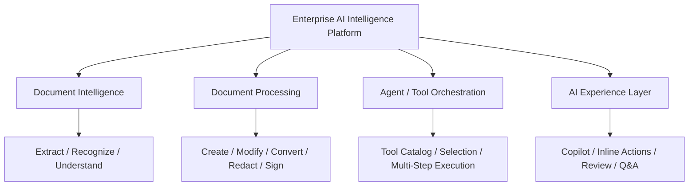
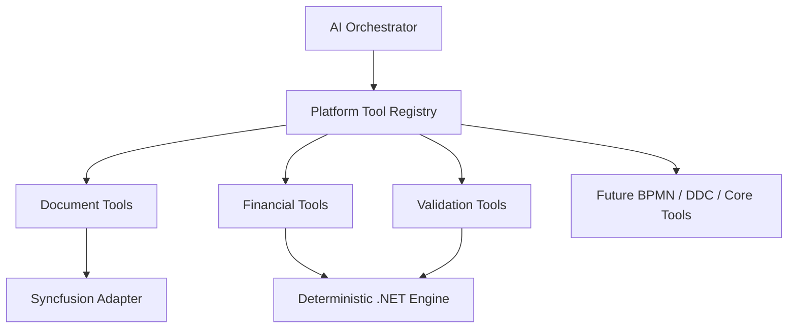
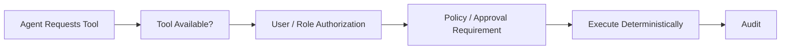
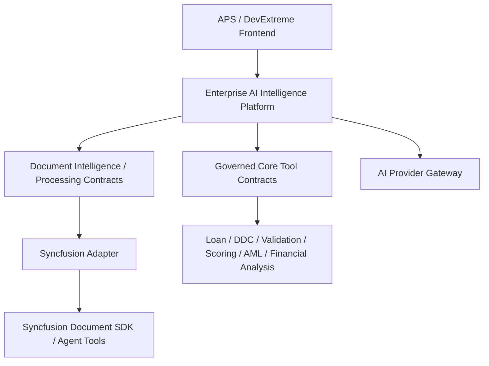
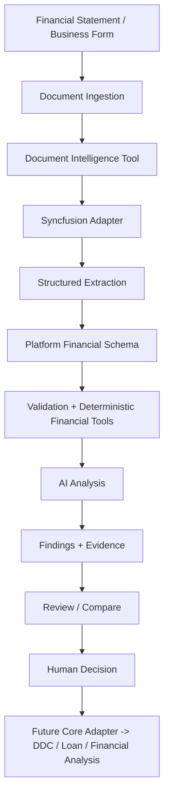

# Syncfusion Document Solutions — Research Analysis

**Sources reviewed:** Syncfusion Essential Studio Document Solutions 2026 Volume 1 and Volume 2; Document Processing Libraries overview; AI Agent-Driven Document Workflows webinar; AI-Powered DOCX Editing/Review webinar  
**Status:** Evaluated for first MVP discovery and mapped against current APS/Core capabilities  
**Purpose:** Identify reusable Syncfusion document capabilities that may accelerate the Enterprise AI Intelligence Platform without making Syncfusion the platform itself.

## Research Rule

Syncfusion is evaluated as a **tool/provider/enabler**. Product requirements and platform architecture remain vendor-independent. Source facts are separated from product interpretation below.

## Source Facts — 2026 Volume 1

The reviewed Volume 1 material demonstrates or documents smart data/table extraction and form recognition, Blazor Smart PDF Viewer AI-assisted experiences such as summarization and smart redaction, and supporting document/editor improvements.

## Source Facts — 2026 Volume 2

The reviewed Volume 2 material demonstrates or documents a Markdown Library, AI Agent Tools, agent-driven deterministic operations across PDF/Word/Excel/PowerPoint/Markdown, Markdown-to-Excel conversion, Smart Spreadsheet improvements, and supporting viewer/editor enhancements.

## Source Facts — Deterministic Document Processing Libraries

The Document Processing Libraries overview confirms a substantial deterministic execution layer underneath AI workflows. Syncfusion provides programmatic create/edit/modify/convert capabilities for PDF, Word, Excel, and PowerPoint without requiring Microsoft Office or Adobe runtime dependencies. The source also describes PDF capabilities such as forms, annotations, bookmarks and digital signatures.

**Product interpretation:** Document Intelligence and Document Processing should be treated as related but distinct platform capabilities: one understands/structures documents; the other executes deterministic document mutations and generation.

## Source Facts — AI Agent-Driven Document Workflows Webinar

The webinar demonstrates an ASP.NET Core document-processing agent architecture in which natural-language requests are interpreted by an AI agent, registered document tools are selected, and Syncfusion Document SDK performs real deterministic operations. The demonstrated/documented tool families include Word, Excel, PDF, PowerPoint, conversion and data extraction tools. It also demonstrates pluggable document storage, system-prompt behavior guidance, streaming of AI/tool activity, multi-step document workflows, and extension with custom business operations.

The webinar materially reduces the earlier unknown around AI Agent Tools: they are intended to be registered, AI-callable tools around deterministic document operations rather than an LLM replacing the document engine.

## Source Facts — AI-Powered DOCX Editing and Review Webinar

The React DOCX Editor webinar demonstrates embedded AI experiences for content generation, rewriting/refinement, grammar correction, translation, summarization and contextual Q&A. It also demonstrates reviewable/side-by-side AI experiences and describes Azure OpenAI or bring-your-own-provider integration and privacy-controlled application workflows.

**Product interpretation:** AI experiences should not be limited to a separate chatbot. The platform should eventually support contextual AI actions, side panels, review/compare experiences and background intelligence inside existing enterprise workspaces.

## Consolidated Product Interpretation

The reviewed material supports four distinct layers:

The central pattern remains **AI reasons; deterministic tools execute**.

## Runtime vs Development-Time Classification

### Runtime Product Capabilities

High-value runtime candidates include structured extraction, form recognition, document-aware assistance, deterministic document operations, AI Agent Tools, spreadsheet processing, tool registration/orchestration, pluggable storage, streamed execution activity, and contextual/reviewable AI experiences.

### Development-Time / AI Engineering Capabilities

Developer templates, VS Code extensions, Agent Skills, Agentic UI Builder, and coding-assistant capabilities belong to the AI Engineering stream. They may improve implementation productivity but must not be represented as runtime AI Platform capabilities.

## Reusable Architecture Patterns

### Tool Registry / Catalog

The platform should be able to expose governed tool families to an orchestrator without coupling business agents to vendor APIs.

### Tool Security Is Not a Prompt

System prompts may guide agent behavior, but authorization must be enforced outside the prompt.

### Pluggable Document Storage

Document input/output storage should be abstracted so an MVP can use controlled local storage while enterprise deployments can use approved object/blob storage.

### Central AI Provider Boundary

Application UI components should not independently send enterprise document content to arbitrary AI providers. Provider selection, authorization, data/privacy policy, audit and model configuration should be centralized behind the AI Platform.

## Mapping Against Current APS/Core

The later Core discovery materially improves how Syncfusion should be positioned.

The current APS frontend already has AI-ready UI patterns through its DevExtreme stack, while the Core backend already owns authoritative Loan, DDC, Validation, Credit Scoring, AML, Financial Analysis, lifecycle/status and integration capabilities. Therefore Syncfusion should not expand into either the enterprise UI authority or the banking business engine.

### Boundary Clarification

**Syncfusion candidate responsibility:**

- document extraction/recognition;
- deterministic document processing;
- document conversion/redaction/generation;
- spreadsheet/document capabilities;
- optional document-review UI components where useful.

**APS/Core responsibility:**

- authoritative application/customer/business data;
- DDC metadata and values;
- validation and dependencies;
- financial/loan calculations;
- lifecycle/status transitions;
- permissions;
- scoring/AML/business integrations;
- system-of-record writes.

**AI Platform responsibility:**

- orchestration;
- tool registry/policy;
- provider/model routing;
- context/security boundary;
- structured AI analysis;
- evidence/audit;
- human review/approval flows.

This boundary is important because it prevents vendor features from becoming product architecture accidentally.

## Candidate Platform Contracts

Candidate responsibilities/contracts include:

- `IDocumentIntelligence` / extraction and recognition capabilities;
- `IDocumentProcessing` / deterministic create, modify, convert, redact, sign operations;
- `IDocumentStorage`;
- platform tool registry/catalog contracts;
- `IFinancialTools` / deterministic financial operations;
- Core/DDC/Validation tool adapters;
- AI provider gateway/routing contracts.

Names remain architecture hypotheses, not final API contracts.

## First MVP Relevance

The strongest first-MVP candidates remain structured financial/table extraction, form recognition, platform-owned schemas, deterministic validation/calculation, AI analysis, evidence and human review.

The Core discovery suggests the MVP should deliberately prepare for a later mapping into existing DDC/Loan/Financial Analysis structures rather than inventing a parallel banking domain model.

## Risks and Unknowns

Production suitability still requires evidence for real financial documents, scanned PDFs, complex tables, merged cells, periods/currencies/units, multilingual documents, evidence/confidence metadata, on-premise/data-residency behavior, security, throughput, licensing, password-protected/signed documents, Smart Spreadsheet financial semantics, provider/model dependencies, and exact authorization boundaries for agent-callable tools.

## Current Conclusion

The reviewed Syncfusion material **confirms and sharpens** the current product direction. Syncfusion remains a serious candidate for the specialized document capability layer of the first Document & Financial Intelligence vertical slice.

The Core discovery now makes the intended boundary clearer: Syncfusion augments document handling; APS/Core remains the deterministic banking authority; the Enterprise AI Intelligence Platform connects the two through governed abstractions, structured schemas, orchestration, policy, audit and human review.

No conclusion has been made that Syncfusion must be the final production provider.
