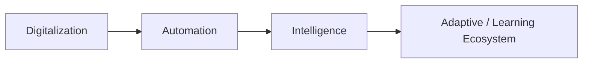
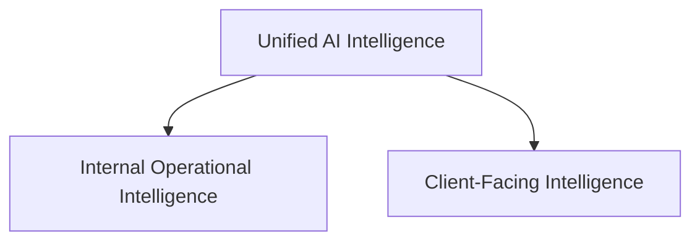
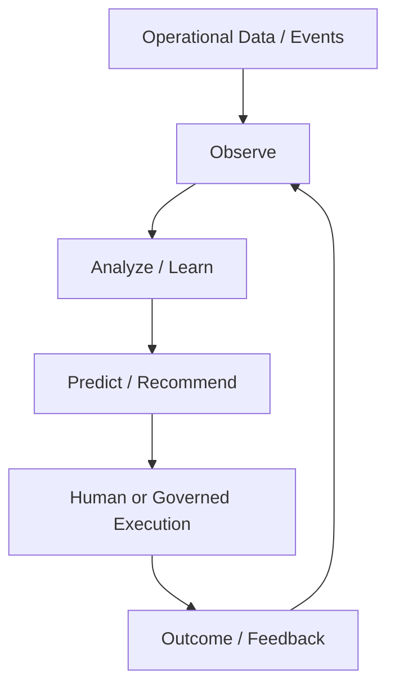
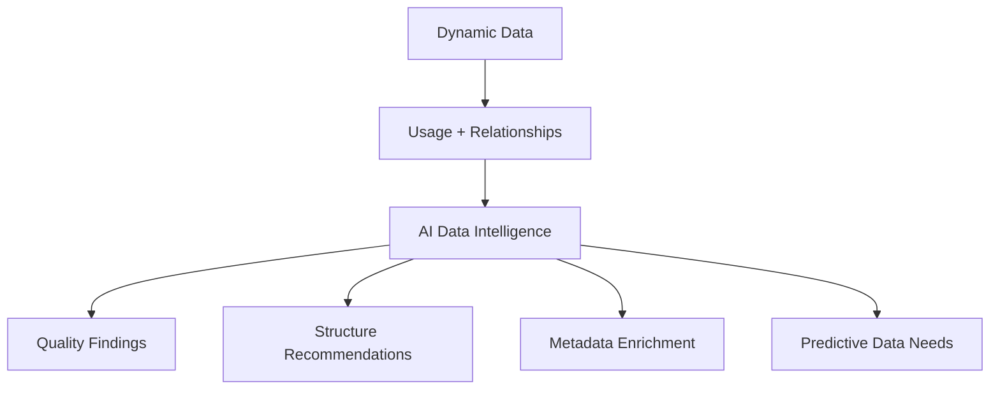
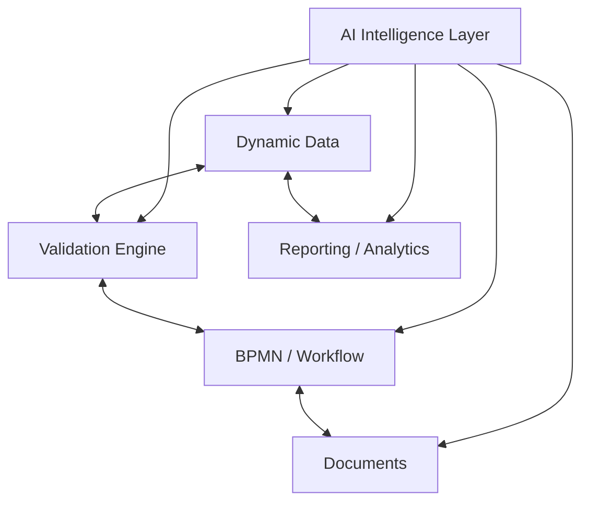
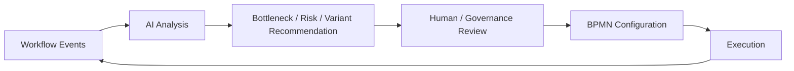
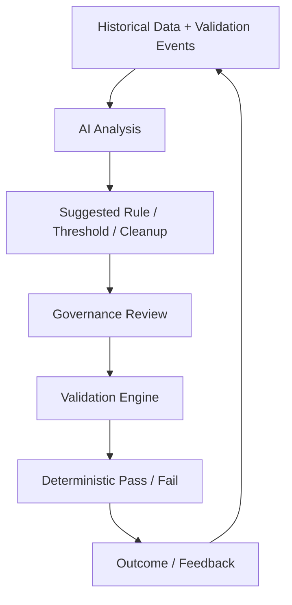
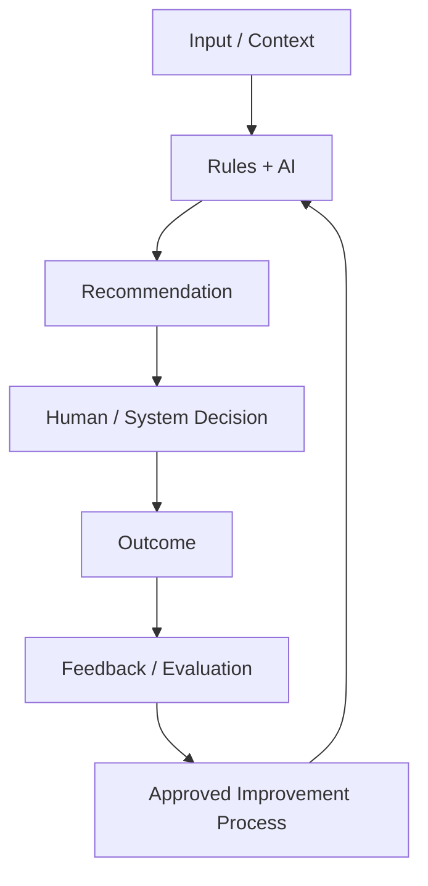

# Vision 2030 — Strategic Analysis

**Source:** *From Automation to Intelligence — Unified AI Framework for Self-Learning and Adaptive Banking Systems*  
**Status:** Primary strategic source  
**Purpose:** Preserve the strategic direction that should guide product definition while distinguishing long-term vision from initial MVP commitments.

## Strategic Direction

Vision 2030 describes a transition from automation toward an intelligent and adaptive ecosystem spanning core banking, digital channels, workflows, validations, data, documents, analytics, and related enterprise capabilities.

The vision has two broad directions:

## Internal Operational Intelligence

The strategic objective is not merely conversational AI. Intelligence should help observe operations, detect patterns and bottlenecks, predict risks, recommend improvements, and support continuous optimization.

## Dynamic Data Intelligence

Dynamic data capabilities are a major foundation. The long-term AI direction includes understanding relationships and dependencies, detecting gaps/redundancy, improving data quality, enriching metadata, suggesting data structures, and preparing data for analytics/model use.

Natural-language/semantic configuration is an important future pattern: a user describes an information need and AI can propose fields, types, dependencies, validations, and analytical possibilities. This should remain a governed design-assistance capability rather than uncontrolled schema mutation.

## Connected Engines

A central strategic implication is that intelligence should connect existing deterministic engines rather than replace them.

## Workflow Intelligence

The vision includes analysis of actual workflow behavior, bottlenecks, redundant tasks, completion times, errors, and process variants. The product interpretation is that AI should initially **observe, predict, and recommend**, while the BPMN/workflow engine remains authoritative for execution.

## Validation Intelligence

The Validation Engine remains deterministic. AI can analyze historical patterns, recurring corrections/overrides, obsolete or redundant rules, anomalies, and possible thresholds, then recommend improvements.

## Feedback and Learning

For the vision to become measurable engineering rather than a broad "self-learning" claim, the platform should eventually capture the relationship between recommendations, human/system decisions, and outcomes.

The initial product should not imply uncontrolled online self-modification. Learning/adaptation must be defined per use case: observe, recommend, predict, retrain offline, change configuration, or execute automatically — each with explicit governance.

## Product Implication

Vision 2030 supports defining the product as an **Enterprise AI Intelligence Platform** that augments deterministic enterprise engines with contextual AI analysis, document intelligence, prediction, recommendations, explanation, and governed feedback loops.

The Loan Copilot and Document & Financial Intelligence MVP are vertical slices of this broader vision, not the entire product.
